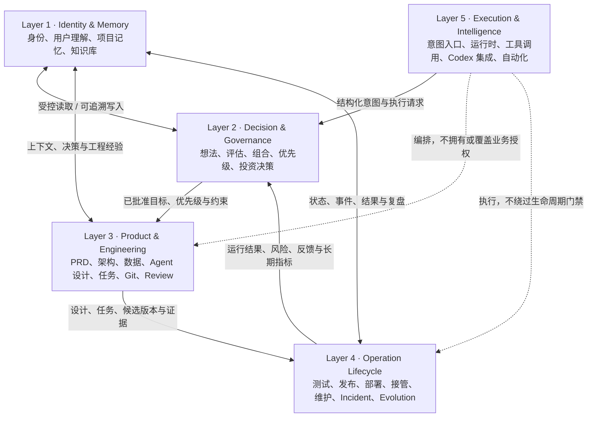

# AI CTO System 五层架构

## 1. 架构定位

AI CTO System 使用 **Layer + Module** 作为长期稳定的架构模型：

- **Layer** 定义稳定的职责边界，回答“哪一层对这类决策和数据负责”。
- **Module** 是层内可独立治理、演进和登记状态的能力单元。
- **Phase** 只保留为历史交付批次，回答“这组能力何时建立”，不再承担架构归属。
- **Lifecycle State** 描述单项目当前所处状态，与交付 Phase、架构 Layer 分开管理。

该模型不新增功能，也不授予任何自动执行权限。Layer 5 当前仅定义未来自动化执行的边界。

## 2. 五层模型

### Layer 1：Identity & Memory Layer

**职责：** 定义 AI CTO 是谁、如何理解用户、如何保存项目事实与可复用经验。它是跨层共享的记忆平面，不是业务审批器。

**包含：** AI CTO Identity & Work Rules、User Brain、Project Memory、Knowledge Base、Memory Management。

**边界：** 只保存有来源、适用范围、Confidence 和更新责任的内容；不能用记忆替代当前证据、门禁或用户授权。

### Layer 2：Decision & Governance Layer

**职责：** 判断做什么、为什么做、先做什么、投入多少，以及是否允许进入下一决策或设计阶段。

**包含：** Idea Analysis、Research、Evaluation、Build vs Buy、Confidence、Project Approval、Portfolio、Priority、Dependency、Investment Decision、AI Cost、Portfolio Health。

**边界：** 输出建议、评分、授权边界与治理记录；不直接设计实现，不执行代码、部署或外部工具动作。

### Layer 3：Product & Engineering Layer

**职责：** 把已批准的目标转换为可追溯、可验证、可实施的产品与工程设计，并管理开发执行证据。

**包含：** PRD、Requirement Priority、Architecture、Database、Agent Design、Traceability、Task Management、Development Plan、Git、TDD、Code Review、Change Impact、Development Status。

**边界：** 只处理已获授权的范围；Design 完成不等于 Development 授权，Development 完成不等于 Testing 授权。

### Layer 4：Operation Lifecycle Layer

**职责：** 管理候选版本和产品从测试、发布、部署到长期运营、接管、维护、故障、演进与退出的全过程。

**包含：** Project Lifecycle、Testing、Bug、AI Evaluation、Security Review、Release、Deployment / Rollback、Monitoring、Existing Project Onboarding、Maintenance、Incident、Postmortem、Technical Debt、Feedback、Evolution、Retirement。

**边界：** 生命周期状态与门禁的权威归属在本层；评分、Dashboard 或未来自动化执行不得替代本层 Gate。

### Layer 5：Execution & Intelligence Layer

**职责：** 为未来自动化提供意图接入、运行时编排、工具执行、Codex 集成和自动化控制。

**包含：** Intent Gateway、Agent Runtime、Tool Calling、Codex Integration、Automation，以及计划中的 Capability Governance。

**当前状态：** `Planned`。本次架构审查不实现 Layer 5 模块，也不进入 Phase 8.2。

**边界：** Layer 5 负责“如何安全执行”，不拥有“是否应该做”的业务决策；不得覆盖 Layer 2 的决策、Layer 3 的工程基线、Layer 4 的状态门禁或 Layer 1 的记忆写入规则。

## 3. 跨层数据流

1. 未来请求由 Layer 5 Intent Gateway 结构化；在 Layer 5 未实现前，由人工或 Codex 按现有协议完成同等入口记录。
2. Layer 2 读取 Layer 1 的用户、项目和知识上下文，形成价值判断、优先级、证据、Confidence、风险和授权边界。
3. Layer 3 只接收 Layer 2 已批准且版本化的目标，把它转换为 PRD、Architecture、Task、Test Plan 和工程证据。
4. Layer 4 接收冻结的工程候选基线，执行 Testing、Release、Deployment、Onboarding、Maintenance 和 Evolution 门禁。
5. Layer 4 的运行结果、Incident、反馈、成本和能力趋势回流 Layer 1，并成为 Layer 2 后续决策的证据。
6. Layer 5 未来可编排上述流程，但每个动作必须携带来源、授权、输入版本、结果和审计记录；编排不能改变各层的权威边界。

跨层能力必须有且只有一个 **Owning Layer**。其他层通过版本化输入输出合同消费该能力，不能以“跨层”为理由建立重复模块。

## 4. 划分理由

- 身份与记忆变化慢、被所有能力读取，独立为 Layer 1 可以避免把事实存储与决策混在一起。
- 价值判断和资源授权需要独立于具体工程方案，Layer 2 防止“能做”被误写成“该做”。
- 产品与工程产物共享 Requirement → Design → Task → Commit → Test 追踪，归入 Layer 3 可保持设计与实现一致。
- 测试、发布、接管、维护和演进都围绕生命周期状态、证据和门禁，归入 Layer 4 可以统一运营语义。
- 自动化执行具有工具权限、运行时和审计风险，独立为 Layer 5 可以保证它服务于治理，而不是反向吞并治理。

## 5. 架构权威来源

- 模块归属与状态：[MODULE_REGISTRY.md](./MODULE_REGISTRY.md)
- 新需求归类：[FEATURE_CLASSIFICATION_RULES.md](./FEATURE_CLASSIFICATION_RULES.md)
- 历史 Phase 映射：[PHASE_MAPPING_REVIEW.md](./PHASE_MAPPING_REVIEW.md)
- 结构演进：[ARCHITECTURE_EVOLUTION_STANDARD.md](./ARCHITECTURE_EVOLUTION_STANDARD.md)
- 架构决策：[ADR-0009](../adr/ADR-0009-AI-CTO-SYSTEM-ARCHITECTURE-MODEL.md)
