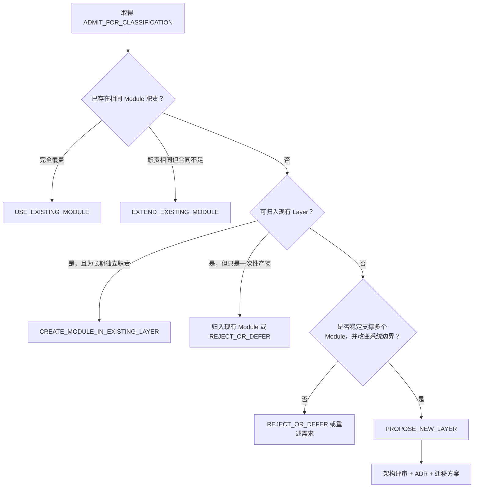

# 未来需求归类规则

## 1. 核心规则

未来新增需求不得直接创建新的 Phase。任何 AI CTO System 功能、协议、集成、自动化或治理需求必须先按[模块加入评估规则](../strategy/MODULE_ADMISSION_CRITERIA.md)取得 `ADMIT_FOR_CLASSIFICATION`，再形成 **Feature Classification Record**，决定复用、扩展、建立 Module，或发起新 Layer 架构评审。

战略准入回答“是否应该进入系统”，本规则回答“进入后属于哪里”。`CONDITIONAL_ADMISSION` 或 `REJECT_OR_DEFER` 不得通过架构分类绕过。

Phase 名称、路线图标签、截止时间、负责人指令和历史投入都不是架构归属证据。

## 2. 归类记录

每次归类必须按以下固定字段输出：

| 字段 | 要求 |
|---|---|
| Feature / Request | 稳定 ID、名称、问题与预期价值 |
| Strategic Admission | Admission Record、结果、批准人和版本；必须为 `ADMIT_FOR_CLASSIFICATION` |
| Evidence / Confidence | 支持需求与边界判断的证据和可信等级 |
| Owning Layer | 五层之一；必须且只能有一个 |
| Existing Module | 命中的注册模块；无则写 `NONE` |
| Classification Result | 使用第 3 节的一个固定结果 |
| Cross-Layer Inputs / Outputs | 消费和提供的版本化合同；无则写 `NONE` |
| Risks / Redlines | 安全、数据、成本、权限、生命周期和不可逆风险 |
| Architecture Review Required | `YES` 或 `NO` 及理由 |
| ADR Required | `YES` 或 `NO` 及理由 |
| Registry Update | 需要新增或修改的 Module Registry 记录 |
| Next Action | 下一项文档或评审动作；不能直接编码 |

## 3. 固定归类结果

- `USE_EXISTING_MODULE`：现有 Module 已覆盖需求，仅创建或更新该模块内的 Artifact。
- `EXTEND_EXISTING_MODULE`：职责相同，但需要扩展合同、规则或能力边界。
- `CREATE_MODULE_IN_EXISTING_LAYER`：现有 Layer 能容纳，但需求是长期、独立、可治理的职责。
- `PROPOSE_NEW_LAYER`：五层均无法合理承载，且满足新 Layer 的严格条件。
- `REJECT_OR_DEFER`：价值、证据、边界或时机不足，不进入结构变更。

禁止使用 `CREATE_NEW_PHASE` 作为归类结果。

## 4. 判断流程

具体执行：

1. 在 [MODULE_REGISTRY.md](./MODULE_REGISTRY.md) 检索同义职责、输入输出和状态。
2. 若现有 Module 已覆盖，复用它；不要因为交付物名称不同而重复建模。
3. 若职责相同但合同不足，扩展现有 Module，并分析相关文档、数据和消费者影响。
4. 若需求在现有 Layer 内形成长期、独立、可版本化、可审计的责任边界，才允许提出新 Module。
5. 跨层需求必须指定一个 Owning Layer，并明确其他层的输入输出合同；“跨层”不是创建重复 Module 或新 Layer 的理由。
6. 只有现有五层都无法承载、职责长期稳定、能容纳多个 Module、具有独立治理与运行边界时，才能提出新 Layer。
7. 新 Module 更新注册表；新 Layer 或重大边界调整必须完成架构评审和 ADR 后才可批准。

## 5. Module 与 Layer 判定标准

### 扩展现有 Module

同时满足：责任主体不变；核心目的不变；消费者仍使用相同主合同；变化可以在现有 Owner、风险和生命周期内治理。

### 在现有 Layer 创建 Module

同时满足：有清晰长期职责；有独立输入输出和 Owner；被多个流程或 Artifact 复用；需要独立版本、状态或风险治理；不复制其他 Module 的权威数据。

### 提议新 Layer

必须同时满足：五层职责确实不足；边界在多个项目和版本周期中稳定；至少支持多个独立 Module；拥有独立治理对象、数据流和责任；给出跨层合同、迁移、兼容、废弃和回滚方案；通过架构评审并创建 ADR。

## 6. Capability Governance 归类示例

| 字段 | 结论 |
|---|---|
| Feature / Request | 外部能力、插件与工具的注册、权限和生命周期治理 |
| Owning Layer | Layer 5：Execution & Intelligence |
| Existing Module | Capability Governance（文档治理 `Completed`；Runtime / Integration `Planned`） |
| Classification Result | `USE_EXISTING_MODULE`；后续如扩展边界则使用 `EXTEND_EXISTING_MODULE` |
| Cross-Layer Inputs / Outputs | 读取 Layer 2 授权、Layer 3 技术合同、Layer 4 安全与运营门禁；向执行运行时提供受控能力清单 |
| Architecture Review Required | 当前 `NO`；模块已登记在现有 Layer 5 |
| ADR Required | 当前 `NO`；后续重大权限或运行时边界变化再判断 |
| Registry Update | Phase 8.2 已将治理文档状态更新为 `Completed`；没有注册或激活真实 Capability |
| Next Action | 等待 Phase 8.2 用户确认；确认前不接入真实外部能力，不进入 Phase 8.3 |
