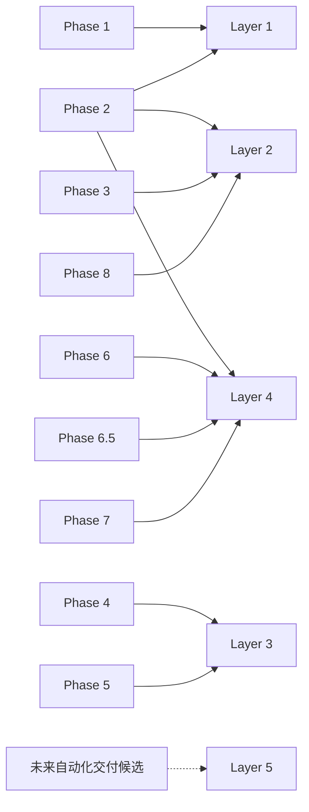

# Phase 到五层架构映射审查

## 1. 审查口径

Phase 1–8 是 AI CTO System 的历史交付批次；Layer + Module 是当前及未来的权威架构模型。一个 Phase 可以交付多个 Layer 的 Module，一个 Layer 也可以由多个 Phase 逐步完善。映射不改写 Git 历史，也不把历史 Phase 变成新的生命周期状态。

## 2. 映射关系

| Historical Phase | Primary Layer | Secondary / Cross-cutting | 主要交付 | 审查结论 |
|---|---|---|---|---|
| Phase 1 · Kernel | Layer 1 | 全局基础设施 | Identity、工作规则、User Brain、Project Memory、Knowledge Base、Git 与目录骨架 | 主要属于 Layer 1；Git 和文档骨架是跨层基础，不单独形成 Layer |
| Phase 2 · Operating Protocol | Layer 4 | Layer 1、Layer 2 | Idea Intake、Lifecycle、Initialization、Document Relationship、Memory Management、Project State | 原 Phase 跨三层：Idea 入口属 Layer 2，Memory 属 Layer 1，生命周期与初始化属 Layer 4；不应继续作为单一架构边界 |
| Phase 3 · Decision Intelligence | Layer 2 | Layer 1 提供证据 | Candidate、Research、Evaluation、Build vs Buy、Confidence、Approval Gate | 归入 Layer 2；Confidence 与证据由 Layer 1 保存，但决策语义由 Layer 2 管理 |
| Phase 4 · Design Intelligence | Layer 3 | Layer 2 提供批准目标 | PRD、Requirement Priority、Architecture、Database、Agent Design、Traceability、Design Gate | 归入 Layer 3 |
| Phase 5 · Development Intelligence | Layer 3 | Layer 4 接收候选基线 | Task、Development Plan、Git、TDD、Review、Change Impact、Development Gate | 归入 Layer 3；进入 Testing 的状态转换由 Layer 4 生命周期消费 |
| Phase 6 · Testing & Release | Layer 4 | Layer 3 提供实现证据 | Test、Bug、AI Evaluation、Security、Release、Deployment、Rollback、Monitoring | 归入 Layer 4 |
| Phase 6.5 · Existing Project Onboarding | Layer 4 | Layer 1 保存恢复记忆，Layer 3 提供设计语义 | Scan、Reverse Analysis、Recovery、Health、Migration Gate、Experience Extraction | 归入 Layer 4；是替代入口，不是新项目顺序阶段 |
| Phase 7 · Maintenance & Evolution | Layer 4 | Layer 1 沉淀经验，Layer 2 评估价值 | Maintenance、Incident、Postmortem、Debt、Feedback、AI Capability Trend、Evolution、Retirement | 归入 Layer 4 |
| Phase 8 · Portfolio Governance | Layer 2 | Layer 1 提供项目事实，Layer 4 提供健康与状态 | Portfolio、Priority、Dependency、Technical Asset、AI Cost、Dashboard、Investment、Portfolio Health | 归入 Layer 2；Portfolio 是治理覆盖层，不是生命周期状态 |
| Future execution delivery | Layer 5 | 必须消费 Layer 1–4 权威合同 | Intent Gateway、Agent Runtime、Tool Calling、Codex Integration、Automation、Capability Governance | 仅表示未来候选交付方向；不得预先命名为 Phase 9+，更不得把单一功能直接变成新 Phase |

简化映射：

## 3. 重复职责审查

| 表面重复 | 边界判断 | 是否合并 | 调整建议 |
|---|---|---|---|
| Project Evaluation、Project Priority、Project Health、Portfolio Health、Evolution Score、Asset Quality | 分别评价项目立项、资源顺序、单项目现状、组合现状、演进提案和技术资产，决策对象不同 | 不合并 | 统一 Evidence、Confidence、评分版本、红线和授权边界元数据，禁止分数互相替代 |
| Project Lifecycle 与 Portfolio Status | 前者是单项目阶段，后者是组合处置状态 | 不合并 | 在所有汇总中分列 Current Stage 与 Portfolio Status |
| PHASE_GATE_CHECKLIST 与 Design / Development / Release / Evolution 专项 Gate | 通用清单是索引和最小转换要求，专项 Gate 是对应授权的权威来源 | 不合并 | 后续可建立 Gate Catalog；明确通用清单不得覆盖专项 Gate |
| AI Evaluation 与 AI Capability Evolution | 前者验证发布候选，后者观察线上长期趋势 | 不合并 | 共享指标定义和基线标识，保持不同时间窗与授权用途 |
| Bug、Incident、Maintenance Task、Technical Debt、Feedback | 分别描述缺陷、生产事件、维护工作、长期债务和用户输入 | 不合并 | 使用稳定 ID 互相关联，禁止用一个对象覆盖另一个对象的历史 |
| Knowledge Base 与 Technical Asset Registry | 前者保存可复用知识，后者保存经质量审核可复用的技术资产 | 不合并 | 建立 Knowledge → Candidate Asset → `APPROVED_FOR_REUSE` 的晋级路径 |
| PROJECT_STATE、Portfolio Register、CTO Dashboard | 分别是项目实时权威状态、组合登记和只读投影 | 不合并 | Dashboard 只读引用权威来源，不反向改写状态 |
| Product Architecture Standard 与 AI CTO System Architecture | 前者规范被管理产品的设计，后者定义 AI CTO 自身元架构 | 不合并 | 名称和链接中明确 product-level 与 system-level |
| Idea Intake 与 Intent Gateway | 前者是业务候选协议，后者是未来执行入口 | 不合并 | Intent Gateway 只结构化和路由，不替代 Idea 判断 |
| Technical Asset Registry 与 Capability Governance | 前者管理复用资产，后者规划运行时可启用能力、权限和撤销 | 不合并 | Capability 可引用资产记录，但执行权限必须由 Layer 5 独立治理 |

## 4. 合并结论

本次审查不建议进行破坏性合并。当前主要问题不是文件数量，而是过去用 Phase 同时表达交付顺序、架构归属和生命周期，导致：

1. Phase 2、Phase 6.5 等横跨多个职责边界；
2. Portfolio Governance 曾被描述为“层”，容易与五层架构中的 Layer 混淆；
3. 评分模型、状态模型和 Gate 名称相近，缺少统一的对象与授权边界说明；
4. 未来自动化能力可能被误归到 Portfolio，或仅因路线图标签直接创建新 Phase；
5. Layer 5 如果没有边界，可能重复实现 Layer 2 决策或绕过 Layer 4 门禁。

## 5. 调整建议

- 从现在起用 Layer 表达稳定职责，用 Module 表达能力单元，用 Lifecycle State 表达项目状态，用 Phase 仅引用历史交付。
- 维护 [MODULE_REGISTRY.md](./MODULE_REGISTRY.md) 作为模块归属和状态的唯一索引。
- 所有新需求先执行 [FEATURE_CLASSIFICATION_RULES.md](./FEATURE_CLASSIFICATION_RULES.md)，不直接创建 Phase。
- 为所有评分模型统一 Evidence、Confidence、版本、红线和 Decision Object，但不合并不同决策对象。
- 后续建立跨模块合同或 Gate Catalog 时，作为现有 Module 扩展提出；本次不新增这些功能。
- Capability Governance 保持 Layer 5 `Planned`，等待本次架构审查确认；不进入 Phase 8.2。
