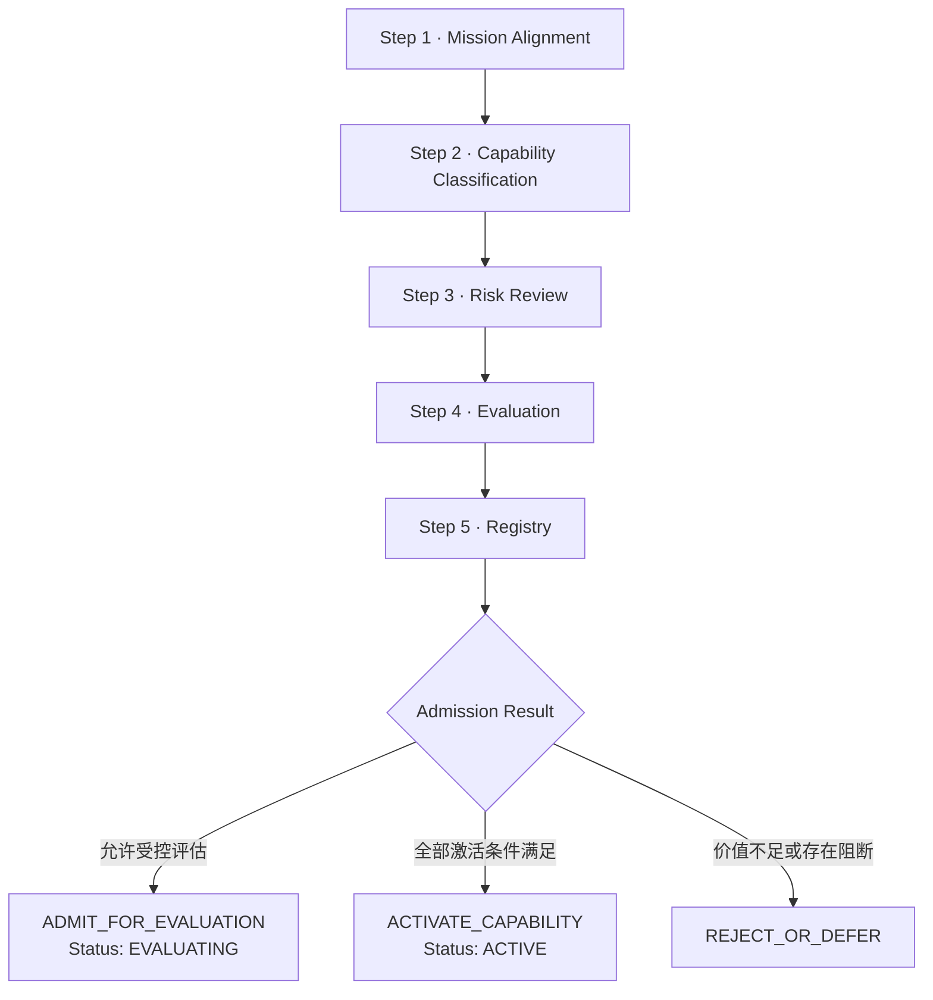

# Capability 准入流程

## 1. 入口与前置条件

任何新增内部或外部 Capability 都必须创建 Candidate Record。不得先安装、启用、调用或授予凭据，再补做准入。

准入流程：

## 2. Step 1：Mission Alignment

使用 [Manifesto](../strategy/AI_CTO_SYSTEM_MANIFESTO.md) 和 [Module Admission Criteria](../strategy/MODULE_ADMISSION_CRITERIA.md) 判断能力是否直接服务想法到产品转化、长期维护进化、技术资产或 AI 技术组织能力。

记录 Mission Contribution、目标用户、使用场景、预期指标、长期资产、复杂度、替代方案、Evidence 和 Confidence。只因流行、可自动化、已有预算或已经集成不能通过。

Mission 不成立时输出 `REJECT_OR_DEFER`，不进入后续安装或评估。

## 3. Step 2：Capability Classification

从八类 Type 中选择一个主要类型，并记录：

- Applicable Layer；
- Applicable Phase / Lifecycle Stage；
- Task Type；
- Input / Output；
- 依赖和相关 Capability；
- 内部、外部或混合来源；
- 只读、写入、执行或管理类副作用。

边界不清时保持 Candidate，不得用“通用能力”规避权限拆分。

## 4. Step 3：Risk Review

至少检查：

| 域 | 必须验证 |
|---|---|
| 安全 | 权限最小化、数据访问、网络、代码执行、凭据、供应链、日志、隔离和撤销 |
| License | License 身份、版本、允许用途、分发 / 修改义务、依赖 License 和冲突 |
| 维护状态 | Owner、最近维护、发布频率、未解决问题、弃用信号、替代方案 |
| 兼容性 | 平台、Runtime、接口、数据格式、版本、现有项目和升级 / 回滚 |

风险分为 `Low`、`Medium`、`High`、`Critical`。License 未确认、来源不可验证、要求超范围生产凭据、不可逆副作用无回滚、已知恶意供应链或核心兼容性未知均阻断激活。高风险能力只能在隔离、最小权限和明确停止条件下评估。

## 5. Step 4：Evaluation

按[质量评估标准](./CAPABILITY_EVALUATION_STANDARD.md)冻结版本、环境、权限、测试、指标和 Evidence，评估价值、成本、功能、稳定性、兼容性、维护、安全与复用。

Evaluation 期间状态为 `EVALUATING`。评估必须使用非生产或经批准的隔离环境；需要真实高风险副作用但无法安全隔离时结果为 `BLOCKED`，不得以人工承诺代替。

## 6. Step 5：Registry

任何进入评估或激活判断的能力都必须按[Registry Standard](./CAPABILITY_REGISTRY_STANDARD.md)取得唯一 Capability ID 和版本化记录：

- `ADMIT_FOR_EVALUATION`：创建或更新 Registry，Status 为 `EVALUATING`，只授权已记录的评估范围。
- `ACTIVATE_CAPABILITY`：Registry 完整、Evaluation 有效、阻断项关闭、人类批准后，Status 更新为 `ACTIVE`。
- `REJECT_OR_DEFER`：未评估候选可保留 `DISCOVERED` 及阻断原因；曾启用或需要明确停用的能力进入 `DISABLED`。不得创建自定义状态。

## 7. 三种准入结果

### `ADMIT_FOR_EVALUATION`

Mission Alignment 成立，分类明确，风险可在隔离条件下评估，且 Evaluation Plan 已批准。它不允许生产调用、项目默认选择或长期凭据。

### `ACTIVATE_CAPABILITY`

仅当以下条件全部满足：Registry 完整；当前版本 Evaluation 有效；Quality Score 达到目标用途阈值；安全、License、维护、兼容和权限检查通过；替代 / 回滚可执行；项目适用边界明确；人类批准当前版本和权限。

### `REJECT_OR_DEFER`

使命价值不足、证据不足、风险不可控、License / 来源阻断、质量未达标、复杂度过高或当前无维护能力。记录重新评审条件；不得因期限、职位或沉没投入变为条件激活。

## 8. Admission Record

每次判断必须输出：Candidate / Capability ID、Name、Mission Alignment、Type、Source / Version、Applicable Layer / Phase、Risk Level、Security、License、Maintenance、Compatibility、Evaluation Score / Confidence、Registry Status、Permissions、Admission Result、Human Approver、Activation Scope、Blockers 和 Next Action。

若结果不是 `ACTIVATE_CAPABILITY`，`Activation Scope` 必须为 `NONE`。

未注册候选使用：`Registry Record: ABSENT`、`Registry Status: N/A`。如决定保留并创建候选记录，另写 `Proposed Registry Status: DISCOVERED`。不得把 `BLOCKED` 或 `QUARANTINED` 写入 Registry Status；`BLOCKED` 只属于 Evaluation Result。
