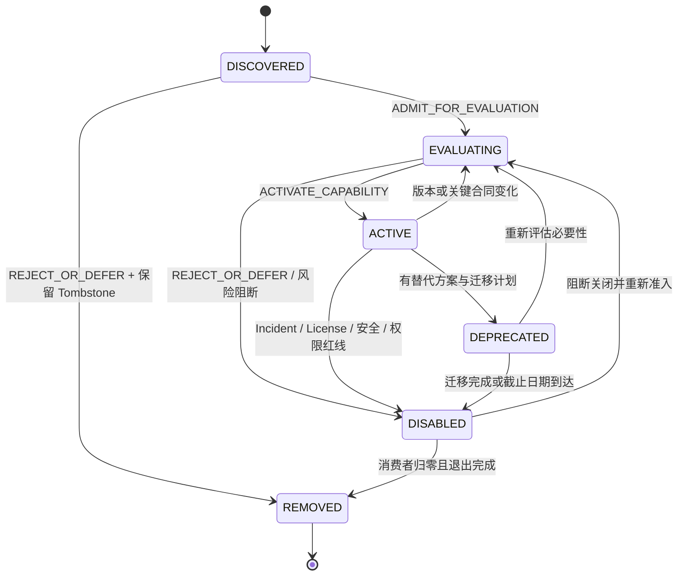

# Capability 生命周期标准

## 1. 状态定义

| Status | 定义 | 是否可被选择 / 调用 |
|---|---|---|
| `DISCOVERED` | 已发现并保留候选记录，尚未获准评估 | 否 |
| `EVALUATING` | 已取得 `ADMIT_FOR_EVALUATION`，在批准范围内评估 | 仅评估环境，不可用于项目执行 |
| `ACTIVE` | 当前版本取得 `ACTIVATE_CAPABILITY`，可在批准范围内使用 | 是，但仍需项目级权限 |
| `DEPRECATED` | 仍可能被存量项目临时使用，禁止新增采用 | 仅批准的存量范围 |
| `DISABLED` | 因风险、失败、权限、维护或治理决定停用 | 否 |
| `REMOVED` | 能力已移除，保留 Tombstone 和历史证据 | 否 |

状态词汇封闭。不得使用 `QUARANTINED`、`BLOCKED`、`PENDING` 或 `APPROVED` 作为 Registry Status；这些信息分别记录在 Risk、Evaluation Result、Blockers 或 Admission Result 中。

尚未创建 Registry Record 的候选没有 Lifecycle Status，必须输出 `Registry Record: ABSENT` 和 `Registry Status: N/A`。如果决定保留该候选，创建记录后的唯一初始状态是 `DISCOVERED`。隔离或禁止使用通过 `Selection: PROHIBITED`、`Activation Scope: NONE` 和权限撤销表达，不创建 `QUARANTINED` 状态。

## 2. 状态转换

## 3. 转换条件

- `DISCOVERED → EVALUATING`：Mission、Type 和初始风险明确；Evaluation Plan、隔离、权限和责任人批准；结果为 `ADMIT_FOR_EVALUATION`。
- `EVALUATING → ACTIVE`：Registry 完整；Evaluation、Security、License、Compatibility 和 Maintenance 通过；质量达到用途阈值；结果为 `ACTIVATE_CAPABILITY`。
- `ACTIVE → EVALUATING`：Source、Version、合同、权限、依赖、License、模型或关键环境变化使旧证据失效。
- `ACTIVE → DEPRECATED`：已有更优替代、维护终止或长期策略退出；迁移期、消费者和停止日期明确。
- 任意可用状态 `→ DISABLED`：安全、数据、License、不可逆副作用、重大 Incident、权限撤销或证据失效需要立即停用。
- `DISABLED → REMOVED`：依赖和消费者归零；数据、凭据、配置、缓存、日志、合同和恢复 / 删除义务关闭。

## 4. Emergency Disable

发现凭据泄露、供应链攻击、未授权写入、敏感数据外泄、License 禁止、不可恢复副作用或重大兼容破坏时，可以先把状态改为 `DISABLED` 并撤销权限，再补全 Incident 和复核记录。Emergency Disable 不等于删除 Evidence，也不允许静默恢复；重新启用必须从 `EVALUATING` 开始。

## 5. 定期复核

每项 `ACTIVE` Capability 必须设 Next Review。高风险和生产写入能力提高复核频率。复核至少验证使命、消费者、版本、来源、License、维护、安全、兼容、质量、成本、权限、Incident、替代方案和退出能力。过期未复核时取消默认选择资格，并按风险进入 `EVALUATING` 或 `DISABLED`。
