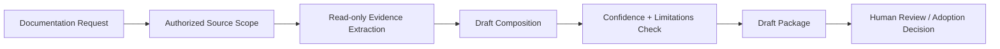

# Documentation Capability Requirement

## 1. 定位

本文件定义 AI CTO 的第一个低风险工程能力需求：**Evidence-driven Documentation Assistant**。

它是一个 Provider 无关的 Capability Requirement，而不是 Capability Candidate、Capability Registry Record、Runtime 功能或工具接入。它的职责是基于明确授权的来源材料生成可审阅的文档草案与可追溯说明，帮助用户和项目团队理解、维护和改进文档。

它不拥有任何治理、架构、项目价值、Gate 或发布决策权。

## 2. 目标

Evidence-driven Documentation Assistant 应当：

1. 将用户指定的目标与已授权来源转换为结构清晰的 `Draft`。
2. 为每项关键结论提供可定位的 `Source Reference`。
3. 为结论和草案标注 `Confidence`，明确事实、推断和未知项。
4. 输出可复核的 `Evidence`，支持人工审阅、后续审计和知识候选判断。
5. 显式输出 `Limitations`，避免把缺失来源、冲突或一次性经验伪装成确定事实。

目标是降低文档整理、草案编写与追溯成本，而不是替代文档 Owner、ADR Author、Gate Owner 或人类审批。

## 3. 严格边界

### 3.1 允许范围

- 读取用户明确授权的文档、项目记忆、模板和其他只读来源。
- 生成草案、结构建议、差异建议、引用清单、冲突提示和缺失信息清单。
- 输出 Evidence、Confidence 和 Limitations。
- 为后续人工维护提供可复制的建议；是否采纳由人类决定。

### 3.2 禁止范围

- 不写入、覆盖或删除任何文件。
- 不修改 Manifesto、ADR、Master Plan、Module Registry、任何 Gate 或其他权威治理文件。
- 不创建 Capability Candidate、Capability Registry Record 或 `ACTIVE` Capability。
- 不选择、评估、安装、调用或绑定任何 Provider、模型、CLI、MCP、API 或外部工具。
- 不修改 Runtime、Workflow、Agent、Permission、Budget、项目状态或知识状态。
- 不把草案、引用或高 Confidence 视为审批、授权、历史真相或发布许可。

## 4. 运行模型

`Human Review / Adoption Decision` 位于 Capability 之外。该 Requirement 只定义输出包，不能自行采纳、写入或推进任何状态。

## 5. Input Contract

每次未来调用必须提供以下最小输入；任何必填输入缺失时不得补造事实，应返回受控失败或澄清请求。

| 字段 | 要求 | 示例约束 |
|---|---|---|
| Request ID | 稳定的请求标识 | 用于审计与 Evidence 关联 |
| Objective | 需要生成或维护的文档目标 | 必须说明目标读者和预期产物 |
| Authorized Source Scope | 明确可读取的来源路径、版本、段落或记录 | 默认最小范围；未列入即不可读取 |
| Project Context | 项目、阶段、任务或现有文档关系 | 仅提供与请求相关的最小上下文 |
| Output Constraints | 格式、模板、语言、长度与必须覆盖的主题 | 不得要求绕过权威文档规则 |
| Sensitivity Constraints | 不可处理或不可复述的数据范围 | 密钥、令牌、个人数据和未授权内容必须排除 |

来源材料应可被定位。若来源没有稳定路径、版本、时间或段落标识，输出必须降低 Confidence 并在 Limitations 中说明。

## 6. Output Contract

每次成功输出必须包含下列五项，字段不可省略：

| 字段 | 必填内容 | 约束 |
|---|---|---|
| `Draft` | 可供人类审阅的文档草案、结构建议或差异建议 | 明确标记为 Draft；不得声称已写入或已批准 |
| `Source Reference` | 每项关键结论对应的来源路径 / 标识、版本或时间、可定位位置 | 不能定位时写 `UNKNOWN`，不得编造引用 |
| `Confidence` | 对草案关键结论的 Confidence 等级与理由 | 使用 L1–L4 语义；不以文风流畅替代证据 |
| `Evidence` | 支持 Draft 的摘录摘要、事实链、冲突或验证记录 | 不输出敏感原文、密钥或未授权数据 |
| `Limitations` | 缺失来源、冲突、适用范围、未验证假设与不能回答的问题 | 不得为空；无已知限制时明确说明检查范围 |

建议输出包还可包含 `Open Questions`、`Recommended Human Review` 和 `Change Proposal`，但它们不得替代五项必填字段。

### 6.1 Confidence 语义

| Level | 含义 | 文档助手的使用方式 |
|---|---|---|
| L1 | 基于有限上下文的推断 | 只能作为待确认草案，并在 Limitations 中说明 |
| L2 | 有公开资料或已授权文档支持 | 可以提出建议，不代表项目事实已验证 |
| L3 | 有当前项目的可定位记录或验证支持 | 可以形成较明确草案，仍需人工采纳 |
| L4 | 多次长期项目证据支持 | 可作为强参考，仍不能替代当前项目审查 |

## 7. 权限、Human Control 与安全

### 7.1 最小权限

- 只读：仅可读取 `Authorized Source Scope` 中明确列出的来源。
- 无写入：不授予文件、Git、数据库、网络、部署、Runtime 或知识状态写入权限。
- 无密钥：不请求、不存储、不回显凭据、令牌或敏感原文。
- 无扩展：来源范围、项目范围或数据敏感度变化时必须由人类重新确认。

### 7.2 Human Control

| 行为 | 控制模式 | 说明 |
|---|---|---|
| 生成草案输出包 | `NOTIFY` 候选 | 仅限无副作用、最小只读范围；当前 Requirement 不实现自动执行 |
| 提出权威文档修改建议 | `CONFIRM` | 人类必须审阅并自行决定是否执行写入 |
| 直接修改任何权威文件 | `BLOCK` | 超出本 Capability Requirement 范围 |
| 来源或敏感范围不明确 | `BLOCK` | 先缩小范围或补充授权 |

`NOTIFY`、`CONFIRM` 与 `BLOCK` 是未来控制要求，不构成当前 Runtime 或 Invocation Authorization。

## 8. Evidence 与失败处理

### 8.1 Evidence 最小集

Evidence 至少记录：Request ID、来源范围、来源定位、抽取事实、Draft 与来源的对应关系、Confidence 理由、生成时间、已知冲突和 Limitations。

Evidence 是可审阅输出，不自动写入 Knowledge Base，也不改变 Knowledge Lifecycle。

### 8.2 受控失败

| 场景 | 行为 | 输出要求 |
|---|---|---|
| 来源不足或不可定位 | 不生成确定性结论 | `Draft` 仅保留待补充结构；Confidence 降级；列出缺失来源 |
| 来源相互冲突 | 不自行裁决 | 并列冲突引用、说明影响与需要的人类决策 |
| 请求要求修改权威文件 | 拒绝执行写入 | 明确 `BLOCK` 原因；可生成不含写入的建议 |
| 检测到敏感内容或权限超范围 | 停止处理超范围部分 | 不复述敏感内容；记录安全限制 |
| 输出无法关联 Evidence | 不输出为成功草案 | 返回可追溯性失败与补证建议 |

## 9. 验收标准

在进入任何 Provider Candidate 或实现设计前，Documentation Capability Requirement 至少应通过以下静态验收：

1. 任何成功输出均同时包含 `Draft`、`Source Reference`、`Confidence`、`Evidence`、`Limitations`。
2. 所有读取范围都必须由 `Authorized Source Scope` 显式限定。
3. Contract 中不存在文件写入、Git、网络、外部工具、Runtime 或知识状态变更权限。
4. Manifesto、ADR、Master Plan、Gate 和其他权威文件的直接修改为 `BLOCK`。
5. 来源不足、冲突、敏感信息和 Evidence 缺失都有受控失败输出。
6. Provider、版本、License、成本与具体工具保持 `UNSPECIFIED`，不创建 Candidate 或 Registry Record。

## 10. 与后续 Provider Evaluation 的关系

本 Requirement 仅描述能力需求。未来若人类批准进入 Provider Evaluation，必须先证明候选可以满足本 Contract，并独立完成 Source、Version、License、Permission、Security、Cost、Maintenance、Compatibility、Fallback 与 Evidence 审查。

在此之前：

- Capability Registry Record：`ABSENT`
- Candidate：`NONE`
- Selection：`PROHIBITED`
- Activation：`NONE`

## 11. 当前结论

Evidence-driven Documentation Assistant 是第一项 P0 Engineering Capability Requirement。它仅定义只读、草案与可追溯性辅助的需求边界；不代表任何能力已经实现、注册、评估、选择或激活。
