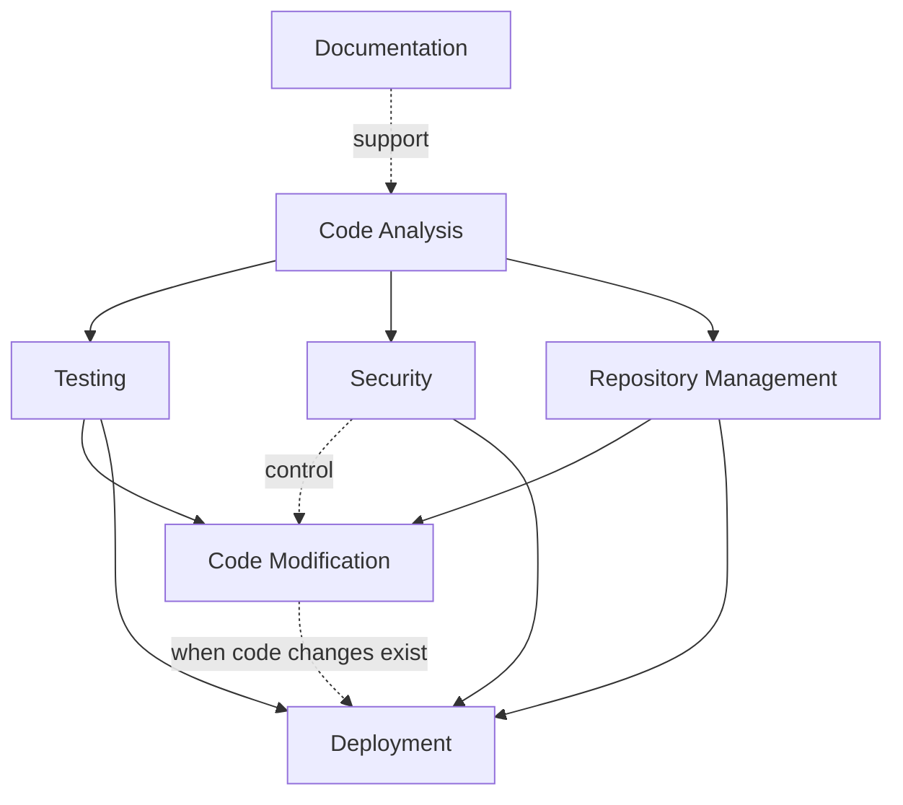
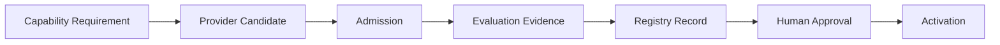

# Engineering Capability Roadmap & Priority Assessment

## 1. 目的与边界

本路线图把 [Engineering Capability Strategy](./ENGINEERING_CAPABILITY_STRATEGY.md) 转化为能力建设顺序、依赖与人类控制建议。它服务既有的 Layer 5 `Capability Governance` Module，不新增 Module，不定义任何具体 Provider，也不构成采购、安装、注册、选择、调用、激活或 Runtime 修改授权。

路线图中的优先级只用于决定“先定义和验证哪类 Capability Requirement”。每个具体 Provider Candidate 仍必须独立完成：

`Capability Requirement → Provider Candidate → Admission → Evaluation → Registry → Activation`

在未满足该链路前，Capability Registry Record 可以保持 `ABSENT`，不得写入 `ACTIVE`。

## 2. Capability Priority Framework

优先级按六项依据进行定性判断；任何 License、来源、权限、安全、兼容性或不可逆副作用红线均可阻断后续准入，不能由高价值抵消。

| 依据 | 判断问题 | 对优先级的影响 |
|---|---|---|
| 业务价值 | 是否直接提高交付质量、维护能力、可追溯性或研发复利？ | 高价值优先定义 Requirement |
| 自动化收益 | 是否能减少重复、低价值或易漏的人工步骤，同时保留质量？ | 收益高且可控者优先 |
| 风险 | 是否访问敏感数据、写入文件、改变 Git、执行代码或影响生产？ | 风险越高，越后进入受控评估 |
| 实现复杂度 | Contract、Adapter、隔离、回滚、兼容性与运维成本是否可控？ | 复杂度低且边界清晰者优先 |
| Human Control | 是否能以草案、只读、隔离或确认把副作用控制在可逆范围？ | 控制越明确，越适合前置 |
| Evidence 要求 | 是否可在不接入生产或真实 Provider 的条件下验证输入、输出、失败与审计合同？ | Evidence 越易闭环，越适合作为前序能力 |

`P0` 表示优先建立能力 Requirement 和受控评估设计，不表示自动执行；`P3` 表示需要更强前置能力、Evidence 与审批后再考虑。

## 3. Capability Priority Ranking

| 优先级 | Capability | 评估摘要 | 当前建议 |
|---|---|---|---|
| P0 | Documentation Capability | 高业务价值、低副作用、合同和 Evidence 易验证；可先限定为草案与一致性检查 | 首先定义权威来源引用、草案范围与保护规则 |
| P0 | Code Analysis Capability | 为理解、Review、测试定位与变更影响提供只读基础 | 首先定义只读范围、源码引用、Confidence 与盲区输出 |
| P1 | Testing Capability | 能把工程结论转化为可验证 Evidence，但需要隔离环境和测试数据治理 | 在只读分析基线后定义测试输入、环境、结果与失败合同 |
| P1 | Security Capability | 对高权限能力形成必要约束；自身不应成为放行权威 | 先定义发现、分级、升级与敏感数据边界 |
| P2 | Repository Management Capability | 增强可追溯性，但分支、Commit、Push、Merge 均有状态副作用 | 先读历史和差异；任何写入操作保留确认 |
| P2 | Code Modification Capability | 自动化收益高，但需要任务、设计、测试、Review 与回滚链完整 | 仅在分析、测试、仓库管理合同受控后提出 Candidate |
| P3 | Deployment Capability | 用户影响和环境风险最高，依赖完整交付、配置、安全与回滚治理 | 最后考虑；默认不具备可调用资格 |

Security Capability 同时是 P1 的独立能力和所有高权限能力的风险约束输入；它不因为优先级靠前而获得发布、审批或风险接受权。

## 4. Capability Dependency Analysis

### 4.1 依赖原则

- `Hard Dependency`：缺失时不得进入该能力的 Provider Evaluation 或 Invocation 设计。
- `Control Dependency`：能力可被设计，但高副作用调用必须等待该控制条件满足。
- `Support Dependency`：提高质量或 Evidence 完整度，不单独阻断低风险草案工作。

### 4.2 依赖矩阵

| Capability | Hard Dependency | Control Dependency | Support Dependency |
|---|---|---|---|
| Documentation | 权威来源与文档保护规则 | 人类确认（权威文档变更） | Audit / Knowledge 引用 |
| Code Analysis | 项目只读上下文与 Evidence Contract | 最小读取权限 | Documentation |
| Testing | 测试策略、隔离环境、测试数据边界 | Permission / Budget Guard | Code Analysis、Documentation |
| Security | 安全审查范围与发现升级合同 | 最小权限、敏感信息保护 | Code Analysis、Audit |
| Repository Management | Git Workflow、Audit、受控仓库范围 | 人类确认、回滚点 | Code Analysis、Security |
| Code Modification | Code Analysis、Testing、Task / Design 可追溯性 | Repository Management、Review、Approval、回滚 | Security、Documentation |
| Deployment | Delivery Readiness、Environment Spec、Testing、Security | Repository Management、Release / Delivery Gate、Mandatory Approval、回滚 | Code Modification（仅当交付物包含代码改动） |

## 5. Capability Maturity Roadmap

| 阶段 | 目标 | Capability 范围 | 验证重点 | 明确排除 |
|---|---|---|---|---|
| 阶段 1：低风险辅助能力 | 建立只读、草案和 Evidence 输出的最小闭环 | Documentation、Code Analysis；Testing / Security 的 Requirement 设计 | 合同稳定性、来源定位、权限收敛、审计完整性、Fallback | 文件写入、Commit、部署、生产数据与 Provider Activation |
| 阶段 2：受控工程能力 | 建立隔离验证、测试 Evidence 与受控变更准备 | Testing、Security、Repository Management；Code Modification 的受控 Candidate 设计 | 隔离环境、失败处理、预算、确认、Review、回滚与兼容性 | 自动 Commit / Merge、自动代码修改、生产部署 |
| 阶段 3：高权限执行能力 | 在所有 Gate 和 Evidence 完整后评估高副作用能力 | Code Modification、Deployment | 端到端权限、Gate、审批、版本、监控、停止、回滚与 Incident 处理 | 无审批执行、绕过 Gate、默认生产访问 |

每个阶段结束只产生“是否可进入下一阶段的设计或 Evaluation”判断，不自动提升某个 Capability 的 Registry Status。

## 6. Human Control Strategy

本路线图使用以下策略标签，并映射到 Runtime Human Control Model 的同等语义：

| 策略标签 | 含义 | Runtime 对应语义 |
|---|---|---|
| `AUTO` | 仅可作为未来低风险、可逆、无外部副作用的候选；当前不实现 | `AUTO_EXECUTE` 候选 |
| `NOTIFY` | 可在既定范围完成后报告 Evidence | `NOTIFY_AFTER` |
| `CONFIRM` | 执行前需要明确用户或授权人确认 | `CONFIRM_BEFORE` |
| `BLOCK` | 当前不允许选择或执行；必须先关闭前置缺口 | 不创建 Invocation Authorization |

| Capability | 默认策略 | 允许升级/降级的前提 |
|---|---|---|
| Documentation | `AUTO` 候选，仅限非权威草案；权威文档变更为 `CONFIRM` | 明确草案路径、无敏感数据、完整引用与审计 |
| Code Analysis | `NOTIFY` | 只读范围、最小权限、无敏感数据外泄；否则升级为 `CONFIRM` |
| Testing | `NOTIFY`，隔离条件不满足时 `CONFIRM` | 批准环境与数据边界、预算、失败处理完整 |
| Security | `CONFIRM` | 仅受控读取；敏感/生产范围保持或升级为强制审批 |
| Repository Management | `CONFIRM` | 只读查询可降为 `NOTIFY`；Commit / Push / Merge 不得降级 |
| Code Modification | `CONFIRM` | 需求、设计、测试、Review、回滚和范围全满足；当前不提供 AUTO 路径 |
| Deployment | `BLOCK` | 仅在 Delivery / Release Gate、Security、回滚与环境 Evidence 全满足后，才可提出 `CONFIRM` / Mandatory Approval 请求 |

`AUTO` 是未来控制候选而非当前授权；在不存在真实 Provider、Runtime 自动化和 Activation 的现状下，不会产生自动调用。

## 7. Provider Evaluation Entry

未来 Provider 只能从已定义的 Capability Requirement 进入，不能以“已有工具”或“某 Provider 可用”倒推系统能力边界：

进入 Provider Candidate 前必须至少有：

1. 对应的 Capability Contract、适用项目/阶段和非目标；
2. 明确风险、最小权限、人类控制、预算、Failure Model 与 Fallback；
3. 可评估的质量与 Evidence 要求；
4. 无法由既有 Capability 覆盖的缺口 Evidence。

Provider Candidate 的 Source、Version、License、Permission、Security、Cost、Maintenance 与 Compatibility 必须各自具备 Evidence。任何未知关键项均可导致 `REJECT_OR_DEFER`；没有该路径不得创建 `ACTIVE` Registry Record。

## 8. Evolution Interface

未来能力组合的优化遵循既有策略生命周期，而不是直接改变 Provider 或 Runtime：

| 动作 | Roadmap 触发信号 | 需要的最小输出 |
|---|---|---|
| Add / Adopt | 明确缺口、重复人工工作、缺少可验证的工程 Evidence | Requirement、替代比较、Admission 结论、评估计划 |
| Improve | 质量下降、成本上升、权限过宽、Incident 或兼容性变化 | 基线、改进假设、前后 Evidence、回滚与复评 |
| Merge | 合同重叠、消费者分散、维护成本重复 | 重叠分析、迁移计划、Fallback、历史追溯 |
| Deprecate | 安全风险、维护终止、不可接受成本或已验证替代 | 弃用理由、期限、迁移与选择限制 |
| Remove | 无消费者且权限、数据和依赖已退出 | Removal Evidence、权限撤销、Tombstone / 复盘 |

这些动作是未来 Phase 10 自我优化与简化的输入接口。任何动作仍需遵守 Capability Governance、Knowledge Evidence、项目 Gate 和人类最终决策。

## 9. 当前推荐下一步

推荐下一步是先建立 **Documentation Capability Requirement**：限定为非权威文档草案、来源引用、一致性检查与 Evidence 输出；不允许直接改写核心治理文件，也不创建具体 Provider Candidate。

该建议是路线图的 P0 Requirement 设计优先级，不是接入、安装、激活或调用任何工具的授权。
