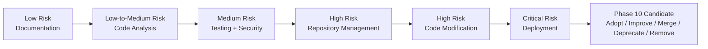

# Engineering Capability Strategy

## 1. 目的与边界

Engineering Capability 是 AI CTO 将已获授权的工程任务转化为可追溯结果时可能使用的一组能力合同。它的目标不是追求最多工具或最高自动化，而是以最小必要权限提升从想法到可交付、可维护产品资产的效率、质量与复利。

本策略属于既有的 Layer 5 `Capability Governance` Module，服务 Layer 3 的产品与工程活动，以及 Layer 4 的验证、交付和维护活动。它不新增 Module、Registry Record、Provider 评估、Capability Activation 或 Runtime 行为。

本策略只回答“未来需要什么工程能力、应以什么风险顺序建设”；不回答“使用哪个 Provider”。任何具体实现仍必须经过：

`Mission Alignment → Admission → Registry → Evaluation → Activation → Invocation Authorization`

因此，本文件中的优先级不是启动、采购、安装、调用或激活授权。

## 2. Engineering Capability 目标

AI CTO 未来的工程能力应支持以下结果：

1. 在不越权的前提下理解代码、文档、测试与变更影响。
2. 以明确输入、输出、失败边界与 Evidence 辅助工程决策和执行。
3. 在需求、设计、任务、提交、测试与发布之间保持可追溯性。
4. 通过可替换的合同积累工程资产，避免 AI CTO Core 依赖单一 Provider。
5. 让高副作用操作保留人类审批、Gate、审计、停止和回滚边界。

Engineering Capability 不拥有项目价值判断、架构基线、生命周期 Gate、发布授权或 ACTIVE Knowledge 写入权；这些权威分别保留在既有治理、工程、运营和知识模块。

## 3. Capability 分类与合同需求

| Capability 类别 | 目标与典型工作 | 最小 Contract 需求 | 非目标 |
|---|---|---|---|
| Code Analysis Capability | 代码理解、结构分析、依赖与变更影响分析、只读 Review | 只读输入范围、分析结论、来源定位、Confidence、Evidence、已知盲区 | 不修改文件、不推进 Workflow、不替代架构决策 |
| Documentation Capability | 生成、维护、校验 PRD、设计、运行与交付文档 | 文档范围、权威来源引用、变更建议、冲突提示、Evidence | 不直接改写 Manifesto、ADR、Master Plan 或 Gate 结论 |
| Testing Capability | 设计、执行、分析 Unit / Integration / Regression 等测试 | 测试目标、环境、数据边界、结果、失败输出、覆盖与 Evidence | 不把测试通过等同于发布授权 |
| Code Modification Capability | 生成受限修改建议或经批准的代码变更 | Task / Design 引用、拟变更范围、Diff / Proposal、验证要求、回滚建议、Evidence | 不自行写入、提交、发布或绕过 Review / Approval |
| Repository Management Capability | 分支、提交、差异、历史和变更管理 | Repository Scope、操作类型、变更清单、Git Evidence、回滚点 | 不推送、合并、删除历史或变更治理文件而未获授权 |
| Deployment Capability | 构建、部署、环境检查、回滚辅助 | Environment Spec、配置引用、部署计划、版本、验证与回滚 Evidence | 不替代 Release / Delivery Gate 或直接触达生产环境 |
| Security Capability | 密钥、权限、供应链、配置和代码风险检查 | 扫描范围、数据处理边界、发现分级、误报说明、Evidence、升级路径 | 不以单次扫描取代 Security Review 或风险接受决策 |

所有类别都必须以 Provider 无关的合同描述 Input、Output、Permission、Budget、Failure Model、Evidence、Compatibility、Fallback 与 Replacement。合同不得把产品、模型、CLI、SDK、MCP 或仓库名称当作能力定义本身。

## 4. 风险、权限、人类控制与 Evidence

下表定义未来候选能力的默认最低治理要求。实际项目应根据数据敏感度、环境、可逆性和权限扩大要求上调控制等级。

| Capability 类别 | 默认风险 | 最小权限 | 默认 Human Control | 最低 Evidence 要求 |
|---|---|---|---|---|
| Documentation | Low | 指定文档的受限读取；输出草案写入需受控路径 | `CONFIRM` 用于权威文档变更；仅生成草案可 `NOTIFY_AFTER` | 输入来源、变更建议、冲突/限制、时间戳 |
| Code Analysis | Medium | 指定项目的只读文件与依赖元数据 | `NOTIFY_AFTER`；涉及敏感代码或扩大范围时 `CONFIRM` | 文件/版本引用、分析方法、结论、Confidence、盲区 |
| Testing | Medium | 隔离测试环境、批准的测试数据与日志 | 安全隔离测试可 `NOTIFY_AFTER`；生产数据/环境必须 `MANDATORY_APPROVAL` | Test Case、环境、数据边界、结果、失败日志、覆盖范围 |
| Security | Medium | 受限读取配置、依赖与日志；不得读取未授权 Secret 值 | `CONFIRM`；涉及敏感数据或生产环境必须 `MANDATORY_APPROVAL` | 扫描范围、规则/版本、发现、误报判断、升级记录 |
| Repository Management | High | 指定仓库与分支；操作细分到 read / branch / commit / push | 读取可 `NOTIFY_AFTER`；创建分支、Commit、Push、Merge 均 `CONFIRM` 或更高 | 前后 Git 状态、操作清单、Commit / Diff 引用、回滚点 |
| Code Modification | High | 仅批准的项目、文件范围与可写工作区 | `CONFIRM`；跨模块、高影响或不可逆改动 `MANDATORY_APPROVAL` | Requirement / Design / Task 引用、Diff、测试、Review、回滚方案 |
| Deployment | Critical | 明确环境、最小凭据引用和受控发布权限 | `MANDATORY_APPROVAL` | 环境规格、配置版本、发布计划、验证、监控与回滚 Evidence |

`AUTO_EXECUTE` 不属于本策略任何类别的默认路径。未来若提出低风险自动模式，必须先经 Risk Evaluation、适用范围、停止机制、审计与独立批准；其存在不改变既有 Gate。

## 5. 优先级评估

优先级采用定性排序，综合使命价值、风险、建设复杂度与可获得的自动化收益。风险、Evidence 缺口或 Gate 不得由价值抵消。

| 顺位 | Capability 类别 | 价值 | 风险 | 建设复杂度 | 自动化收益 | 建议 |
|---:|---|---|---|---|---|---|
| 1 | Documentation | High | Low | Low | High | 先定义草案、引用和权威文档保护合同 |
| 2 | Code Analysis | High | Medium | Medium | High | 先限于只读分析与 Evidence 输出 |
| 3 | Testing | High | Medium | Medium | High | 先在隔离环境验证测试设计与结果合同 |
| 4 | Security | High | Medium | Medium | Medium | 先作为发现与升级辅助，不作为放行权威 |
| 5 | Repository Management | High | High | Medium | Medium | 先读、再分支，Commit / Push / Merge 保持确认 |
| 6 | Code Modification | High | High | High | High | 必须绑定 Task、Review、测试和回滚后再评估 |
| 7 | Deployment | High | Critical | High | Medium | 最后接入，且只在交付/发布 Gate 之后评估 |

排序仅定义建设与评估顺序。某个候选若来源、License、权限、安全、成本、维护或兼容性 Evidence 不足，应输出 `REJECT_OR_DEFER`，而非因类别优先而进入 Activation。

## 6. Provider 无关设计原则

每个未来 Engineering Capability Candidate 必须回答：

1. **Purpose：** 它解决哪一类工程任务，服务哪个 Layer / Lifecycle Context？
2. **Contract：** 输入、输出、状态、错误和 Evidence 是否可以被替换实现稳定消费？
3. **Permission：** 最小权限是否可被表达、检查、收回和审计？
4. **Control：** 风险控制是 `NOTIFY_AFTER`、`CONFIRM` 还是 `MANDATORY_APPROVAL`？
5. **Budget：** Token、时间、工具次数、成本和重试上限是什么？
6. **Compatibility：** 是否与 Capability Adapter、Audit、Permission / Budget Guard、Workflow 及现有 Gate 兼容？
7. **Fallback：** 候选不可用、失败或被弃用时，可退回人工、已有能力或其他已批准的替代合同吗？

Provider 是 Candidate 的来源属性，而不是 AI CTO Core 的依赖。任何 Provider 变化、版本变化或权限扩大都必须触发重新 Evaluation；不得通过 Adapter 名称掩盖不可替换的 Core 依赖。

## 7. Capability 建设与简化生命周期

以下五个动作用于未来能力组合的策略治理，和 Capability Registry 的 `DISCOVERED`、`EVALUATING`、`ACTIVE`、`DEPRECATED`、`DISABLED`、`REMOVED` 状态分开记录：

| 策略动作 | 目的 | 进入条件 | 必须保留的治理结果 | 禁止事项 |
|---|---|---|---|---|
| Adopt | 在确有能力缺口时引入一个新的 Candidate 或合同 | 使命对齐、现有能力无法覆盖、可定义合同与风险边界 | 缺口 Evidence、替代比较、准入结论、最小评估计划 | 因流行、单一 Provider 或临时需求直接激活 |
| Improve | 提升已存在能力的质量、权限收敛、成本或 Evidence | 有明确缺陷、Incident、成本/质量趋势或兼容性变化 | 基线、改进假设、前后 Evidence、回滚与复评结论 | 用新版本覆盖旧 Evidence 或绕过复评 |
| Merge | 合并重复、重叠或难以维护的能力合同 | 目的、输入输出与风险边界可证明重叠；迁移可逆 | 比较矩阵、消费者影响、迁移与 Fallback、旧记录追溯 | 以“统一”为由扩大权限或丢失审计历史 |
| Deprecate | 停止新增选择，给出迁移窗口 | 维护中止、成本失控、质量下降、安全风险或更优替代已验证 | 弃用原因、替代路径、迁移期限、选择限制 | 静默停用仍被依赖的 Capability |
| Remove | 从可用组合中移除已完成退出的能力 | 无剩余消费者、数据/凭据/访问已清理、历史仍可追溯 | Removal Evidence、Tombstone / 历史引用、权限撤销、复盘 | 删除历史 Evidence、绕过依赖与数据清理 |

这套生命周期为未来 Phase 10 的自我优化与简化提供候选输入，但不授权 Phase 10、不自动修改 Capability Registry，也不改变当前任何 Capability 的状态。

## 8. 推荐路线

每一步都应先采用只读、草案、隔离或 Mock 验证，再决定是否提出具体 Candidate。推荐路线不允许跳过 Capability Governance，也不允许在没有真实 Evidence 时将任何候选写入 `ACTIVE`。

## 9. 当前结论

- AI CTO 已有 Capability Governance、Runtime Adapter 合同、Permission / Budget Guard 与 Audit 基线，但这些不等于某项 Engineering Capability 已可用。
- 当前 Codex Capability Registry Record 仍为 `ABSENT`，Admission 为 `REJECT_OR_DEFER`，Selection 为 `PROHIBITED`，Activation 为 `NONE`；本策略不改变该结论。
- 本策略不评估、选择或比较任何具体 Provider，也不创建真实工具接入、Provider Artifact、Runtime 代码或 Capability Record。
