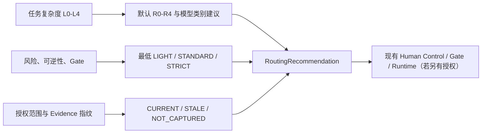

# Execution Profile & Evidence Freshness Standard

## 定位

本标准落实 ADR-0032，在既有 Layer 5 `Execution Routing Governance` 内提供确定性、只读的建议服务。它把调用方提供的任务特征和 Evidence 快照转换为 `RoutingRecommendation`，但不拥有执行、模型、工具、权限、审批或项目 Gate 权威。

实现入口：

- `runtime/routing/execution-routing-contract.ts`
- `runtime/routing/evidence-freshness-service.ts`
- `runtime/routing/execution-profile-policy.ts`
- `runtime/routing/advisory-execution-router.ts`

## 决策关系

## Execution Profile

| Profile | 含义 | 默认验证义务 |
|---|---|---|
| `LIGHT` | L1、低风险、可逆、无适用 Gate 的局部任务 | `TARGETED` |
| `STANDARD` | 常规工程或设计任务 | `CHANGE_IMPACT_AND_TARGETED` |
| `STRICT` | L4、关键风险、不可逆或触及现有 Gate | `FULL_GATE` |

复杂度决定默认 Reasoning：L0–L4 分别对应 R0–R4。风险不会虚增 Reasoning；一个简单但不可逆的任务仍可保持 R1，同时升级为 `STRICT`。模型字段仅返回 `NONE / FAST / STANDARD / HIGH_REASONING / CODE` 类别建议，不选择或调用具体模型。

## Evidence Freshness

每次判断只比较调用方明确传入的相关 `scopeRefs` 与 `fingerprint`：

- 范围和指纹一致：`CURRENT`；
- 已捕获的相关范围或指纹变化：`STALE`；
- 任一侧未提供可比较指纹：`NOT_CAPTURED`。

服务不得读取文件、扫描目录、执行 Git 或访问网络。非必需但过期的 Evidence 只提高验证义务；当任务明确要求当前 Evidence 时，任何非 `CURRENT` 结果都必须输出 `ESCALATE_FOR_REVIEW`、`STRICT` 和 `FULL_GATE`。

## 输出与 Evidence

`AdvisoryExecutionRouter` 返回：

- Routing Decision；
- Profile、R0–R4、模型类别建议与验证义务；
- Evidence Freshness 结果与升级条件；
- 一条 `confidence: L2` 的路由 Evidence；
- “不创建执行授权”的明确 Limitations。

L2 只表示确定性政策判断有实现证据，不证明真实模型质量、任务执行成功或项目 Gate 已通过。

## 强制边界

- `AdvisoryExecutionRouter` 只返回建议和 L2 路由 Evidence。
- `EvidenceFreshnessService` 只比较传入范围与指纹；没有文件、Git 或网络访问。
- `LIGHT` / `STANDARD` / `STRICT` 不替代任何 Gate、Approval、Permission 或 Human Control。
- 推荐的 `SuggestedModelCategory` 不会触发实际模型选择或调用。
- 不调用 `AuditService` 或 Repository，不持久化结果，不改变 Workflow、Task、Agent 或 Capability 状态。
- 不创建 `AUTO_EXECUTE`、Capability Activation、Tool Invocation 或 Git 操作。

## Development Gate

结果：`APPROVED_FOR_TESTING`。

依据：合同、Freshness、Profile Policy 与组合服务已通过 9 项目标测试和全量回归；范围扫描未发现文件系统、网络、模型、工具、Audit Repository 或 Workflow 依赖。该结果只允许继续验证建议服务，不授权真实模型/工具接入、自动切换或执行。
