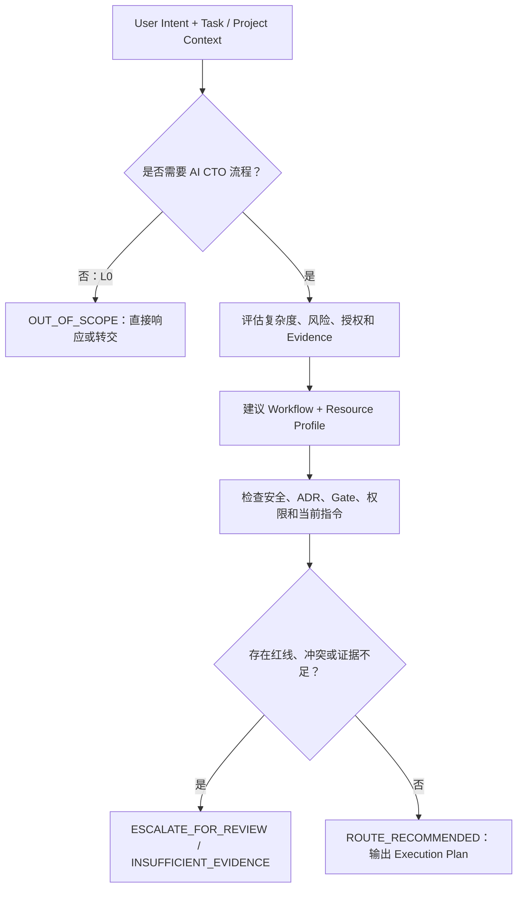

# Execution Routing Governance Standard

## 目的

Execution Routing Governance 让 AI CTO 在未来运行时为一个任务生成可审计的 **Execution Plan**：判断是否应进入 AI CTO 流程，以及建议采用的 Workflow、Capability、Skill、Tool、Model 类别、Reasoning Budget 和 Context Scope。目标是以最低充分资源满足质量、安全、可追溯与用户意图，而不是最大化调用能力。

## 职责边界

Execution Router **只负责决策如何执行，不负责执行**。它不得调用模型、Skill、Tool、Git、MCP 或外部服务；不得修改 Codex 行为、自动切换模型、提交 / 合并代码或绕过人工决策。

它不替代：

- Layer 2 的价值、优先级、投资和项目决策；
- Layer 3 的设计、工程任务和 Review；
- Layer 4 的 Lifecycle、Security、Testing、Release 或其他 Gate；
- Capability Governance 的准入、Registry、激活和权限判断；
- 用户对风险、资源投入、生产变更的最终决定。

## 输入

| 输入 | 最低内容 | 限制 |
|---|---|---|
| User Intent | 请求目标、期望结果、当前授权 | 当前用户指令优先于历史偏好。 |
| Task Context | 任务类型、影响对象、风险、可逆性、质量要求、已知证据 | 缺失或冲突信息必须提高不确定性或升级处理。 |
| Project Context | 生命周期阶段、Project Memory、相关 ADR / Gate、技术与数据约束 | 只加载当前任务相关部分。 |
| Optional Evidence | 历史 Execution Case、Capability / Knowledge、成本与质量数据 | Evidence 不足时不得伪造或自动放宽约束。 |

## 输出：Execution Plan

每个建议性 Execution Plan 至少包含：

| 字段 | 说明 |
|---|---|
| Routing Decision | `OUT_OF_SCOPE`、`ROUTE_RECOMMENDED`、`ESCALATE_FOR_REVIEW` 或 `INSUFFICIENT_EVIDENCE`。 |
| Complexity | L0–L4 与判断依据。 |
| Workflow | Instant、Engineering 或 CTO Workflow，或不进入 AI CTO 流程。 |
| Capability / Skill / Tool | 所需类别、必要性和权限前提；不代表调用。 |
| Model / Reasoning | 模型类别、R0–R4 预算与质量 / 成本理由；不代表自动选择。 |
| Execution Profile | `LIGHT`、`STANDARD` 或 `STRICT` 的建议性执行/验证强度；不代表执行授权。 |
| Context Scope | 最小上下文集合、排除项和加载理由。 |
| User Preference Application | 已应用、未应用或冲突，及理由。 |
| Evidence / Confidence | 事实来源、`CURRENT / STALE / NOT_CAPTURED`、可信度和适用范围。 |
| Escalation Conditions | 触发更高复杂度、人工审批或现有 Gate 的条件。 |

## 决策顺序

## 强制约束

1. 采用最小充分 Workflow、Skill、Tool、Model、Reasoning 与 Context；不能因“流程完整”扩大资源使用。
2. 安全、权限、ADR、项目 Gate、License、数据边界和当前用户指令是不可抵消约束；用户偏好或效率目标不能覆盖它们。
3. 低复杂度建议不构成跳过设计、测试、审查或发布门禁的授权。
4. 无法证实的 Duration、Token、成本、质量或调用次数标为 `NOT_CAPTURED`。
5. 路由建议必须可解释、可复核、可撤销；当前只读实现不创建执行、模型切换、工具调用或自动化能力。

## 当前只读实现

[Execution Profile & Evidence Freshness Standard](./EXECUTION_PROFILE_EVIDENCE_FRESHNESS_STANDARD.md) 定义确定性 `AdvisoryExecutionRouter`：L0–L4 决定默认 R0–R4，风险、可逆性和 Gate 决定最低 Profile，调用方提供的相关范围与指纹决定 Evidence Freshness。实现只返回建议与 L2 Evidence；不读取文件/Git/网络，不调用模型/工具，不持久化，也不改变任何 Runtime 状态。

## 与 EFF-001 的关系

[EFF-001](./execution_cases/EFF-001-phase-8-4-route-sync-review.md) 提供“低复杂度治理同步可能经历高复杂度流程”的单案例信号。它只支持建立路由治理和继续收集 Evidence，不能直接成为默认 Workflow、模型、Git 策略或自动化规则。
