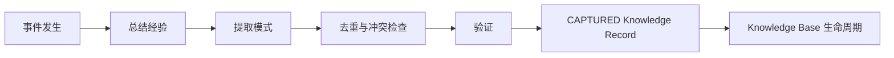

# Knowledge 提取标准

## 1. 触发事件

至少在以下事件完成后评估是否提取 Knowledge：

- 项目 Release、阶段结束、Retirement 或 Existing Project Onboarding 完成；
- Bug 验证关闭、重大 Incident 永久修复或 Postmortem 完成；
- Evolution Proposal 验证完成；
- 架构、工程、Agent、Prompt、数据或业务假设得到验证或证伪；
- 同类问题重复出现，形成可复用模式。

事件发生不代表一定产生 Knowledge。一次性事实、没有复用价值或无法合法保存的内容保留在原项目记录中。

## 2. 提取流程

Knowledge 进入根 `knowledge_base/` 时初始状态为 `CAPTURED`，不能因来源项目成功直接标记 `ACTIVE`。

## 3. 强制内容

禁止只保存结果。每项提取至少包含：

| 内容 | 必须回答 |
|---|---|
| 背景 | 在什么项目、用户、技术、时间、规模和约束下发生 |
| 问题 | 需要解决什么、表现和影响是什么 |
| 原因 | 直接原因、根因、促成因素和未知项是什么 |
| 解决方案 | 采取了什么动作、为什么选择、替代方案是什么 |
| 适用条件 | 哪些前提、版本、环境、规模和组织条件必须成立 |
| 限制 | 哪些场景不适用、风险、代价和未解决问题是什么 |

同时记录结果指标、Evidence、反例、失败尝试、复现 / 验证、Confidence、Source Project、相关 ADR / Bug / Commit / Test / Incident、Owner、时间和 License / 隐私边界。

## 4. 从不同事件提取

### 项目结束

比较目标、计划和实际结果，提取有效路径、关键权衡、失败、资产复用效果、维护成本和未完成假设。不能只复制 Project Memory 摘要。

### Bug 解决

保存症状、环境、复现、根因、失败诊断、最终修复、Test Evidence、防复发和相似但不同问题。临时 Workaround 不得冒充永久 Solution。

### Evolution 完成

比较旧基线、Proposal、实施、回滚、用户结果、AI 能力、成本和长期观察，明确哪些改善可推广、哪些只对当前项目有效。

## 5. Pattern 提取

Pattern 必须把单次事件抽象为可判断的条件与行为：

`Context + Problem + Forces → Pattern / Decision → Expected Result + Trade-offs + Failure Modes`

抽象不能删除决定成败的环境、规模、版本或组织约束。只有单一事件时 Evidence 通常最高为 L3，不能宣称多项目通用。

## 6. 去重、冲突与隐私

提取前检索相同问题、模式、结论和来源。重复内容应更新 Evidence 或建立关系，不创建换名副本。冲突内容执行 [Knowledge Conflict Resolution](./KNOWLEDGE_CONFLICT_RESOLUTION.md)，不覆盖旧记录。

用户数据、密钥、个人信息、商业机密、受限代码和第三方内容必须脱敏并确认许可。无法安全提取时只保存受控引用、Hash、摘要或不进入 Knowledge Base。

## 7. Extraction Record

记录 Event ID、Source Project、Trigger、Candidate Title / Type、Background、Problem、Cause、Solution、Applicability、Limitations、Evidence、Confidence、Related Knowledge、Duplicate / Conflict Result、Privacy / License、Owner、Status `CAPTURED` 和 Next Validation Action。
