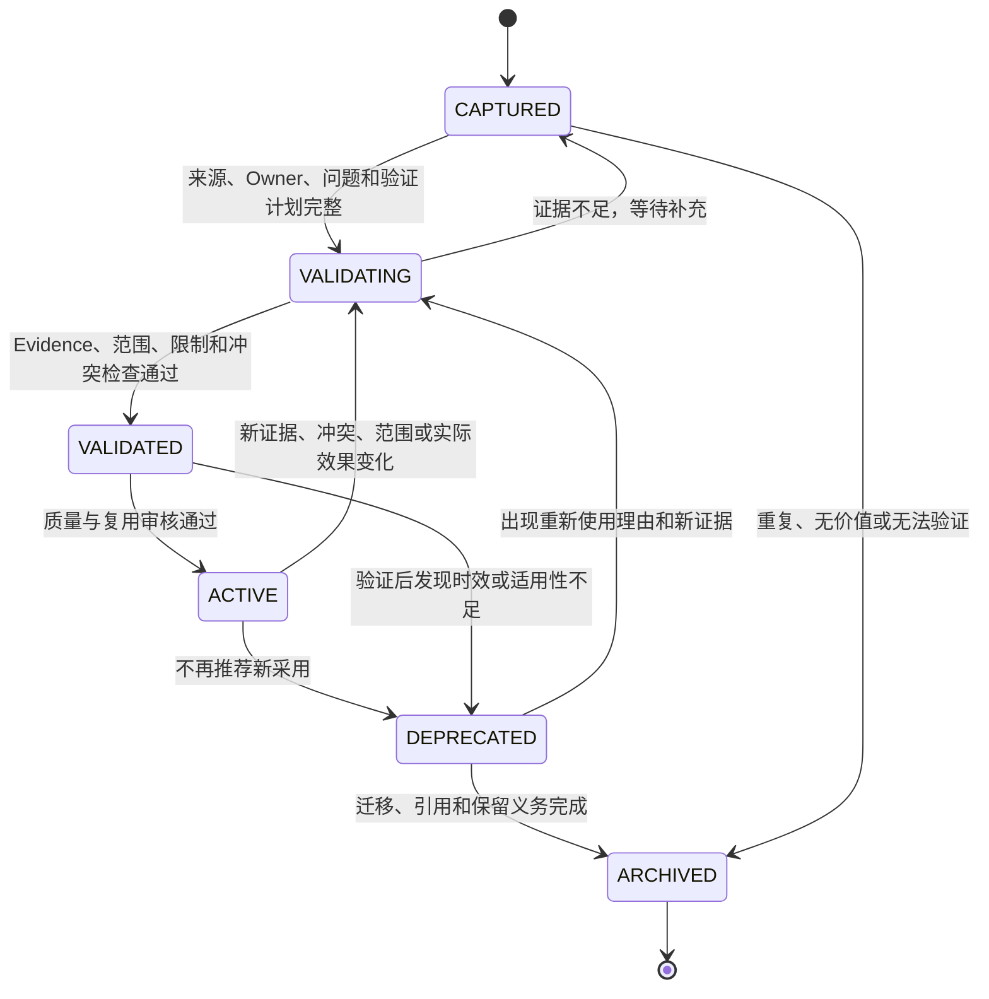

# Knowledge 生命周期标准

## 1. 状态定义

| Status | 定义 | 可否用于项目决策 |
|---|---|---|
| `CAPTURED` | 刚产生的候选知识，内容和来源已记录但未验证 | 否，只能作为调查线索 |
| `VALIDATING` | 正在核验准确性、因果、范围、冲突和复现 | 否，除非明确标记实验性输入 |
| `VALIDATED` | 已达到声明 Evidence Level，内容可信但尚未批准为常规复用资产 | 可参考，不作为默认规则 |
| `ACTIVE` | 已完成质量、范围、冲突和 Owner 审核，可在记录场景中复用 | 是，仍须验证当前项目适用性 |
| `DEPRECATED` | 因新 Evidence、技术变化、风险或更优知识而不推荐新采用 | 仅用于历史、迁移或明确例外 |
| `ARCHIVED` | 已退出日常使用，保留历史、审计和冲突证据 | 否 |

状态词汇封闭。`Candidate`、`Provisional`、`Draft`、`Approved` 或 `Superseded` 不能作为 Knowledge Status；候选性质、可信度和关系分别记录在 Evidence、Confidence 和 Relation 中。

## 2. 状态转换

## 3. 进入条件

- `CAPTURED`：背景、问题、来源、初始结论、创建时间和 Owner 已记录。
- `VALIDATING`：验证问题、方法、Evidence 目标、反例、适用范围和完成条件明确。
- `VALIDATED`：事实 / 推断分离，Evidence 可复核，因果和限制明确，冲突已处理，Confidence 已评定。
- `ACTIVE`：Quality Score 达到目标用途要求，Owner 和复核日期存在，Knowledge Registry 完整，无未解决高影响冲突；规范性技术知识通常至少达到 L3。
- `DEPRECATED`：替代知识、停止采用原因、受影响消费者、迁移方案和截止时间明确。
- `ARCHIVED`：状态历史、关系、引用、消费者、数据 / License 和恢复边界已关闭。

## 4. 退回与失效

新项目失败、反例、技术版本变化、来源撤回、指标下降、冲突或超过 Review Date 时，`ACTIVE` Knowledge 必须回到 `VALIDATING` 或转为 `DEPRECATED`。禁止为了维持推荐状态忽略负面 Evidence。

知识内容修订不能静默覆盖旧结论。保留 Change History、旧 Evidence、旧适用范围、状态变化原因和受影响项目。

## 5. 使用结果回流

每次重要复用记录 `ADOPT`、`ADAPT`、`REFERENCE_ONLY` 或 `REJECT`、目标项目、修改、结果、失败和新 Evidence。成功复用可能提高 Validation Depth；失败、范围不匹配或负面效果必须触发 `VALIDATING` 或 Conflict Resolution。
