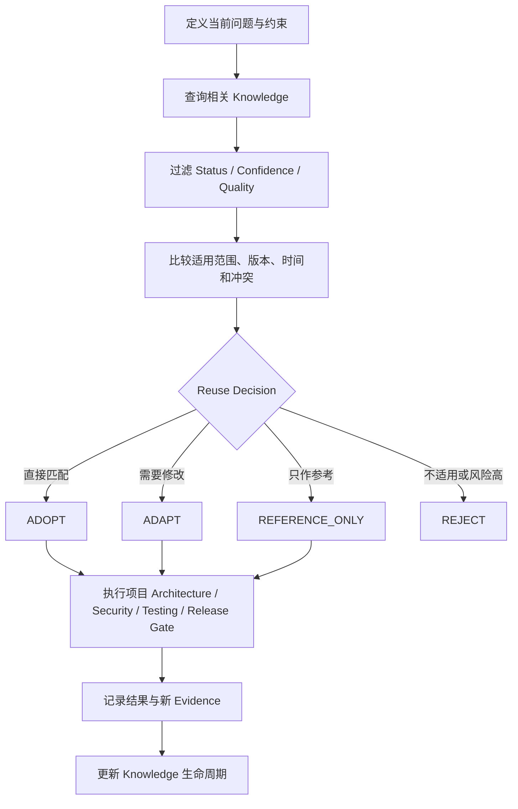

# Knowledge 复用标准

## 1. 何时查询 Knowledge

AI CTO 在形成方案或执行重大判断前，应按当前问题检索 Knowledge Base：

| 阶段 / 事件 | 优先查询 |
|---|---|
| IDEA / EVALUATION | Business Insight、Project Experience、Decision Record、Failure Experience |
| RESEARCH | Project Experience、Business Insight、Decision Record |
| DESIGN | Architecture Pattern、Agent Pattern、Prompt Pattern、Decision Record |
| DEVELOPMENT | Engineering Pattern、Bug Solution、Failure Experience |
| TESTING | Engineering Pattern、Bug Solution、Failure Experience、Prompt / Agent Pattern |
| RELEASE / MAINTENANCE | Project Experience、Bug Solution、Failure Experience、Decision Record |
| Bug / Incident | Bug Solution、Failure Experience、Engineering / Architecture Pattern |
| EVOLUTION | Project Experience、Decision Record、Failure Experience、Business Insight、全部受影响 Pattern |

查询范围必须包括支持和反对当前方案的 Knowledge，不能只搜索期望结论。

## 2. 复用流程

## 3. 候选过滤

- `ACTIVE`：可以成为复用候选，但必须检查当前范围。
- `VALIDATED`：可参考或受控验证，不作为默认规则。
- `CAPTURED` / `VALIDATING`：只用于 Research、提出假设或设计实验。
- `DEPRECATED`：不得用于新采用，除非明确的历史兼容例外获批准。
- `ARCHIVED`：只用于历史和审计。

L1 / L2、50–69 分、过期、存在未解决冲突或范围不匹配的 Knowledge 不能成为强制决策依据。

## 4. 适用性检查

复用前至少比较：用户与业务目标、规模和负载、数据和一致性、技术与版本、团队能力、部署环境、安全与合规、成本、时间、失败容忍、维护周期和退出路径。

“同一数据库”“同一框架”或“过去成功”不是充分匹配。任何决定性差异都必须降低当前 Confidence、选择 `ADAPT / REFERENCE_ONLY / REJECT` 或创建验证任务。

## 5. 不可绕过的 Gate

Knowledge Reuse 不能跳过或替代：

- 当前项目 Architecture 与 ADR；
- Security Review、权限、隐私和 License；
- Test Plan、TDD、Regression 和适用 AI Evaluation；
- Development、Testing、Release 和 Deployment / Rollback Gate。

Knowledge 记录中的旧批准、测试或发布证据只证明旧基线，不能授权当前项目。

## 6. Reuse Record

重要复用至少记录：Target Project / Requirement、Knowledge ID / Version、Status、Evidence Level / Confidence、Quality Score、Scope Match、Conflicts、Reuse Decision、Adaptation、Affected Architecture / Security / Tests、Human Decision、Result、Metrics、Failures 和 New Evidence。

实际结果回写 Knowledge，但不静默改写原结论。成功和失败都可能触发重新验证、范围拆分、Quality 更新、Confidence 升降或 Deprecated。
