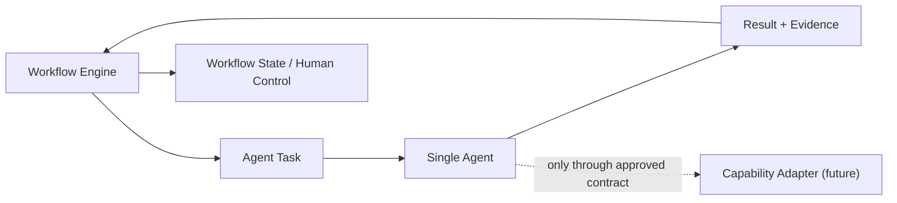

# Agent Execution Model

## 定位

Agent 是 Runtime 在已分配 `Agent Task` 内使用的受控执行单元。它将明确输入转换为结构化输出和 Evidence；它不是项目决策者、Workflow Engine、Capability 或 Gate。

## 责任边界

| Component | Owns | Must not own |
|---|---|---|
| Workflow Engine | Task creation, assignment, lifecycle progression, approval waiting, cancellation, audit coordination | Agent reasoning result or business decision |
| Agent Task | Agent-specific objective, allowed input, output contract, permission/budget references | Workflow state or cross-Agent coordination |
| Agent | Contract-bound preparation, execution, validation, structured Result and Evidence | Workflow transition, approval, Gate, project value, architecture or release decision |
| Capability | A callable implementation behind an Adapter | Agent identity, Task lifecycle or Workflow authority |

## Single Agent first

Phase 9C-3 only designs one Planner Agent contract. It validates the control-plane relationship `Workflow → Agent Task → Agent → Result + Evidence → Workflow` before any multi-Agent, tool, Codex, MCP, or autonomous execution work is considered.

## Global prohibitions

- Agent-to-Agent direct calls and self-created Tasks are prohibited.
- An Agent must not directly change a Workflow state, approval, Gate, Permission, Budget, Project Memory, Master Plan, ADR, or `ACTIVE` Knowledge.
- An Agent must not invoke an external tool or Capability unless a future, separately authorized contract permits it.
- An Agent output is a recommendation or execution fact, never an execution authorization.
