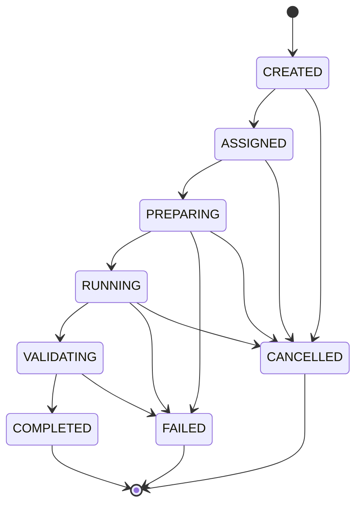

# Agent Lifecycle Model

## States

| State | Meaning |
|---|---|
| `CREATED` | Workflow Engine created an Agent Task and contract; no Agent has started work. |
| `ASSIGNED` | Workflow Engine assigned the contract to one Agent type. |
| `PREPARING` | Agent validates input, context, permission, budget, and control mode. |
| `RUNNING` | Agent performs only the authorized task reasoning. |
| `VALIDATING` | Agent validates that its own output matches the output contract and Evidence requirement. |
| `COMPLETED` | A contract-valid Result + Evidence was returned to Workflow Engine. |
| `FAILED` | The Agent could not produce a valid result; failure evidence was returned. |
| `CANCELLED` | Workflow Engine or human cancellation stopped the Agent Task. |

## State machine

## Transition rules

1. Only the Workflow Engine creates, assigns, cancels, or records an Agent lifecycle transition.
2. The Agent may report readiness, result, or failure facts; it must not write lifecycle state itself.
3. Missing/unauthorized input, denied Permission/Budget, or an invalid output contract prevents `RUNNING` or `COMPLETED`.
4. `COMPLETED`, `FAILED`, and `CANCELLED` are terminal for one Agent Task attempt.
5. A retry is a Workflow Engine decision that creates a separately auditable new attempt within the approved retry budget; it is not an Agent self-loop.
