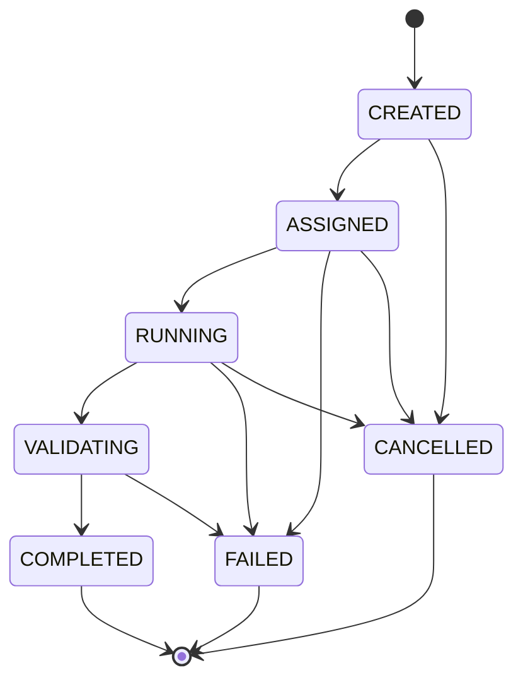

# Agent Runtime Lifecycle

## Persisted implementation states

Phase 9C-4 uses the following persisted AgentTask states. The Phase 9C-3 conceptual `PREPARING` checks are implemented as preflight validation while an AgentTask is `ASSIGNED`; this does not change Workflow lifecycle authority.

| State | Meaning |
|---|---|
| `CREATED` | AgentTask exists but has not been assigned. |
| `ASSIGNED` | Workflow selected `PLANNER`; preflight checks run before invocation. |
| `RUNNING` | Planner port is executing its local deterministic calculation. |
| `VALIDATING` | Runtime validates result schema, plan version, Evidence, Permission/Budget outcome, and planner boundary. |
| `COMPLETED` | Valid proposed Execution Plan + Evidence accepted by Runtime. |
| `FAILED` | Input, authorization, adapter, or validation failure recorded. |
| `CANCELLED` | Workflow/human cancellation stopped the AgentTask. |

## Transition ownership

- Agent Runtime domain service performs AgentTask transitions after receiving facts from the Port.
- Workflow Engine alone performs Workflow transitions, including `PLANNING → WAITING_APPROVAL`.
- `COMPLETED`, `FAILED`, and `CANCELLED` are terminal for an attempt. There is no Agent self-retry or automatic restart.
