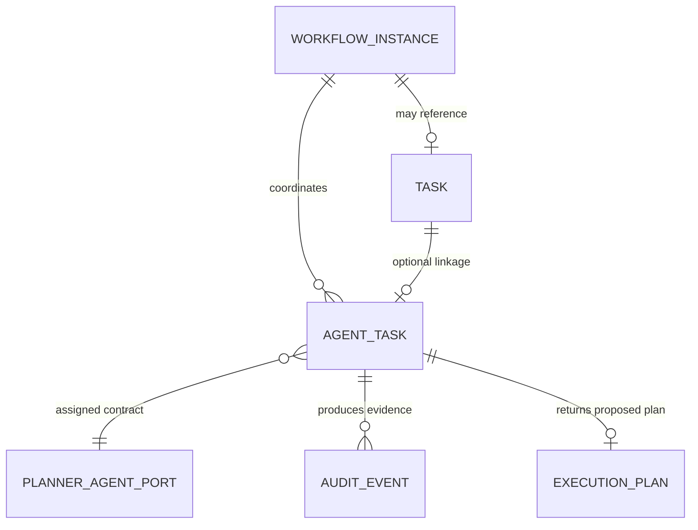

# Agent Task Model

## Entity

`AgentTask` is the execution contract for one Agent attempt. It is separate from the existing generic `Task`: generic `Task` remains responsible for the Runtime Foundation's task input/output, while `AgentTask` adds Agent identity, Agent lifecycle, authorization, budget, and agent-specific evidence.

| Field | Type / value | Purpose |
|---|---|---|
| `agent_task_id` | Identifier | Unique AgentTask identity. |
| `workflow_id` | Workflow reference | Parent Workflow. |
| `task_id` | Generic Task reference | Optional association to the existing Runtime Task; not a duplicate Workflow owner. |
| `agent_id`, `agent_type` | Identifier / `PLANNER` | Assigned Agent contract. |
| `input` | `PlannerExecutionInput` | Explicit request, intent, context, and constraints. |
| `output` | `PlannerAgentResult` | Result or bounded failure. |
| `status` | Agent lifecycle state | Current AgentTask lifecycle state. |
| `permission_scope` | Permission snapshot | Allowed/denied actions and expiry. |
| `budget_scope` | Budget snapshot | Token, time, tool, cost, and retry limits. |
| `control_mode` | `CONFIRM` | Human-control mode for this Planner MVP. |
| `evidence` | Evidence collection | Agent-provided and Runtime-produced Evidence. |
| `created_at`, `updated_at` | Timestamp | Traceability. |

## Relationship rules

Phase 9C-4 permits only one Planner AgentTask per Workflow planning attempt. It does not introduce multi-Agent dependencies or change the Runtime Foundation's one generic Task constraint.

## Invariants

1. AgentTask is created and updated only by an Agent Runtime domain service through its repository Port.
2. `agent_type`, Permission, Budget, and input references are immutable once `RUNNING` begins.
3. A `COMPLETED` Planner AgentTask contains exactly one `ExecutionPlan` with `status: PROPOSED`.
4. An AgentTask Result cannot include a Workflow state command or a Capability invocation.
5. Evidence is append-only in Audit; it is not an automatic Knowledge write.
