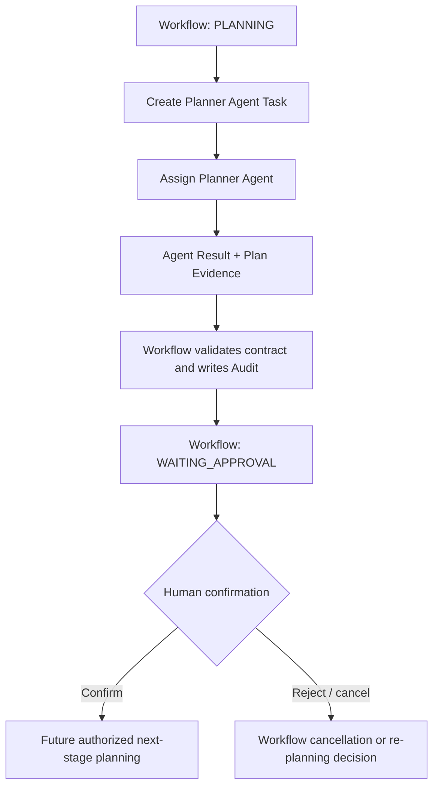

# Agent Workflow Integration

## Control relationship

The Workflow Engine remains the sole lifecycle coordinator. An Agent is a bounded worker for a Workflow-created Agent Task.

## Integration contract

| Step | Workflow Engine responsibility | Agent responsibility |
|---|---|---|
| Create | Create Task, assign objective/context/control/permission/budget | None |
| Assign | Select permitted Agent type and record assignment | Accept only complete contract |
| Execute | Observe Budget/Permission/kill switch and coordinate Audit | Produce only contract output |
| Return | Validate Result schema/Evidence and record it | Return Result + Evidence or failure |
| Advance | Move Workflow to `WAITING_APPROVAL` after a valid Planner result | Must not request or perform state change |
| Continue | Wait for human confirmation and apply future approved process | None |

## Prohibitions

- The Planner Agent cannot call `WorkflowService.transition`, mutate a repository, or issue a state command.
- The Workflow Engine cannot treat an Agent plan as human approval.
- No Agent Result can create a Capability invocation, another Agent Task, or a code change in Phase 9C-3.
