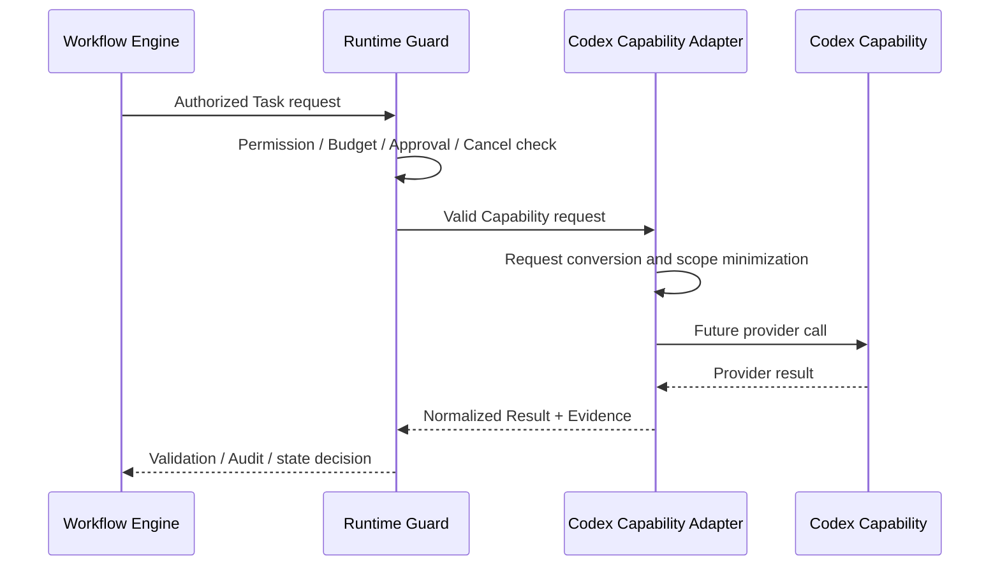

# Codex Adapter Design

## Purpose

`CodexCapabilityAdapter` is the only future Runtime boundary to Codex. It converts a provider-neutral Capability request into a Codex request and converts the response into the contract in [Codex Capability Contract](CODEX_CAPABILITY_CONTRACT.md).

## Adapter flow

## Required responsibilities

1. Validate contract version, Task reference, operation, context references, Permission Grant, Budget Snapshot and Approval Reference.
2. Convert only approved inputs into provider-specific request fields.
3. Re-check cancellation and remaining budget immediately before dispatch.
4. Normalize provider output into status, result reference, changed-file references, usage and Evidence.
5. Reject malformed output and return a bounded failure category.
6. Emit no hidden side effect: every provider invocation maps to one Runtime audit record.

## Prohibitions

- Do not call `WorkflowService.transition` or mutate Workflow repositories.
- Do not grant, expand, cache or infer permissions/approvals.
- Do not write files, create commits or call a provider unless Runtime has supplied a valid authorized request.
- Do not bypass Capability Registry, evaluation, activation, project Gates or Human Control.
- Do not make Core depend on a provider SDK, CLI, MCP server or network transport.

## Replaceability

The adapter exposes the provider-neutral contract. A future Codex transport, a mock adapter, or another engineering provider may implement the same boundary, provided it passes contract, security, budget, approval and audit evaluation.
