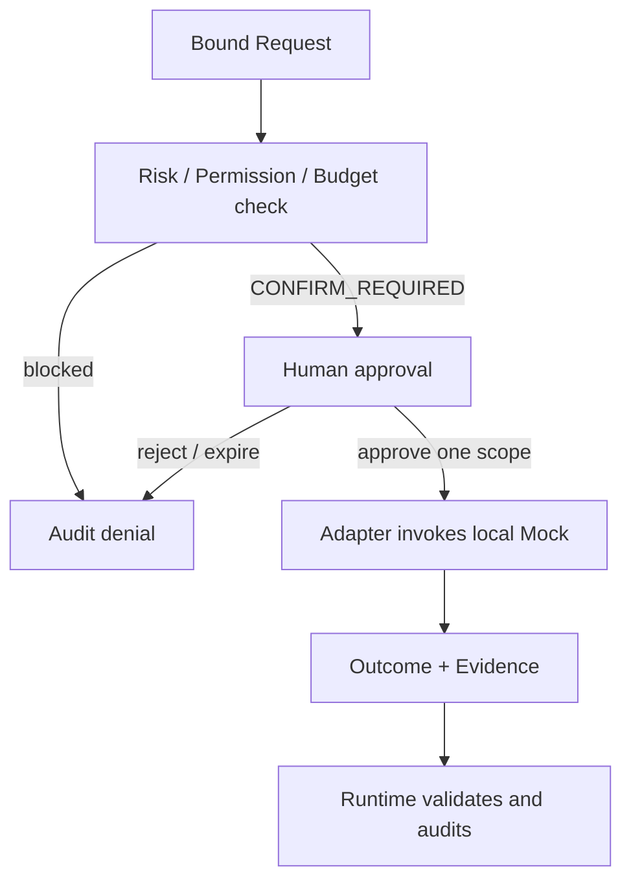

# Codex Approval Flow Design

## First-version control policy

The local Mock validates the same control barrier required for future sensitive Codex work. The following operations are always `CONFIRM_REQUIRED` in the first version:

- Code modification proposal that may later lead to a patch.
- Any file modification request.
- Any Commit creation request.

No `AUTO` route is implemented. An absent, expired, rejected or scope-mismatched approval blocks invocation.

## Flow

## Approval binding

An approval record binds Task reference, operation, input/file proposal scope, Capability/Adapter version, Permission Snapshot, Budget Snapshot, approver, decision time and expiry. It is consumed by Runtime only for the matched invocation; the Adapter cannot fabricate or extend it.

## Boundary

Approval allows a bounded Mock invocation only. It does not authorize actual file changes, commits, external Codex access, Capability Activation, release, Gate override or a follow-up task.
