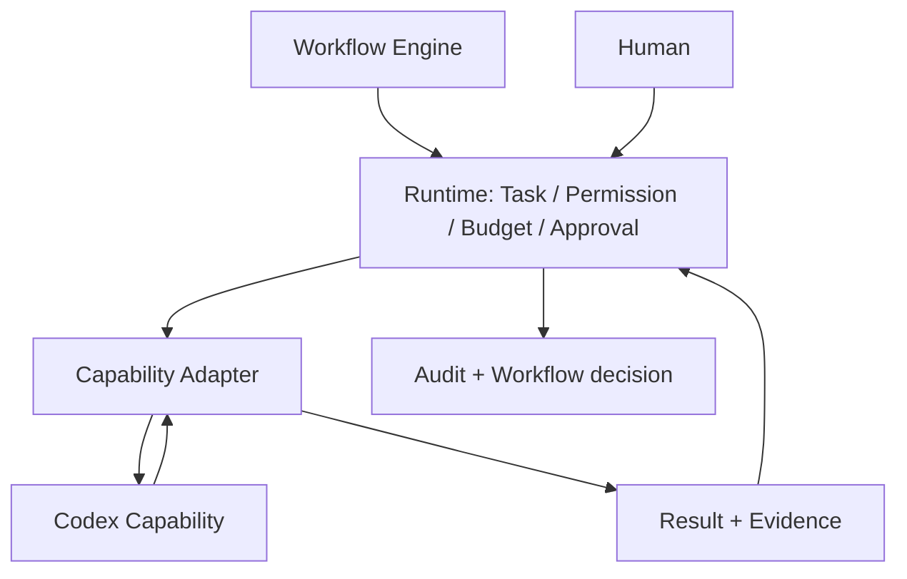

# Codex Capability Architecture

## 定位

Codex 是未来可替换的 `Engineering Capability` 提供方，不是 AI CTO Core、Agent Manager 或 Workflow Controller。AI CTO Runtime 保持控制平面权威：分配任务、检查权限和预算、等待人工确认、写入审计并推进 Workflow；Codex 仅在获得一次受控调用授权后返回结果和 Evidence。

## 职责边界

| Component | 负责 | 不负责 |
|---|---|---|
| Workflow Engine | 状态流转、任务编排、Gate 与审批等待 | 执行 Codex 请求或解释供应商协议 |
| Runtime Guard | 权限、预算、取消和 Kill Switch 判断 | 产生代码、改变项目价值或批准变更 |
| Codex Adapter | 合同转换、受控调用、结果/Evidence 标准化 | 绕过 Workflow、提升权限或创建 Commit |
| Codex Capability | 在授权输入范围内完成一次能力操作并返回事实 | 自主创建任务、推进 Workflow、批准或发布 |
| Human | 批准高影响操作和接受风险 | 由 Capability 代替执行 Gate 判断 |

## 设计约束

- Core 只依赖 Capability Contract / Adapter，不依赖 Codex 的具体 SDK、CLI、模型或网络协议。
- 每次调用必须关联一个 Runtime Task、Execution Context、Permission Grant、Budget Snapshot 与 Approval Reference。
- Capability 结果是执行事实或建议，不构成项目决策、架构决策、Gate 授权或发布授权。
- 适配器必须可替换、可禁用、可审计；供应商故障不能改变 Workflow 的权威边界。

## Capability Governance 状态

本文件只定义未来接入边界，不构成 Capability Admission、Evaluation、Registry 或 Activation 完成证据。

| Field | Current value |
|---|---|
| Registry Record | `ABSENT` |
| Registry Status | `N/A` |
| Proposed Registry Status | `DISCOVERED` |
| Selection | `PROHIBITED` |
| Activation Scope | `NONE` |

在完成来源、License、安全、兼容性、维护状态、质量与权限审查前，Runtime 不得选择、分派或调用 Codex Capability。

## 本阶段边界

本阶段只定义合同和架构。没有真实 Codex、API、CLI、网络、MCP、文件修改、项目执行或外部工具调用。
