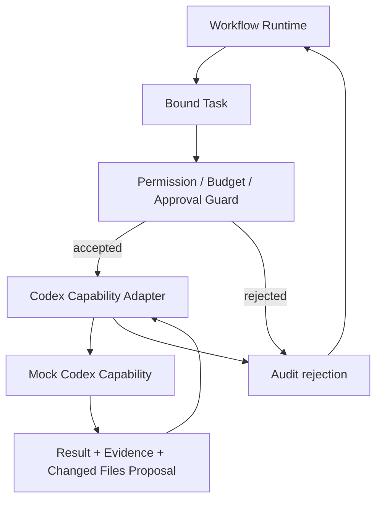

# Codex Capability Integration Implementation Design

## 目标

本设计定义一个本地、受控、可测试的 Codex Capability Adapter MVP。它验证 Runtime 如何通过 Capability Contract 调用 Mock Codex Capability，并获得 Result + Evidence + Audit；不连接真实 Codex，不访问网络，不修改文件，也不改变真实项目。

## MVP scope

包含：

- Codex Execution Contract 的本地实体与输入/输出校验。
- Capability Adapter 的请求转换、Permission / Budget 前置检查、结果转换与 Evidence 标准化。
- 只读式 `ANALYZE_CODE` 和建议式 `PROPOSE_CHANGE` 的 Mock Codex Capability。
- Capability Invocation、Execution Record 与 Audit Event 的关联。
- `CONFIRM_REQUIRED` Approval Barrier 的合同验证。

不包含：

- Codex API、CLI、SDK、MCP、网络或外部工具。
- 文件写入、补丁应用、Commit 创建、Git 操作、真实项目扫描或代码执行。
- Capability Registry 的真实登记/激活、真实 Provider 认证、Agent Manager 或 Workflow Controller。

## Controlled implementation flow

Workflow Runtime owns task lifecycle and state transitions. The Adapter only returns a normalized invocation outcome; it never advances a Workflow or grants authority.

## Implementation boundaries

| Component | Owns | Must not own |
|---|---|---|
| Workflow Runtime | Task binding, state transition, cancellation and next-action decision | Provider request conversion or provider semantics |
| Guard | Permission, budget and approval pre-check | Business/Gate approval or Workflow transition |
| Codex Capability Adapter | Contract conversion, mock invocation boundary, normalization | Permission grant, audit decision or state mutation |
| Mock Codex Capability | Deterministic analysis/proposal result | File change, commit, network call or Workflow mutation |
| Audit | Invocation evidence and control facts | Capability selection, Activation or Knowledge write |

## Design constraints

1. Core depends only on a provider-neutral execution contract and Adapter Port.
2. Every invocation is bound to one Task, Execution Context, Permission Snapshot, Budget Snapshot and control decision.
3. Mock results are examples of contract behavior, not evidence of real Codex capability, quality, cost or safety.
4. Evidence stays in Runtime Audit. It cannot activate Knowledge or Capability Registry entries automatically.

## Related documents

- [Codex Capability Contract](./CODEX_CAPABILITY_CONTRACT.md)
- [Codex Adapter Implementation Design](./CODEX_ADAPTER_IMPLEMENTATION_DESIGN.md)
- [Mock Codex Capability Design](./MOCK_CODEX_CAPABILITY_DESIGN.md)
- [Implementation Gate](./CODEX_CAPABILITY_IMPLEMENTATION_GATE.md)
- [ADR-0024](../adr/ADR-0024-CODEX-CAPABILITY-INTEGRATION.md)
- [ADR-0025](../adr/ADR-0025-CODEX-CAPABILITY-IMPLEMENTATION.md)
