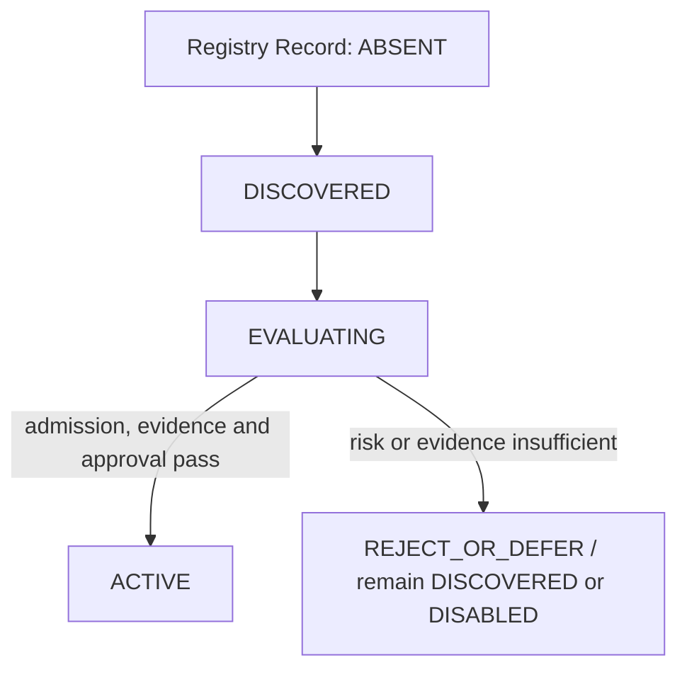

# Codex Capability Registration Flow

## Purpose

This flow connects a future real Codex provider to Capability Governance. It is not a Runtime implementation path and does not create a Registry Record in this phase.

## Required governance evidence

| Transition | Required evidence | Authority |
|---|---|---|
| `ABSENT → DISCOVERED` | Candidate identity, purpose, source/version/license facts and initial Mission Alignment. | Capability Governance record process. |
| `DISCOVERED → EVALUATING` | Admission result `ADMIT_FOR_EVALUATION`, scope, risk review, compatible Contract and evaluation plan. | Capability Governance. |
| `EVALUATING → ACTIVE` | Quality/security/license/maintenance/compatibility evidence, permission model, activation scope and human approval. | Capability Governance plus required human approval. |

## Current phase status

| Field | Value |
|---|---|
| Registry Record | `ABSENT` |
| Registry Status | `N/A` |
| Proposed Registry Status | `DISCOVERED` |
| Selection | `PROHIBITED` |
| Activation Scope | `NONE` |

The Mock is a local test fixture, not a registered external Capability. It cannot satisfy source, license, provider-version, quality or Activation evidence for a real Codex provider.
