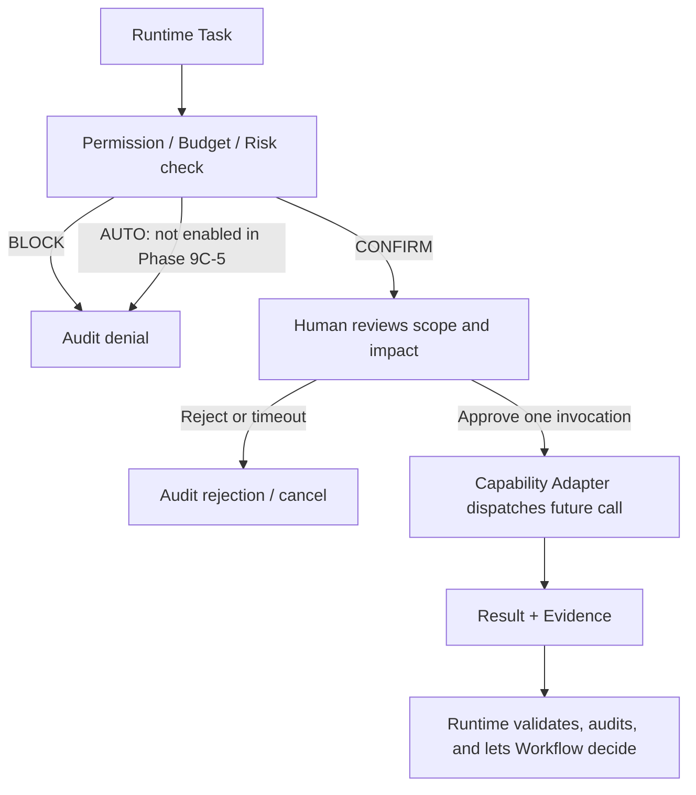

# Codex Human Control Flow

## Control decision

Runtime selects `AUTO`, `CONFIRM`, or `BLOCK` from task risk, reversibility, data impact, permission scope, project requirements and existing Gates. Capability selection never overrides that decision.

| Mode | Meaning for Codex Capability |
|---|---|
| `AUTO` | Reserved for future separately evaluated low-risk, read-only operations; not enabled by this phase. |
| `CONFIRM` | Runtime waits for human approval before the capability invocation or requested side effect. |
| `BLOCK` | Adapter does not dispatch and records the denial. |

## First integration policy

`APPLY_CHANGE` and `CREATE_COMMIT` are always `CONFIRM`. No Codex result, proposed patch or changed-file list can self-approve a modification.

## Approval record

An approval must bind `taskRef`, operation, file/commit scope if relevant, capability/adapter version, permission grant, budget snapshot, approver reference, timestamp and expiry. Approval is not a blanket authorization for later tasks, tools, releases or Gates.
