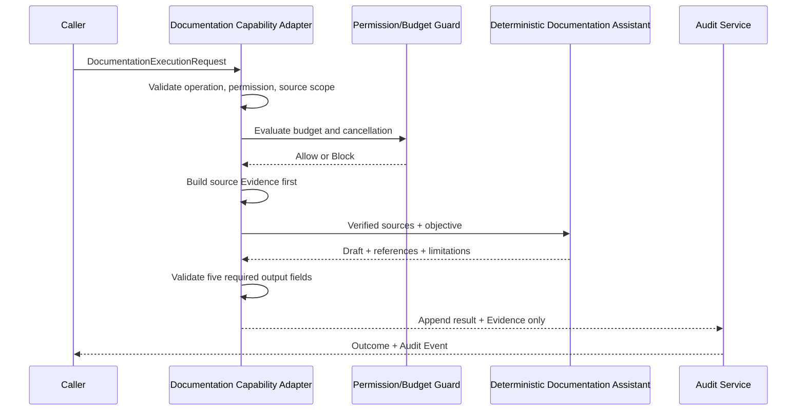

# Documentation Capability MVP Implementation Design

## 1. 目的与实现边界

本设计实现 [Evidence-driven Documentation Assistant](../capability/DOCUMENTATION_CAPABILITY_REQUIREMENT.md) 的最小受控闭环：接收明确授权的来源与任务目标，先形成 Evidence，再生成只读 Draft Package，并追加 Audit Evidence。

实现范围严格限于本地、确定性、内存级运行：

```text
Authorized Source Scope + Task Objective + Project Context
  ↓
DocumentationExecutionRequest
  ↓
DocumentationCapabilityAdapter
  ↓
DeterministicDocumentationAssistant
  ↓
DocumentationResult
  ↓
Audit Evidence
```

本 MVP 不读取文件系统、不扫描仓库、不写入文件、不写入 Knowledge Base、不接入 Provider/网络/MCP/API，也不修改通用 Runtime Core、Workflow 状态或 Capability Registry。

## 2. Thin Core + Contract First 架构

| 组件 | 职责 | 明确不负责 |
|---|---|---|
| `DocumentationExecutionRequest` | 将 Task Objective、Authorized Source Scope、Project Context、Permission 与 Budget 固定为一次调用合同 | 不读取来源、不生成 Draft、不修改状态 |
| `DocumentationInvocationPort` | 定义本地执行体可替换接口 | 不做权限、预算或 Audit 决策 |
| `DeterministicDocumentationAssistant` | 依据已验证的内存来源确定性生成 Draft Package | 不访问文件、网络、Provider 或外部工具 |
| `DocumentationCapabilityAdapter` | 先执行授权、权限、预算与输出验证，再调用 Port | 不修改 Workflow、文件、Knowledge 或 Registry |
| `DocumentationCapabilityRuntimeService` | 调用 Adapter 并仅追加 Audit Event | 不推进 Workflow、不创建 Task、不写入其他状态 |
| 既有 `PermissionBudgetGuard` | 对预算和可执行性进行基础 Guard 判断 | 不替代 Documentation Permission 或人类治理 |
| 既有 `AuditService` | 保存 Evidence 追溯记录 | 不作决策、不写入 Knowledge |

实现新增专用合同和 Adapter，不扩展 `runtime/models/runtime-types.ts`、`TaskInput`、`CapabilityAdapterPort` 或 `RuntimeFoundationService`。这保证 Documentation Capability 独立演进，同时沿用既有 Adapter、Guard 与 Audit 的边界模式。

## 3. 核心 Contract

### 3.1 受支持的唯一操作

`DocumentationOperation` 在 MVP 只允许 `GENERATE_DRAFT`。不存在写入、更新、删除、Commit、部署、知识激活或 Provider 调用操作；因此它们无法通过类型合同进入 Adapter。

### 3.2 Authorized Source Scope

每个来源作为请求内的不可变值传入：

| 字段 | 含义 | 校验 |
|---|---|---|
| `sourceRef` | 稳定来源标识 | 必须同时出现在 `executionContext.allowedContextRefs` |
| `location` | 可定位位置，如文档段落或版本片段 | 必填；缺失则不能形成成功 Evidence |
| `content` | 已由调用方提供的来源正文 | Adapter / Assistant 只能使用该内存值，不读取文件 |
| `versionRef` | 可选版本或时间标识 | 缺失时降低 Confidence 并写入 Limitations |

`Authorized Source Scope` 是唯一的内容输入。Adapter 不接受路径解析、glob、目录、URL 或读取回调，因而不能扫描未授权文件或访问网络。

### 3.3 Request、Permission 与 Budget

`DocumentationExecutionRequest` 必须包含：

- `requestId`、`workflowId`、`taskId`；
- `operation: GENERATE_DRAFT`；
- `taskObjective`；
- `authorizedSources`；
- `executionContext`；
- `permissionGrant`：仅可授予 `GENERATE_DRAFT`，并带有效期；
- `budget` 与可选取消标识。

MVP 的调用者显式调用 Runtime Service；不存在调度器或后台自动调用。对纯内存、无副作用的 `GENERATE_DRAFT`，Guard 可以按安全执行路径评估，但调用完成后必须追加 Audit Event，形成 `NOTIFY` 语义。权限缺失、过期、取消或预算超限时 Adapter 必须在调用执行体之前返回 `BLOCKED`。

### 3.4 DocumentationResult

成功 `DocumentationResult` 必须具有五项非空字段：

| 字段 | 结构与要求 |
|---|---|
| `draft` | 明确标记为草案的确定性文本；只总结已验证来源，不声称已写入或批准 |
| `sourceReferences` | 每条引用至少包含 `sourceRef`、`location`，并带可选 `versionRef` |
| `confidence` | `L1`–`L4`；MVP 在完整可定位本地来源下最高为 `L3` |
| `evidence` | 每条 Evidence 与一个已授权来源关联，包含来源、摘要、Confidence、时间戳与 Reference |
| `limitations` | 非空列表，说明版本缺失、冲突、范围或未验证假设 |

`DocumentationExecutionOutcome` 还包含 `status`、`timestamp`、预算使用量与可选 Failure。Failure 只能为权限拒绝、预算超限、取消、来源范围无效、输出合同无效或本地执行失败；不得伪装为成功 Draft。

## 4. Evidence-first 执行顺序



具体规则：

1. Adapter 在执行体之前验证 `GENERATE_DRAFT` 权限、有效期、取消状态、预算、非空来源和每个 `sourceRef` 的授权。
2. Adapter 为每个合格来源创建 Evidence 基线；无可用 Evidence 时不得调用 Assistant。
3. Assistant 只接收验证后的来源，不接收文件、路径、网络或工具对象。
4. Assistant 使用固定模板生成 `draft`、引用和 `limitations`；不能在 Evidence 后增加未引用的事实。
5. Adapter 验证五项输出、引用子集和 Evidence 与来源一一对应；失败时产生 `BLOCKED` / `FAILURE`，不返回成功草案。
6. Runtime Service 无论成功还是失败都只追加 Audit Event，且不改变 Workflow 或 Knowledge 状态。

## 5. 权限与安全边界

| 风险 | 设计控制 |
|---|---|
| 未授权文件扫描 | 合同只接收内存来源值；没有文件系统 Port、路径读取或目录枚举接口 |
| 权威文件修改 | 仅有 `GENERATE_DRAFT` 操作；没有写入操作、输出目标或写入 Adapter |
| 未授权来源引用 | 每个 `sourceRef` 必须在 `allowedContextRefs` 中；引用超范围即阻断 |
| 敏感信息回显 | Request 可包含敏感约束；MVP 不解析外部文件，执行体不得创建新来源或输出未在输入中授权的内容 |
| Provider / 网络依赖 | 执行体为 `DeterministicDocumentationAssistant`，没有网络、Provider、API、CLI 或 MCP 依赖 |
| ACTIVE Knowledge 写入 | Audit 仅调用 `AuditService.append`；没有 Knowledge Repository 或写入接口 |
| Runtime 权威泄漏 | Service 不调用 WorkflowService、TaskService、Registry 或 Gate 服务 |

Manifesto、ADR、Master Plan 与 Gate 可以作为经授权的只读来源被引用，但该 Capability 永远只返回 Draft Package；它不能对这些文件执行、请求或模拟写入。

## 6. 计划代码结构

新增文件仅限：

```text
runtime/
├── capability/
│   ├── documentation-execution-contract.ts
│   ├── documentation-invocation-port.ts
│   ├── deterministic-documentation-assistant.ts
│   └── documentation-capability-adapter.ts
├── services/
│   └── documentation-capability-runtime-service.ts
└── tests/
    └── documentation-capability.test.ts
```

同时仅更新 `package.json` 的 `test` 脚本以包含新测试文件。不得创建 `agents/`、`tools/`、`integrations/`、`api/`、Provider SDK、文件系统 Adapter 或数据库文件。

## 7. 实现顺序

1. 定义 Documentation Contract、错误类别、输入输出和 Permission 类型。
2. 先编写失败与成功测试，覆盖 Evidence-first 与无副作用边界。
3. 定义 `DocumentationInvocationPort` 及确定性本地执行体。
4. 实现 Adapter 的 preflight、Evidence 建基和输出验证。
5. 实现只追加 Audit 的 Runtime Service。
6. 运行完整 `npm.cmd test`，检查 33 项既有测试与新增测试均通过。
7. 运行范围扫描，确认没有 Provider、网络、文件写入、Knowledge 写入或 Runtime Core 修改。

## 8. 实现 Gate

编码只能在以下条件同时满足后进行：

- 本设计与 [测试计划](./DOCUMENTATION_CAPABILITY_MVP_TEST_PLAN.md) 已确认；
- 五项输出 Contract、Evidence-first 顺序和 `GENERATE_DRAFT` 单一操作已冻结；
- Authorized Source Scope 仅使用请求内内存来源，且验证规则完整；
- Adapter、Audit 与 Guard 的职责边界明确；
- 没有 Provider、Candidate、Registry Activation、文件写入或 Runtime Core 修改；
- 用户明确授权代码实现。

Gate 结果：`CHANGES_REQUIRED`，直到用户确认本设计并授权编码。
