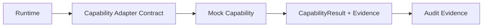

# Mock Capability 实现设计

## 目标

第一个 Mock Capability 仅验证受控链路：

它不是具体工具 Adapter，不调用 Codex、MCP、文件系统、浏览器、数据库或任何外部服务。

## 合同行为

| 项目 | 设计 |
|---|---|
| 输入 | 已授权 `taskId`、`ExecutionContext` 引用、`BudgetSnapshot`、受控 `input`。 |
| 成功输出 | 固定、可预测、脱敏的 `CapabilityResult(status=SUCCESS)`，带 Evidence、Confidence、Timestamp。 |
| 失败输出 | 受控 `CapabilityResult(status=FAILURE)`，带安全错误摘要、Evidence、Confidence、Timestamp。 |
| 副作用 | 无；不修改代码、数据、配置或外部状态。 |
| 重试 | 不自动重试、切换 Adapter 或回退到真实能力。 |
| 审计 | Invocation 前后及结果均必须生成 Audit Event。 |

## 边界

Mock Capability 只能在 Permission / Budget Guard 返回 `ALLOW`，或 `CONFIRM_REQUIRED` 已取得确认后执行。`DENY`、用户取消和预算超限必须阻止调用。Mock 输出可作为未来 Knowledge Candidate 的证据输入，但不能直接写入 `ACTIVE` Knowledge 或批准任何 Gate。
