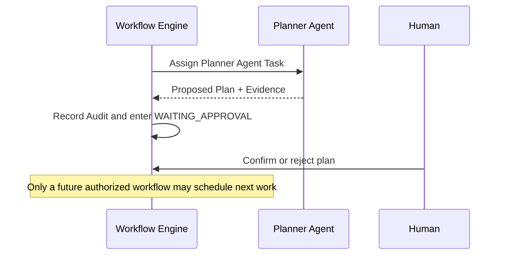

# Planner Agent Design

## Purpose

The Planner Agent turns a bounded user request, Intent Result, and authorized Execution Context into a proposed Execution Plan. It provides planning output only; it does not execute the plan.

## Contract

| Area | Definition |
|---|---|
| Agent Type | `PLANNER` |
| Input | `User Request`, `Intent Result`, `Execution Context`, task constraints, and approved context references |
| Output | `Proposed Execution Plan` + `Plan Evidence` + confidence + stated assumptions/risks |
| Default control | `CONFIRM` |
| Workflow effect | Workflow Engine receives the result and moves the Workflow to `WAITING_APPROVAL` |
| Post-approval effect | Only the Workflow Engine may create or schedule a later approved task; this phase designs no such execution |

## Proposed Execution Plan fields

| Field | Purpose |
|---|---|
| `plan_id` | Identifies the proposal, not an approved execution. |
| `objective` | Restates the bounded task objective. |
| `scope` | Includes and excludes. |
| `ordered_steps` | Proposed high-level steps, dependencies, and expected outputs. |
| `required_capabilities` | Proposed capability types only; no invocation instruction. |
| `assumptions` | Unverified conditions that require validation or confirmation. |
| `risks` | Known technical, security, cost, data, and authority risks. |
| `approval_required` | Always `true` for the Phase 9C-3 Planner Agent. |
| `evidence` | Plan evidence with source, confidence, timestamp, and limits. |

## Allowed actions

- Read only the Task input and references explicitly allowed by Execution Context.
- Analyze the request and produce the proposed plan and Plan Evidence.
- Return `COMPLETED`, `FAILED`, or `CANCELLED` through the Agent Result contract.

## Prohibited actions

- Change a Workflow to `EXECUTING` or any other state.
- Call a Capability, external tool, Codex, MCP, browser, database, or deployment system.
- Modify code, repository content, Master Plan, ADR, Project Memory, Gate, or `ACTIVE` Knowledge.
- Create a new Task, assign another Agent, approve its own plan, or bypass a required confirmation.

## Confirmation flow

No low-risk `AUTO` exception exists in this phase. It may only be considered later through Risk Evaluation, Human Control review, evidence, and a separate authorization.
