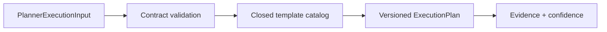

# Planner Agent Implementation Design

## MVP implementation boundary

The first Planner adapter is `DeterministicPlanner`, a local, pure implementation of `PlannerAgentPort`. It validates contract input and selects a fixed plan template from a closed template catalog. It does not call an LLM, network, tool, filesystem, database, Capability, or another Agent.

## Deterministic behavior

1. Validate required User Request reference, Intent Result reference, Execution Context, `CONFIRM` control mode, Permission, and Budget scope.
2. Select exactly one static template by supported Intent/Task category.
3. Populate the Contract using only input values and template constants.
4. Set `status: PROPOSED`, `approval_required: true`, `plan_schema_version`, and `planner_version`.
5. Return Plan Evidence showing template identifier, planner version, schema version, timestamp, and bounded confidence.
6. Return `FAILED` with Evidence when input/category/authorization is invalid or unsupported; never infer a new template or call an external source.

## Versioning

| Version field | Owner | Change meaning |
|---|---|---|
| `planner_version` | DeterministicPlanner implementation | Changes to planning rules or template catalog. |
| `plan_schema_version` | ExecutionPlan Contract | Changes to required plan fields or their semantics. |

Any version change must be explicit in Agent Audit and must be reviewed before an implementation is replaced. A future `LLMPlanner` may implement the same `PlannerAgentPort`, but requires separate Capability, security, budget, testing, and approval design.

## Prohibitions

- No model prompt, model call, model fallback, network access, tool call, or external data.
- No Workflow mutation, Approval action, Capability invocation, code modification, file write, or Knowledge activation.
- No automatic continuation after a plan is returned.
