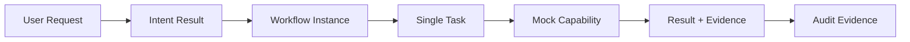

# Runtime Foundation 实施计划

## MVP 目标

Runtime Foundation 的目标是为下列受控闭环提供最小、可测试的实现蓝图：

它验证控制与记录能力，不验证真实工具、真实 Agent、生产环境或自动执行。

## 开发范围

| 包含 | 排除 |
|---|---|
| Workflow 状态与生命周期管理 | 真实工具、Codex、MCP、外部服务调用 |
| 单一 Task 的输入、输出与关联 | 真实 Agent、多 Agent 协作、Agent 直连 |
| Mock Capability Adapter 合同 | 自动代码修改、部署与生产执行 |
| Execution Record、Audit Event、Evidence | 数据库、ORM、框架、部署方案 |
| Permission / Budget Guard 与人类控制输入 | 自动预算扩大、自动批准或 Gate 绕过 |

## 阶段与停止条件

| 阶段 | 目标 | 主要输出 | 完成条件 | 停止条件 |
|---|---|---|---|---|
| Phase A：Runtime Core | 管理单 Workflow 与状态。 | Workflow Entity、状态转换合同。 | 正常与受控异常状态均可表达。 | 状态机与既有 Runtime 架构冲突。 |
| Phase B：Task Engine | 管理单一 Task。 | Task 输入/输出、关联与生命周期合同。 | 一个 Workflow 最多一个 Task。 | 需要多 Task 或 Agent 协作。 |
| Phase C：Capability Adapter | 验证受控能力调用边界。 | Mock Adapter Request / Result 合同。 | 成功与失败均产生安全 Result。 | 需要真实工具或外部副作用。 |
| Phase D：Audit System | 记录执行事实和 Evidence。 | Execution Record、Audit Event、Evidence Contract。 | 关键状态和调用均可追溯。 | Audit 被用于决策或授权。 |
| Phase E：Integration Test | 验证最小闭环。 | 测试矩阵和场景 Evidence。 | 正常、失败、取消、超限均满足契约。 | 任一场景依赖真实工具或扩大范围。 |

## 开发顺序

1. 固化 Entity、状态机和受限转换。
2. 定义并验证单 Task 约束及输入输出。
3. 定义 Mock Capability Adapter 与 Result / Evidence 合同。
4. 接入 Permission / Budget Guard、人类控制与追加式 Audit。
5. 以四类场景进行集成验证。

本计划仅描述后续 Phase 9C-2 的实施顺序；不授权现在编写 Runtime 代码。
