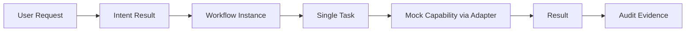

# Runtime MVP 范围

## 目标

Phase 9B 只定义 Runtime 的首个可验证控制闭环，用于验证受控编排、状态、预算、人工控制与审计能够形成一致记录；它不是完整 AI CTO，也不构成任何自动执行授权。

## MVP 必须覆盖

- 单一 `Workflow Instance` 与其单一 `Task` 的创建、关联和状态管理。
- 经 `Capability Adapter` 合同调用的 Mock Capability；不得直接调用任何具体工具。
- `AUTO`、`CONFIRM`、`BLOCK` 三类最小人工控制。
- Permission 与预算检查，以及 Result 和 Audit Evidence 的记录。
- 正常完成、Capability 失败、用户取消、预算超限四种受控结局。

## Success Criteria

| 验收项 | 可观察结果 |
|---|---|
| Workflow 创建 | 创建唯一 Workflow 和唯一关联 Task，并保留 Intent 引用。 |
| 状态管理 | 只允许已定义的转换；每次转换可追溯。 |
| Capability 调用 | 仅通过 Mock Capability Adapter 生成受控 Result。 |
| Audit 生成 | 写入所需最小审计字段和 Evidence。 |
| 失败处理 | Capability 失败、取消和预算超限均安全停止、记录且进入正确终态。 |

## 非目标

本范围不实现 Runtime 代码、真实 Agent、Codex/MCP、真实工具调用、自动代码修改、自动部署、生产环境执行、多 Agent 协作、复杂循环或自动执行。
