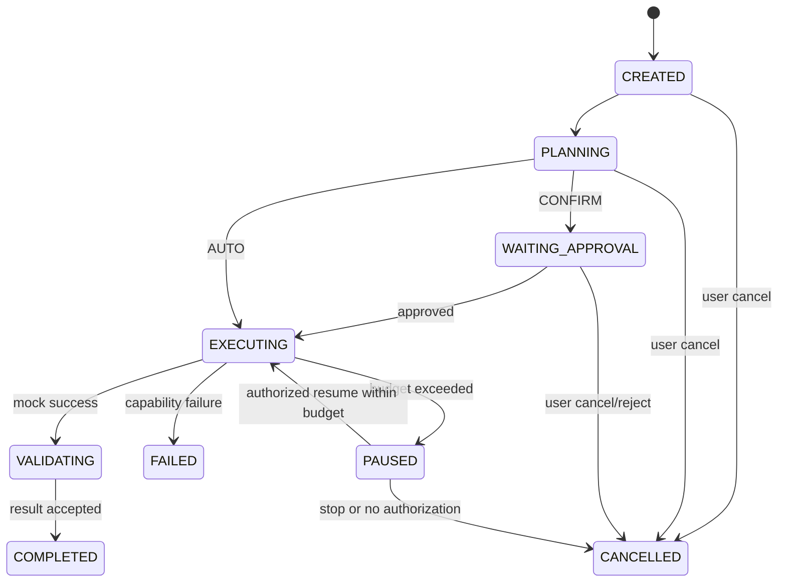

# Runtime MVP Workflow

## 最小流程

## 场景与预期

| 场景 | 处理 | 必须记录的结果 |
|---|---|---|
| 正常完成 | Mock Capability 成功，验证 Result。 | `COMPLETED`、Result、Invocation 与 Audit。 |
| Capability 失败 | 停止当前执行，不做真实工具或自动回退调用。 | `FAILED`、失败原因与 Audit。 |
| 用户取消 | 立即阻止后续调用；已开始的模拟任务进入安全停止。 | `CANCELLED`、取消人、时间与 Audit。 |
| 预算超限 | 停止新调用并进入暂停或取消；不得自动增加预算。 | `PAUSED` 或 `CANCELLED`、超限项、使用量与 Audit。 |

## 暂停、恢复与失败

暂停仅用于预算或显式控制中断。恢复必须重新检查 Permission、Human Control 和剩余预算；没有授权则取消。失败不会自动创建新 Task、重试循环或替换 Capability。若未来动作被标记需回滚，只记录 `ROLLING_BACK` 状态与待决 Evidence，不在 MVP 执行真实回滚。
