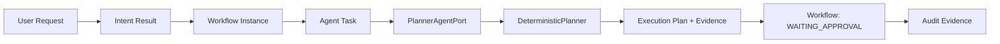

# Single Agent Runtime Implementation Design

## Goal

Phase 9C-4 defines the smallest future implementation that can validate a controlled Planner Agent Runtime loop. It extends the Runtime Foundation without changing its Control Plane ownership.

## In scope for a future implementation

- Agent Runtime registration and assignment for one `PLANNER` Agent type.
- One `AgentTask` linked to one Workflow and one Planner Agent contract.
- `PlannerAgentPort` with a local `DeterministicPlanner` adapter.
- A versioned `ExecutionPlan` Contract object and Agent Result/Evidence.
- Workflow-controlled movement from a valid planner result to `WAITING_APPROVAL`.
- Agent audit events, Permission/Budget preflight, cancellation, and bounded failure handling.
- Deterministic local tests for success, failure, denial, confirmation wait, cancellation, and audit completeness.

## Explicitly excluded

- Model calls, network, external tools, Codex, MCP, browser, database, or production deployment.
- A real or autonomous Agent, multi-Agent collaboration, Agent-to-Agent calls, tool invocation, code modification, or automatic execution after approval.
- Low-risk `AUTO` / `NOTIFY` Planner behavior, model routing, automatic retry, persistence, or new governance authority.

## Architecture rules

1. Workflow Engine owns Workflow state, approval waiting, cancellation, and coordination.
2. `AgentTask` owns Agent-specific execution data; it does not own a Workflow transition.
3. `PlannerAgentPort` is the stable boundary. `DeterministicPlanner` is an in-process, side-effect-free adapter behind it.
4. Planner returns a Result and versioned `ExecutionPlan` Contract; it cannot command or perform the next step.
5. A valid Plan is proposed, not approved. Workflow records it, writes Audit, then enters `WAITING_APPROVAL`.
6. Permission/Budget Guard denies or stops an Agent attempt; it does not grant human approval.

## Execution Plan Contract

| Field | Meaning |
|---|---|
| `execution_plan_id` | Stable identity for the proposed plan. |
| `plan_schema_version` | Version of the `ExecutionPlan` Contract schema. |
| `planner_version` | Version of the planner implementation that created the plan. |
| `workflow_id`, `agent_task_id` | Links plan to one controlled execution context. |
| `status` | Always `PROPOSED` at Planner return; never `APPROVED` or `EXECUTING`. |
| `objective`, `scope` | Bounded objective and explicit inclusion/exclusion. |
| `ordered_steps`, `dependencies` | Descriptive next-step proposal only; no callable command. |
| `assumptions`, `risks` | Unverified conditions and known risk boundaries. |
| `required_capability_types` | Suggested future capability categories, not invocations. |
| `approval_required` | Always `true` for this phase. |
| `evidence`, `confidence`, `created_at` | Traceability, confidence, and timestamp. |

## Success criteria

1. Given the same valid input and planner version, `DeterministicPlanner` returns the same Contract-valid proposed plan.
2. No planner path accesses a network, tool, model, repository write, or Capability invocation.
3. The Agent cannot mutate a Workflow; only Workflow Engine records `WAITING_APPROVAL`.
4. Every completion, failure, denial, and cancellation has Agent Audit Evidence.
5. Confirmation is required before any later Workflow work is considered; Phase 9C-4 implements no post-confirmation execution.
