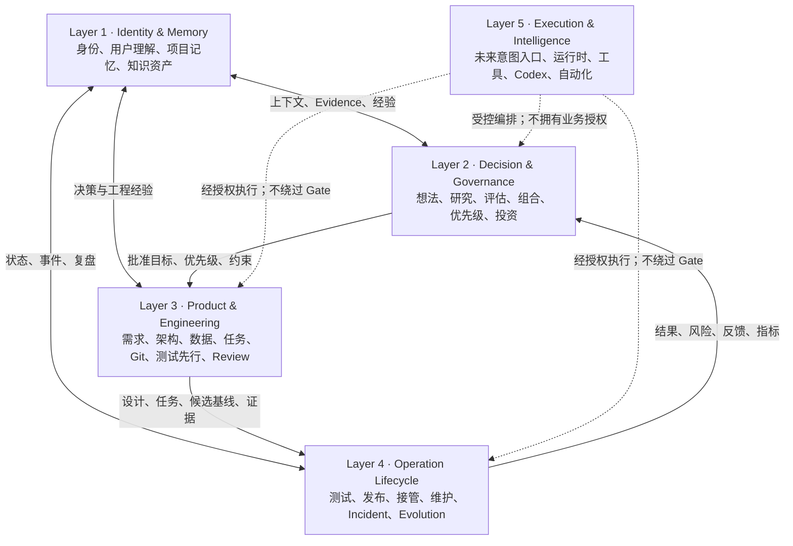
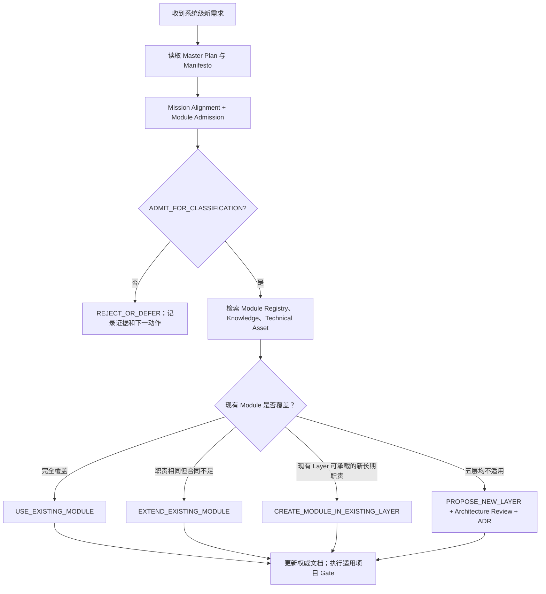

# AI CTO System Master Plan

## 1. 系统使命

AI CTO System 的使命是帮助个人或组织建立可持续运作的 AI 技术组织，将想法持续转化为可交付、可维护、可进化的产品资产，并通过真实使用、经验沉淀和技术资产复用形成研发复利。

系统不是单纯代码生成工具、聊天机器人、普通项目管理工具或无约束自动化机器人。AI 负责分析、建议和在授权范围内执行；人类保留使命变化、重大资源投入、风险接受、生产发布和架构边界变化的最终决定权。

使命、核心价值与系统边界的权威来源是 [AI CTO System Manifesto](./AI_CTO_SYSTEM_MANIFESTO.md)。

### Master Plan 权威关系

本文件是 AI CTO System 的最高级**总体规划与开发入口**：后续系统级需求首先在这里核对使命、架构、当前能力、路线、扩展规则和 ADR 索引。

它不覆盖下列专门权威来源：

| 对象 | 权威来源 | Master Plan 的职责 |
|---|---|---|
| 为什么存在、价值与边界 | [Manifesto](./AI_CTO_SYSTEM_MANIFESTO.md) | 引用并保持一致，不改写使命 |
| 重大历史决策 | [ADR Index](#10-核心-adr-索引) | 汇总影响，不覆盖历史事实和后果 |
| 当前 Module、Owning Layer 与状态 | [Module Registry](../architecture/MODULE_REGISTRY.md) | 汇总规划视图，发现差异时优先同步 Registry |
| 单项目生命周期状态 | [Project Lifecycle](../protocol/PROJECT_LIFECYCLE.md) | 说明架构关系，不创建或重写状态 |
| 具体执行授权 | 各阶段 Gate、Security Review、Release Gate | 不授予或绕过 Gate |
| 项目连续性与交付进度 | Project Memory、Development Progress | 汇总当前方向，不替代原始记录 |

冲突处理顺序：Manifesto 的使命与边界 → 安全、数据与可逆性 → 已接受 ADR 的历史决策 → Master Plan 的当前总体规划 → Module Registry 的当前事实 → 当前项目的生命周期 Gate。发现不一致时，停止推进、记录差异并更新对应权威来源；禁止选择性引用以绕过约束。

## 2. 五层架构模型

Layer 定义稳定职责边界，Module 定义层内可独立治理的能力，Phase 只表示历史交付批次，Lifecycle State 只描述单项目当前状态。四者不得混用。

## 3. Layer 职责

| Layer | 核心职责 | 权威对象 | 主要输出 | 不得做什么 |
|---|---|---|---|---|
| Layer 1：Identity & Memory | 定义身份、理解用户、保存项目事实与可复用知识 | User Brain、Project Memory、Knowledge Base | 可追溯上下文、Evidence、经验 | 用历史记忆替代当前证据、Gate 或用户授权 |
| Layer 2：Decision & Governance | 判断做什么、为什么做、何时做、投入什么资源 | Idea、Evaluation、Portfolio、Priority、Investment | 建议、评分、风险、决策边界 | 直接设计、编码、部署或调用外部工具 |
| Layer 3：Product & Engineering | 把批准目标变成可追溯的产品和工程基线 | PRD、Architecture、Database、Task、Commit、Test 链 | 设计、计划、任务、Review 与开发证据 | 把 Design 或开发完成当作下一阶段自动授权 |
| Layer 4：Operation Lifecycle | 管理测试、发布、接管、维护、故障、演进与退出 | Lifecycle State、Gate、Release、Incident、Evolution | 授权结果、运行证据、运营记录 | 被评分、Dashboard 或自动化绕过 Gate |
| Layer 5：Execution & Intelligence | 管理未来意图接入、运行时、工具和自动化的受控执行 | Capability Contract、运行时审计与权限 | 结构化请求、受控执行和审计 | 决定业务价值、改变 Layer 2 决策或覆盖 Layer 4 Gate |

完整的数据流、边界与理由见 [五层架构](../architecture/AI_CTO_SYSTEM_ARCHITECTURE.md)。

## 4. 当前已完成能力

`Completed` 表示治理规范、模板、目录或登记机制已经建立；不表示已有 Agent Runtime、自动化、真实外部 Capability 或生产执行实现。当前 Module 的精确状态以 [Module Registry](../architecture/MODULE_REGISTRY.md) 为准。

| Layer | 已完成能力摘要 | 当前限制 |
|---|---|---|
| Layer 1 | AI CTO 身份与工作规则、User Brain、Project Memory、Knowledge Governance、Knowledge Registry、知识试点 | 知识试点仅有 2 条 `VALIDATED`、1 条 `VALIDATING`、0 条 `ACTIVE`；没有 RAG 或向量数据库 |
| Layer 2 | Idea Intake、Research、Evaluation、Build vs Buy、Confidence、Approval Gate、Portfolio、Priority、Dependency、Asset、Cost、Dashboard、Investment、Health | 评分与建议不自动启动项目或抵消安全、数据、合规和 Gate 红线 |
| Layer 3 | PRD、需求优先级、Architecture、Database、Agent Design、Traceability、Task、Plan、Git、TDD、Review、Change Impact、Development Gate | 没有任何规则允许跳过 Design、Testing 或人工批准直接编码 |
| Layer 4 | Lifecycle、Initialization、Testing、Security、Release、Deployment、Monitoring、Onboarding、Health、Maintenance、Incident、Debt、Feedback、Evolution、Retirement | 文档治理不等于真实项目已经通过相应门禁或部署 |
| Layer 5 | Capability、Execution Routing、Intent Gateway 治理与 Phase 9A / 9B / 9C-1 设计、Phase 9C-2 Runtime Foundation MVP 本地实现 | 真实 Agent、Tool Calling、Codex Integration、Automation 与真实 Capability 接入均未实现 |

已完成的历史基线：Phase 1 Kernel、Phase 2 Operating Protocol、Phase 3 Decision Intelligence、Phase 4 Design Intelligence、Phase 5 Development Execution Intelligence、Phase 6 Testing & Release Intelligence、Phase 6.5 Existing Project Onboarding、Phase 7 Maintenance & Evolution、Phase 8 Portfolio Governance、Architecture Review、Strategic Alignment、Phase 8.2 Capability Governance、Phase 8.3 Knowledge Governance 与 Knowledge Governance Pilot。

## 5. 当前开发路线

| 路线状态 | 内容 | 授权含义 |
|---|---|---|
| 已完成治理基线 | Phase 1–8.5、Architecture Review、Strategic Alignment、Knowledge Governance Pilot | 仅证明相应治理文档或试点已完成 |
| 当前工作 | Phase 9C-2 Runtime Foundation Implementation | 已实现单 Workflow、单 Task、Mock Capability、In-memory Port、Guard、Execution / Audit 与 12 项本地测试；不接入真实工具或 Agent |
| 未启动 | 真实 Capability、Agent、Tool Calling、Codex/MCP、持久化、生产交付与自动执行 | 没有相应开发或执行授权 |

Phase 只是历史交付标签和路线元数据，不是 Module、Layer、Lifecycle State 或自动授权。未来候选路线可以标记为 `PROPOSED`、`UNDER_REVIEW`、`APPROVED_FOR_DESIGN` 或 `DEFERRED`，但这些仅为规划结果，不能写入 Module Registry 状态或项目生命周期。

## 6. 未来 Phase 规划

### Phase 8.4：Intelligent Resource & Execution Routing Governance

状态：文档治理已完成；Runtime、Router 代码、自动化、模型切换与真实调用均未启动。

来源：用户确认的真实使用反馈包括模型耗时、Token 效率与流程过载风险；[EFF-001](../governance/execution_cases/EFF-001-phase-8-4-route-sync-review.md) 提供单案例验证。这些反馈是路线研究输入，不构成量化性能结论或实现授权。

治理边界：在任务类型、风险、质量、预算和时延约束下，输出建议性的 Execution Plan；定义复杂度、Workflow、Capability / Skill / Tool、模型类别、Reasoning、Context、偏好和 Evidence 的选择规则。该方向只消费 Layer 1 的经验与成本证据、Layer 2 的优先级和投资约束、Layer 3 的任务基线及 Layer 4 的运行证据，且不得绕过任何 Gate。

明确排除：本阶段不实现或接入 Router 代码、模型路由、直接模型调用、任务队列、限流、Agent Runtime、工具调用、自动化、监控服务或外部集成，也不修改 Codex 行为。

未来如需实现 Runtime 或自动化，必须先提供多个可比较的任务类型、模型、Token、时延、成功/失败、成本、队列/重试/阻塞/人工介入，以及质量、成本、时延和安全权衡证据；同时完成 Mission Alignment、Evidence Review、Feature Classification、Architecture Review、必要 Admission / ADR 与受影响 Gate 分析。

任何后续路线必须先回答“为什么值得进入 AI CTO System”，再回答“属于哪里、如何安全实施”。当前可预见的长期方向仅用于规划检索，不构成承诺或实现计划：

1. 在 Evidence、Mission Alignment 与 Architecture Review 支持下，逐步评估 Layer 5 的运行时和自动化能力。
2. 在独立真实项目中继续验证 Knowledge Governance 的跨项目适用性；不把单项目试点直接提升为通用规则。
3. 通过真实项目使用反馈完善 Portfolio、Capability 和 Knowledge 的治理证据。

任何方向若未取得 `ADMIT_FOR_CLASSIFICATION`，必须保持 `PROPOSED` 或 `DEFERRED`，不得因路线图命名直接成为新 Phase、Module 或开发任务。

## 7. Module 扩展规则

未来扩展必须按以下顺序进行：

1. 先阅读本 Master Plan、Manifesto、[Architecture Principles](./AI_CTO_ARCHITECTURE_PRINCIPLES.md) 和 [Module Admission Criteria](./MODULE_ADMISSION_CRITERIA.md)。
2. 证明使命贡献、核心问题、长期资产、复用价值、复杂度、风险和人类决策点。
3. 取得 `ADMIT_FOR_CLASSIFICATION` 后，在 [Module Registry](../architecture/MODULE_REGISTRY.md) 检索相同职责。
4. 依次选择 `USE_EXISTING_MODULE`、`EXTEND_EXISTING_MODULE`、`CREATE_MODULE_IN_EXISTING_LAYER`、`PROPOSE_NEW_LAYER` 或 `REJECT_OR_DEFER`。
5. 新 Module、Module 移动 / 合并 / 拆分、跨层权威或核心 Gate 变化必须按 [Architecture Evolution Standard](../architecture/ARCHITECTURE_EVOLUTION_STANDARD.md)评审，并在适用时创建 ADR。
6. 更新 Module Registry、Master Plan、SKILL、Project Memory 和 Development Progress；保持单一权威，不复制 Module 事实。

Master Plan 本身是战略 Artifact，不是 Module，不进入 Module Registry。

## 8. 新需求分类流程

每次分类必须使用 [Feature Classification Rules](../architecture/FEATURE_CLASSIFICATION_RULES.md) 的固定字段：Feature / Request、Strategic Admission、Evidence / Confidence、Owning Layer、Existing Module、Classification Result、Cross-Layer Inputs / Outputs、Risks / Redlines、Architecture Review Required、ADR Required、Registry Update 和 Next Action。

## 9. 架构禁止事项

以下行为被禁止：

1. 以路线图、Phase 名称、截止时间、负责人意见、预算或沉没投入代替 Mission Alignment、Evidence 或分类。
2. 为单一功能、模板、一次性 Artifact 或临时项目状态直接创建 Module、Layer 或 Phase。
3. 让一个 Module 拥有多个 Owning Layer，或以跨层需求为理由复制权威数据、评分、状态或 Gate。
4. 用 Master Plan、Portfolio Score、Quality Score、历史 Knowledge、Capability 状态或 Dashboard 取代当前项目 Gate。
5. 把 `Completed` 治理文档解释为 Runtime、Agent、自动化、外部 Capability 或生产授权已经实现。
6. 把单项目经验、一次事件、公开资料或高质量分直接升级为通用最佳实践、`ACTIVE` Knowledge 或强制决策依据。
7. 让 Layer 5 自动化决定业务价值、绕过人类批准、改变 Layer 2 决策或跳过 Layer 3 / Layer 4 证据与门禁。
8. 通过删除、覆盖或静默改写 ADR、Knowledge、Project Memory 或 Registry 来解决冲突。
9. 在未完成 Architecture Review、必要 ADR、Registry 同步和受影响 Gate 的情况下改变系统边界。
10. 将 Phase 8.4 的文档治理完成解释为 Router Runtime、自动化、模型切换、真实工具调用或新的执行授权。

## 10. 核心 ADR 索引

| ADR | 主题 | 持续影响 |
|---|---|---|
| [ADR-0001](../adr/ADR-0001-PROJECT-LIFECYCLE-ORDER.md) | Research 与 Evaluation 顺序 | 两阶段均完成后才能进入 Design |
| [ADR-0002](../adr/ADR-0002-PROJECT-EVALUATION-AND-APPROVAL.md) | 评分与立项门禁分离 | 分数不自动批准项目 |
| [ADR-0003](../adr/ADR-0003-DESIGN-AND-DEVELOPMENT-AUTHORIZATION.md) | Design 与 Development 授权分离 | Design 完成不授权编码 |
| [ADR-0004](../adr/ADR-0004-DEVELOPMENT-EVIDENCE-AND-TESTING-AUTHORIZATION.md) | 开发证据与 Testing 授权分离 | 开发完成不自动进入 Testing |
| [ADR-0005](../adr/ADR-0005-TESTING-AND-RELEASE-AUTHORIZATION.md) | Testing 与 Release 授权分离 | 发布门禁不等于部署成功 |
| [ADR-0006](../adr/ADR-0006-EXISTING-PROJECT-ONBOARDING.md) | 已有项目接管 | 旧项目使用独立 Onboarding 入口 |
| [ADR-0007](../adr/ADR-0007-MAINTENANCE-AND-EVOLUTION-GOVERNANCE.md) | Maintenance 与 Evolution 治理 | 长期变化先经 Proposal 与 Gate |
| [ADR-0008](../adr/ADR-0008-PORTFOLIO-GOVERNANCE.md) | Portfolio Governance | 组合治理不改变单项目生命周期 |
| [ADR-0009](../adr/ADR-0009-AI-CTO-SYSTEM-ARCHITECTURE-MODEL.md) | Layer + Module 架构 | Phase、Layer、Module、Lifecycle State 分离 |
| [ADR-0010](../adr/ADR-0010-AI-CTO-SYSTEM-MISSION-ALIGNMENT.md) | 战略使命对齐 | Mission Alignment 先于架构分类 |
| [ADR-0011](../adr/ADR-0011-CAPABILITY-GOVERNANCE.md) | Capability Governance | 能力必须准入、注册、评估和激活后才可调用 |
| [ADR-0012](../adr/ADR-0012-KNOWLEDGE-GOVERNANCE.md) | Knowledge Governance | 知识必须有 Evidence、状态、质量、范围与冲突治理 |
| [ADR-0014](../adr/ADR-0014-EXECUTION-ROUTING-GOVERNANCE.md) | Execution Routing Governance | 路由只输出建议性 Execution Plan；不执行、不绕过 Gate |
| [ADR-0015](../adr/ADR-0015-INTENT-GATEWAY-GOVERNANCE.md) | Intent Gateway Governance | 意图分类先于执行路由；低置信度先询问 |
| [ADR-0016](../adr/ADR-0016-DELIVERY-AND-ENVIRONMENT-GOVERNANCE.md) | Delivery & Environment Governance | 交付须覆盖用户环境、配置、文档与支持；不等于部署成功 |
| [ADR-0017](../adr/ADR-0017-AI-CTO-GOVERNANCE-COMPLETION-REVIEW.md) | Governance Completion Review | Runtime 前先验证治理前置条件；不授权实现 |
| [ADR-0018](../adr/ADR-0018-AI-CTO-RUNTIME-ARCHITECTURE.md) | Runtime Architecture | Control Plane First；仅架构合同 |
| [ADR-0019](../adr/ADR-0019-RUNTIME-MVP-SCOPE.md) | Runtime MVP Scope | 以单 Workflow、单 Task、Mock Capability 和 Audit 验证受控闭环；不授权实现 |
| [ADR-0020](../adr/ADR-0020-RUNTIME-FOUNDATION-IMPLEMENTATION.md) | Runtime Foundation Implementation | 先以技术栈中立合同验证薄核心，再在独立授权下进入代码开发 |
| [ADR-0021](../adr/ADR-0021-RUNTIME-FOUNDATION-TECH-STACK.md) | Runtime Foundation Tech Stack | TypeScript + Node.js 24 + node:test + In-memory Port；仅限本地 MVP |

### 使用与维护

后续修改 AI CTO System 自身能力、协议、Module、Capability、Knowledge Governance、工具接入或自动化前，首先阅读本文件，然后按对应专门规则推进。

每次涉及系统边界、Module 状态、完成能力、路线或核心 ADR 的变化，都必须复核本 Master Plan。若无需更新，记录检查结论；若需要更新，必须与 Manifesto、ADR、Module Registry、SKILL、Project Memory 和 Development Progress 保持一致。

本 Master Plan 当前版本已建立同步基线。Phase 9A、9B 与 9C-1 分别完成 Runtime 架构、MVP 范围和实施设计；Phase 9C-2 已在独立分支实现并测试 Runtime Foundation MVP：TypeScript + Node.js 24、Repository Port + In-memory Adapter、单 Workflow / Task、Mock Capability、Guard、Execution / Audit 与 12 项本地测试。该实现不含真实 Agent、Codex/MCP、外部工具、数据库、Web 框架、生产环境或自动执行；这些能力仍须单独准入、设计与授权。
