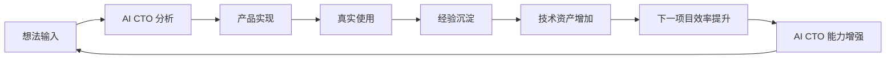

# AI CTO System 核心价值飞轮

## 1. 飞轮模型

## 2. 各环节的价值

| 环节 | 核心产出 | 进入下一环节的条件 |
|---|---|---|
| 想法输入 | 问题、用户、目标、约束和历史关联 | 达到 Idea Candidate 最小标准 |
| AI CTO 分析 | Research、Evaluation、Confidence、风险和立项建议 | 有证据且经人类决定 |
| 产品实现 | PRD、Architecture、Task、Commit、Test 与 Release | 通过适用工程和发布 Gate |
| 真实使用 | 用户结果、运行指标、成本、反馈、Bug 和 Incident | 基线、时间窗与 Evidence 可追溯 |
| 经验沉淀 | Project Memory、Postmortem、解决方案和失败模式 | 已验证、脱敏并标注适用边界 |
| 技术资产增加 | 可复用 Module、模板、Prompt、代码、架构和评测方法 | 通过质量、License、安全与复用审核 |
| 下一项目效率提升 | 更少研究和返工、更高复用率、更快验证 | 记录实际复用和结果，而非理论节省 |
| AI CTO 能力增强 | 更好的判断、设计、执行建议和风险识别 | 用长期项目结果验证，而非功能数量 |

## 3. 为什么产生复利

复利来自“每次交付都保留可验证资产”，而不是单纯重复使用 AI：

1. Project Memory 降低重新理解项目和历史决策的成本。
2. Knowledge Base 保存经过验证的失败模式与解决方案，减少重复试错。
3. Technical Asset Registry 让新项目优先复用已有架构、模块和评测方法。
4. Portfolio 数据让资源、依赖和成本判断建立在更多真实样本上。
5. 真实使用和长期指标纠正 AI 推测，使后续建议的 Confidence 提高。
6. 人类在每次重大决策中保留控制并看到证据，个人与组织能力同步增长。

因此，系统每完成一个有效闭环，下一项目的起点、决策质量和可复用资产都会提高。

## 4. 伪飞轮与断点

以下情况不会产生复利：

- 只有想法和文档，没有真实使用与结果；
- 只保存成功案例，忽略 Bug、Incident、失败与反证；
- 把未经验证的输出直接注册为技术资产；
- 资产没有 Owner、版本、测试、适用范围或退出路径；
- 指标口径不断变化，无法比较前后项目；
- 自动化增加调用次数，却没有提高用户结果或降低长期成本。

发现断点时，必须修复 Evidence、使用验证、知识沉淀或资产质量环节，而不是继续增加功能掩盖问题。

## 5. 飞轮健康指标

至少持续观察：Idea 到验证产品的周期、返工率、已验证资产复用率、复用后的节省、重复 Bug / Incident、技术债趋势、AI 成本、维护投入、用户结果和人类接管 / Override 原因。任何单一指标都不能代表飞轮健康，功能数量不作为核心成功指标。
