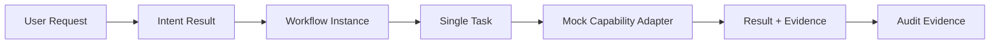

# Phase 9C-1 Runtime Foundation Implementation Design

## 目标与范围

本规格将 Phase 9B 的 Runtime MVP 范围转化为后续实现可使用的技术栈中立设计。它只定义 Entity、Interface Contract、Pseudo Type、State Machine 和 Input / Output Definition；不创建 Runtime 代码、真实 Agent、真实工具、Codex、MCP、数据库、ORM、框架或部署方案。

首个可验证闭环保持不变：



MVP 只允许单一 Workflow、单一 Task 和单次 Mock Capability Invocation；不扩大为多 Agent、自动代码修改、自动部署、生产执行或真实工具调用。

## 设计选择

采用“薄核心 + 明确合同”。核心只负责 Workflow、Task、受控 Invocation、状态和 Evidence 的协调；可替换边界通过合同暴露，避免 Runtime Core 依赖未来具体工具、数据库或框架。

未采用“领域事件优先”，因为当前 MVP 只需最小审计闭环，不需完整事件驱动基础设施；未采用“框架预置架构”，因为它会过早绑定技术选型并破坏 Phase 9C-1 的目标。

## 组件与职责

| 组件 | 责任 | 不负责 |
|---|---|---|
| Workflow Service | 创建与查询 Workflow、验证并推进 Workflow State。 | 调用具体工具、做业务价值或 Gate 最终决策。 |
| Task Service | 为 Workflow 创建唯一 Task、关联输入、状态与 Result。 | 创建多 Task 或调度 Agent。 |
| Permission / Budget Guard | 在状态推进和 Invocation 前输出允许、确认或拒绝结论。 | 自动增加预算、覆盖 Gate 或人工授权。 |
| Capability Adapter Port | 以统一请求调用 Mock Capability 并返回 Result。 | 直接依赖 Codex、MCP 或真实工具。 |
| Audit Port | 追加 Workflow、Task、控制与 Invocation Evidence。 | 修改历史审计、授权执行或决定 Gate。 |
| Execution Context | 以引用方式携带用户、项目与约束上下文。 | 无差别加载所有记忆或敏感数据。 |
| Evidence Contract | 让 Capability Result 携带证据、可信度与时间。 | 将一次模拟结果提升为通用知识或强制决策依据。 |

所有组件的任务流转必须经过 Workflow Service / Workflow Engine 边界；未来 Agent 不能直接相互调用。

## 实体与伪类型

```text
WorkflowInstance {
  workflowId: WorkflowId
  intent: IntentResultRef
  executionContext: ExecutionContext
  state: WorkflowState
  controlMode: ControlMode
  budget: BudgetSnapshot
  taskId: TaskId?
  createdAt: Timestamp
  updatedAt: Timestamp
}

Task {
  taskId: TaskId
  workflowId: WorkflowId
  taskType: TaskType
  input: TaskInput
  state: TaskState
  result: CapabilityResult?
}

ExecutionRecord {
  executionId: ExecutionId
  workflowId: WorkflowId
  taskId: TaskId
  status: ExecutionStatus
  startedAt: Timestamp?
  endedAt: Timestamp?
  resultRef: ResultRef?
}

CapabilityInvocation {
  invocationId: InvocationId
  taskId: TaskId
  adapterId: AdapterId
  status: InvocationStatus
  request: CapabilityRequest
  result: CapabilityResult?
  budgetUsage: BudgetUsage
}

AuditEvent {
  auditId: AuditId
  workflowId: WorkflowId
  taskId: TaskId?
  eventType: AuditEventType
  status: RuntimeStatus
  evidence: Evidence[]
  timestamp: Timestamp
}
```

`ExecutionContext` 的最小合同：

```text
ExecutionContext {
  userRef: UserRef?
  projectRef: ProjectRef?
  intentRef: IntentResultRef
  constraintRefs: ConstraintRef[]
  allowedContextRefs: ContextRef[]
}
```

它只保存受控引用，不复制 User Brain、Project Memory 或 Knowledge Base 原文；具体读取仍服从既有 Memory Runtime 和 Context Routing 规则。

`Evidence` 的最小合同：

```text
Evidence {
  evidenceId: EvidenceId
  source: EvidenceSource
  summary: SafeText
  confidence: ConfidenceLevel
  timestamp: Timestamp
  reference: EvidenceRef?
}

CapabilityResult {
  status: SUCCESS | FAILURE | CANCELLED | BLOCKED
  output: SafeResult
  evidence: Evidence[]
  confidence: ConfidenceLevel
  timestamp: Timestamp
  error: SafeError?
}
```

Evidence 必须可追溯、脱敏且带时间；它支持审计和后续复盘，但不能替代项目 Gate、ADR 或人工决策。

## 状态机与失败语义

正常路径为：`CREATED → PLANNING → EXECUTING → VALIDATING → COMPLETED`。`CONFIRM` 在调用前进入 `WAITING_APPROVAL`；`BLOCK` 不创建可执行 Invocation。

| 事件 | 目标状态 | 规则 |
|---|---|---|
| Capability 失败 | `FAILED` | 停止当前调用，不自动替换 Capability 或重试。 |
| Task / Workflow 失败 | `FAILED` | 写入失败原因和 Evidence；不创建新 Task。 |
| 用户取消 | `CANCELLED` | 阻止后续调用并记录取消 Evidence。 |
| 预算超限 | `PAUSED` 或 `CANCELLED` | 不自动增加 Token、时间、工具或成本预算。 |
| 需要回滚的后续动作 | `ROLLING_BACK` | 仅定义记录与协调语义，不实现真实回滚。 |

从 `PAUSED` 恢复必须重新通过 Permission / Budget Guard 和适用的人类确认。所有状态变化均须产生 Audit Event。

## Interface Contracts

```text
WorkflowService.create(input: CreateWorkflowInput) -> CreateWorkflowOutput
WorkflowService.get(query: WorkflowQuery) -> WorkflowView
WorkflowService.transition(command: TransitionWorkflowCommand) -> TransitionWorkflowOutput

TaskService.create(input: CreateTaskInput) -> CreateTaskOutput
TaskService.get(query: TaskQuery) -> TaskView

CapabilityAdapter.invoke(request: CapabilityRequest) -> CapabilityResult
PermissionBudgetGuard.evaluate(request: GuardRequest) -> GuardDecision
AuditPort.append(event: AuditEvent) -> AuditReceipt
AuditPort.list(query: AuditQuery) -> AuditEvent[]
```

`GuardDecision` 只允许 `ALLOW`、`CONFIRM_REQUIRED`、`DENY`。任何 `DENY` 或预算超限必须阻止 Invocation；`CONFIRM_REQUIRED` 必须等待相应确认记录。所有接口均使用引用和安全文本，禁止将 API Key、Secret、未脱敏配置或敏感用户数据作为合同输入或审计输出。

## Mock Capability

唯一的 Mock Capability 只用于验证：`Runtime → Adapter → Capability → Result + Evidence`。其输入是已授权 Task、Execution Context 引用与 Budget Snapshot；输出是固定、可预测且脱敏的 `CapabilityResult`。它必须能返回成功和受控失败两种结果，不调用真实系统，也不产生外部副作用。

## 测试策略

| 类型 | 覆盖范围 |
|---|---|
| Unit Test | Workflow 合法 / 非法状态转换、单 Task 约束、Guard 决定、Evidence Contract。 |
| Integration Test | Workflow 到 Task、Mock Adapter、Result 与 Audit 的闭环。 |
| Failure Test | Capability 失败、Task / Workflow 失败、用户取消、预算超限和暂停恢复。 |
| Audit Test | 事件完整性、关联关系、Evidence / Confidence / Timestamp 存在、敏感信息排除。 |

未来实现须先编写测试，再实现对应行为；测试不得调用真实工具、模型、生产环境或 Agent。

## 实施顺序与 Gate

建议按 Runtime Core、Task Engine、Mock Capability Adapter、Audit System、Integration Test 五个阶段推进。每阶段只在前一阶段的合同、测试与审计要求成立时继续。

进入代码开发前必须完成并确认：Implementation Plan、Project Structure、Data Model、API Contract、Mock Capability Design、Test Plan、Failure Handling 与风险清单。Gate 只允许 `APPROVED_FOR_IMPLEMENTATION` 或 `CHANGES_REQUIRED`；本规格不产生 `APPROVED_FOR_IMPLEMENTATION` 结果。

## 边界与后续

具体编程语言、框架、数据库、ORM、持久化策略、HTTP / RPC、部署与工具接入均推迟至获得 Phase 9C-2 Runtime Foundation Implementation 代码开发授权后再确定。届时必须复核本规格、已有 Permission / Budget / Audit / Safety 规则以及适用 Gate，且不得以实现便利为由扩大 MVP。
