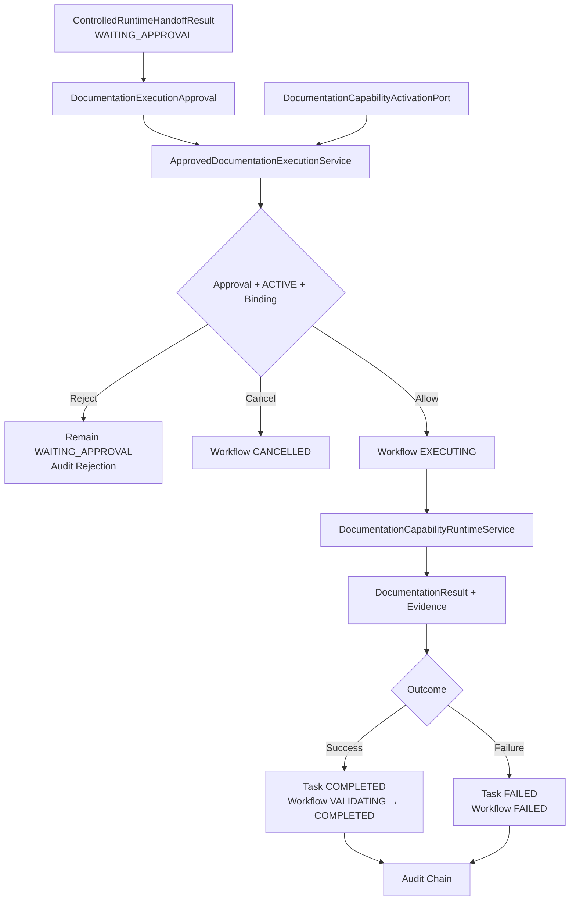

# Controlled Documentation Capability Activation & Execution Design

## 1. 决策摘要

AI CTO System 将在既有 Capability Governance 与 Layer 5 Runtime 内，把本地确定性 Documentation Capability 作为首个受限 `ACTIVE` Capability 候选，并建立一条专用的审批后执行桥。

目标闭环：

```text
WAITING_APPROVAL
→ Explicit Confirmation
→ ACTIVE / Permission / Budget / Source Scope Check
→ Documentation Capability
→ Draft Package + Evidence
→ Validation
→ Audit
→ COMPLETED / FAILED
```

该设计不新增 Module、Phase、Agent、通用 Capability Dispatcher、Provider 或审批系统。它不接入 LLM、Codex、MCP、网络、文件系统或外部工具，也不激活 Documentation 之外的任何 Capability。

## 2. 战略与架构归类

| 检查项 | 结论 |
|---|---|
| Mission Alignment | 通过：把已批准目标转化为可追溯文档草案，直接服务想法到产品与研发资产沉淀 |
| Capability Type | Documentation Capability |
| Owning Governance | 既有 Layer 5 Capability Governance |
| Runtime Integration | 扩展既有 AI CTO Runtime Architecture |
| Module Admission | `EXTEND_EXISTING_MODULE`；不新增 Module |
| Architecture Review | 不需要；不改变五层职责、Runtime Core 或权威层级 |
| ADR | 不需要；激活规则已由 ADR-0011 与既有 Capability Governance 决定 |

设计对象编号：`SYS-L5-DOC-ACT-001`。

## 3. Capability Identity 与受限激活结论

### 3.1 Identity

| Field | Value |
|---|---|
| Capability ID | `CAP-DOC-0001` |
| Name | Deterministic Evidence-driven Documentation Assistant |
| Type | Documentation Capability |
| Source | AI CTO System 内部 TypeScript 实现 |
| Source Commit | `9876764` |
| Runtime | Node.js 24 |
| Operation | 仅 `GENERATE_DRAFT` |
| Provider | `NONE` |
| Network / Filesystem / Tool | `NONE` |
| Risk | Low，限当前受控范围 |
| Human Control | `CONFIRM_REQUIRED` |

Source Commit 是当前五个实现对象的最近行为提交：Documentation Contract、Adapter、Deterministic Assistant、Runtime Service 与专用测试。任何相关文件发生行为变化，当前 Evaluation 与 Activation 自动失效，Registry 必须回到 `EVALUATING`。

### 3.2 License / Usage Terms

当前仓库没有外部分发 License 文件。本 Capability 的激活依据不是未知外部 License，而是项目所有者明确批准的内部使用条款：

- Usage Terms：`INTERNAL_USE_ONLY`；
- 允许：在 AI CTO System 内部、非生产、当前仓库受控 Runtime 中使用；
- 禁止：公开分发、商业再许可、外部打包、跨组织共享；
- 重新评审触发器：任何外部分发、Provider 接入、第三方依赖或仓库所有权变化。

这项内部使用批准不能解释为开源 License。

### 3.3 Evaluation

| 维度 | 得分 | Evidence 与限制 |
|---|---:|---|
| 功能有效性 | 23/25 | 20 项专用测试覆盖成功、权限、预算、取消、来源、Evidence、输出与泄漏边界 |
| 稳定性 | 15/20 | 确定性重复执行；无长期运行、并发和大样本 Evidence |
| 兼容性 | 13/15 | 当前 Node 24 Runtime、Audit 与 Capability Adapter 已验证 |
| 维护状态 | 10/15 | 内部维护且可替换；缺少长期版本历史与维护指标 |
| 安全 | 15/15 | 无文件、网络、Provider、工具、Knowledge 或 Workflow 隐式副作用 |
| 复用价值 | 8/10 | 可服务设计和工程草案；确定性输出能力有限 |
| **Total** | **84/100** | Confidence `L3`，仅适用于当前版本和内部受控环境 |

当前内部只读用途的目标阈值为 70 分；总分 84 且没有当前范围内的安全、来源、Usage Terms、权限或兼容性红线，因此 Evaluation Result 使用封闭词汇 `PASS`。所有限制进入 Activation Scope，禁止创建 `PASS_WITH_RESTRICTED_SCOPE` 等自定义结果。

### 3.4 Registry Lifecycle

正式 Registry Record 创建于 `capabilities/documentation/CAP-DOC-0001.md`，Change History 必须记录：

```text
ABSENT
→ DISCOVERED
→ EVALUATING / ADMIT_FOR_EVALUATION
→ ACTIVE / ACTIVATE_CAPABILITY
```

最终 `ACTIVE` 只代表当前版本可进入任务级选择；每次调用仍必须独立通过 Workflow 状态、Approval、Permission、Budget 和 Source Scope 校验。

## 4. 架构



`ApprovedDocumentationExecutionService` 只协调既有 Workflow、Task、Documentation Capability 与 Audit。它不拥有项目价值、Intent、Routing、Capability Admission、Gate 或文档采纳决策权。

## 5. 组件边界

### 5.1 Formal Registry Record

`capabilities/documentation/CAP-DOC-0001.md` 是人类可审阅的 Capability Registry 权威记录，包含标准要求的 Identity、Source、Version、Usage Terms、权限、Evaluation、风险、Activation、Fallback、Review 和 Change History。

### 5.2 DocumentationCapabilityActivationPort

Runtime 不解析 Markdown。只读 Port 返回由可信 Composition Root 注入的不可变激活投影：

```ts
interface DocumentationCapabilityActivationSnapshot {
  capabilityId: 'CAP-DOC-0001';
  version: string;
  registryStatus: 'DISCOVERED' | 'EVALUATING' | 'ACTIVE' | 'DEPRECATED' | 'DISABLED' | 'REMOVED';
  sourceCommit: string;
  allowedOperations: readonly ['GENERATE_DRAFT'];
  allowedEnvironment: 'INTERNAL_LOCAL';
  activationScope: readonly string[];
  lastReviewAt: string;
  nextReviewAt: string;
}
```

当前 Adapter 为 In-memory，仅保存一个 Registry 投影。调用请求不能提交或覆盖 Registry Status。

### 5.3 DocumentationExecutionApproval

```ts
interface DocumentationExecutionApproval {
  approvalId: string;
  status: 'CONFIRMED';
  classificationId: string;
  routingId: string;
  workflowId: string;
  taskId: string;
  capabilityId: 'CAP-DOC-0001';
  capabilityVersion: string;
  operation: 'GENERATE_DRAFT';
  sourceScopeFingerprint: string;
  confirmedAt: string;
  expiresAt: string;
}
```

Approval 由可信调用方在用户明确确认后提供。当前设计不实现用户身份系统、UI、通用 Approval Repository 或自动确认。

### 5.4 ApprovedDocumentationExecutionRequest

执行请求组合：

- `DocumentationExecutionApproval`；
- 现有 `DocumentationExecutionRequest`；
- `classificationId` 与 `routingId`；
- 可选 `cancelled` 只用于确认后的取消信号。

Capability Permission Grant、Budget 和 Authorized Sources 继续使用现有 Documentation Contract，不重复定义第二套权限或预算合同。

## 6. Source Scope Fingerprint

确认必须绑定来源内容，避免用户确认后替换材料。

算法固定为：

1. 验证 `sourceRef` 唯一且所有字段符合现有 Documentation Contract；
2. 对每项来源计算 `contentHash = SHA-256(UTF-8 content)`；
3. 按 `sourceRef` 升序排列；
4. 构造数组元素 `{ sourceRef, location, versionRef: versionRef ?? null, contentHash }`；
5. 对该数组的标准 `JSON.stringify` UTF-8 字节计算 SHA-256；
6. 输出小写 64 位十六进制字符串。

Approval 中的 Fingerprint 必须与执行时重新计算结果完全一致。该算法只处理请求内内存内容，不读取文件系统。

## 7. 执行与状态规则

### 7.1 Preflight 顺序

在任何 Workflow 状态变化前按以下顺序检查：

1. Workflow 存在且状态严格为 `WAITING_APPROVAL`；
2. Task 存在、属于该 Workflow 且状态为 `CREATED`；
3. Classification、Routing、Workflow、Task ID 与 Handoff 引用一致；
4. Approval 为 `CONFIRMED`，`confirmedAt` / `expiresAt` 是标准 ISO，且尚未过期；
5. Capability ID、Version 与 Activation Snapshot 一致；
6. Registry Status 为 `ACTIVE`；
7. Operation 位于 `allowedOperations` 且环境为 `INTERNAL_LOCAL`；
8. Source Scope Fingerprint 一致；
9. Documentation Request 中 Workflow、Task 与 Execution Context 引用一致。
10. Permission Grant 包含 `GENERATE_DRAFT`，授权时间为标准 ISO 且尚未过期；
11. Token、Tool、Time 与 Cost 均未超过现有 Budget Snapshot；
12. Authorized Sources 非空、引用唯一，且全部位于 `allowedContextRefs`；
13. 若收到执行前取消信号，直接进入取消路径。

除取消外，任一失败均返回受控拒绝、追加拒绝 Audit，并保持 `WAITING_APPROVAL`。取消进入 `CANCELLED`。这些资格检查发生在 Documentation Adapter 调用和 Workflow `EXECUTING` 转换之前；Adapter 内部继续执行既有二次校验，防止执行桥与 Capability 边界之间发生漂移。

### 7.2 Success

```text
WAITING_APPROVAL
→ EXECUTING
→ DocumentationCapabilityRuntimeService.execute
→ TaskService.complete(SUCCESS mapping)
→ VALIDATING
→ COMPLETED
```

Documentation Result 映射为现有 `CapabilityResult`：Draft 进入 `output`，Evidence / Confidence 保持原值，Timestamp 使用 Outcome Timestamp。原始五项 Draft Package 仍作为执行服务返回值，不被扁平映射取代。

### 7.3 Capability Failure

Documentation Adapter 的 Permission、Budget、Source、Cancellation、Invocation 或 Output Validation 失败：

```text
EXECUTING
→ TaskService.complete(non-success mapping)
→ Workflow FAILED
```

不重试、不切换 Provider、不修改来源、不生成替代草案。

### 7.4 Cancellation

若在 Capability 调用前收到取消信号：

```text
WAITING_APPROVAL → CANCELLED
```

不调用 Capability。进入 `EXECUTING` 后的取消仍由 Documentation Adapter 的既有 `cancelled` 合同处理，并产生失败结果。

### 7.5 Replay Protection

Workflow 只有 `WAITING_APPROVAL` 可以进入本执行桥。第一次成功或失败后状态不再是 `WAITING_APPROVAL`，相同 Approval 再次提交会被状态检查拒绝。当前不新增 Approval Consumption Repository。

## 8. Audit Model

最小事件链：

- `DOCUMENTATION_APPROVAL_VERIFIED`；
- `DOCUMENTATION_EXECUTION_STARTED`；
- 既有 `DOCUMENTATION_CAPABILITY_COMPLETED` 或 `DOCUMENTATION_CAPABILITY_REJECTED`；
- `DOCUMENTATION_WORKFLOW_COMPLETED` 或 `DOCUMENTATION_WORKFLOW_FAILED`；
- Preflight 失败时使用 `DOCUMENTATION_EXECUTION_BLOCKED`；
- 取消使用 `DOCUMENTATION_EXECUTION_CANCELLED`。

Audit 必须关联：

- Classification ID、Routing ID、Workflow ID、Task ID；
- Capability ID、Version、Approval ID；
- Source Scope Fingerprint；
- Result Reference 与 Evidence；
- Budget Snapshot；
- Failure Reason 与 Failure Stage。

Audit 只记录事实，不产生 Invocation Authorization，不采纳 Draft，不写入或激活 Knowledge。

## 9. Failure Model

| Condition | Result | Workflow | Capability Called |
|---|---|---|---|
| Missing / expired / mismatched Approval | `APPROVAL_REJECTED` | `WAITING_APPROVAL` | No |
| Registry not `ACTIVE` | `CAPABILITY_NOT_ACTIVE` | `WAITING_APPROVAL` | No |
| Version / operation / environment mismatch | `ACTIVATION_SCOPE_MISMATCH` | `WAITING_APPROVAL` | No |
| Source fingerprint drift | `SOURCE_SCOPE_CHANGED` | `WAITING_APPROVAL` | No |
| Pre-execution cancellation | `CANCELLED` | `CANCELLED` | No |
| Documentation preflight failure | Existing Documentation failure | `FAILED` | Adapter yes; Assistant no |
| Invocation / output validation failure | Existing Documentation failure | `FAILED` | Yes |
| Success | Draft Package | `COMPLETED` | Yes |
| Repeat after terminal state | `WORKFLOW_NOT_WAITING_APPROVAL` | Unchanged | No |

## 10. Test Design

测试必须覆盖：

1. 治理验收人工核对 `CAP-DOC-0001` Registry Record 完整，Change History 记录 `DISCOVERED → EVALUATING → ACTIVE`；自动化测试不通过匹配 Markdown 文本代替行为验证；
2. Activation Port 返回不可变可信投影，请求不能伪造 `ACTIVE`；
3. 正常确认生成 Draft、Source References、Confidence、Evidence、Limitations；
4. 非 `ACTIVE`、版本、Operation、Environment 不匹配时阻断；
5. Approval 缺失、过期、Classification / Routing / Workflow / Task ID 不匹配时阻断；
6. Source Scope Fingerprint 确定性、顺序无关、内容变化敏感；
7. Permission、Budget、取消、来源与无效输出沿用 Documentation Adapter 边界；
8. 成功状态为 Task `COMPLETED`、Workflow `COMPLETED`；
9. Capability 失败状态为 Task `FAILED`、Workflow `FAILED`；
10. 相同 Approval 重复执行被拒绝；
11. Audit 事件和关联字段完整；
12. 没有文件、网络、Provider、LLM、Codex、MCP、Tool、Knowledge 或其他 Capability 副作用；
13. 全量回归测试通过。

## 11. 实施文件边界

预计新增：

- `capabilities/documentation/CAP-DOC-0001.md`；
- `docs/capability/DOCUMENTATION_CAPABILITY_EVALUATION.md`；
- `runtime/capability/documentation-capability-activation-contract.ts`；
- `runtime/capability/documentation-capability-activation-port.ts`；
- `runtime/capability/in-memory-documentation-capability-activation-repository.ts`；
- `runtime/integration/approved-documentation-execution-contract.ts`；
- `runtime/integration/approved-documentation-execution-service.ts`；
- `runtime/tests/approved-documentation-execution.test.ts`。

预计修改：

- `package.json`；
- 既有 Capability / Runtime 治理入口与项目记忆。

禁止修改：

- Runtime Foundation、Workflow、Task、Agent 和现有 Documentation Capability 的公开合同；
- Manifesto、既有 ADR、核心 Lifecycle 与 Permission Model；
- 其他 Capability 的 Registry / Activation 状态。

## 12. 完成判定与成熟度

本切片实现后，系统将首次具备“结构化 Intent → Routing → Workflow → 人工确认 → 已激活本地 Capability → Result / Evidence / Audit”的内部受控闭环。

成熟度仍为 `INTERNAL_ONLY`，因为它仍缺：

- 自然语言用户入口；
- 可信用户身份与通用确认交互；
- 文件写入与目标项目安全边界；
- 持久化 Registry / Approval / Workflow / Audit；
- 隔离真实项目端到端 Pilot。

下一可用性切片应是用户入口与确认适配，而不是新增 Capability 或通用 Dispatcher。
