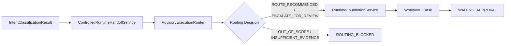

# Controlled Intent-to-Runtime Handoff Design

## 1. Decision Summary

AI CTO System will extend the existing Layer 5 Runtime with a thin, controlled handoff service. The first version accepts only a structured `IntentClassificationResult`, obtains an advisory routing decision, and—only when routable—creates one Workflow and one Task through the existing Runtime. Every created Workflow is forced to `CONFIRM` control and must stop at `WAITING_APPROVAL` before any Capability invocation.

This design does not add a Module, Phase, classifier, Graph Engine, Agent, Capability, tool, provider, or approval system.

## 2. Strategic Admission

| Field | Decision |
|---|---|
| Candidate ID / Name | `SYS-L5-HANDOFF-001` / Controlled Intent-to-Runtime Handoff |
| Mission Contribution | Connects understanding, execution planning, and controlled Runtime state so project requests become traceable technical work rather than disconnected advice. |
| Core Problem | Intent Gateway, Advisory Execution Router, and Runtime Foundation exist independently; no versioned contract currently joins their outputs and control boundaries. |
| Owning Layer / Existing Module | Layer 5 / AI CTO Runtime Architecture; consumes Intent Gateway and Execution Routing Governance. |
| Reuse Analysis | Reuse existing intent vocabulary, `AdvisoryExecutionRouter`, `RuntimeFoundationService`, Workflow, Task, Guard, and Audit. No duplicate state machine or authority is created. |
| Long-term Asset | Versioned handoff contract, deterministic mapping rules, correlation chain, and integration tests reusable by future user entry adapters. |
| Complexity Impact | One thin integration service and dedicated contracts/tests; no persistence, provider, network, tool, or multi-Agent dependency. |
| Evidence / Confidence | L3: repository contracts and 137 passing tests prove the components exist and the handoff is absent. |
| Human Decision | User approved structured-intent input, confirmation-only Runtime creation, routing disposition, and test boundaries on 2026-08-06. |
| Admission Result | `ADMIT_FOR_CLASSIFICATION` |
| Next Action | Write an implementation plan after written-spec review; coding remains separately gated. |

## 3. Feature Classification

| Field | Decision |
|---|---|
| Feature / Request | `SYS-L5-HANDOFF-001`: connect structured Intent → advisory Routing → controlled Runtime. |
| Strategic Admission | `ADMIT_FOR_CLASSIFICATION` |
| Evidence / Confidence | L3 repository implementation evidence; user-confirmed boundaries. |
| Owning Layer | Layer 5 — Execution & Intelligence |
| Existing Module | AI CTO Runtime Architecture |
| Classification Result | `EXTEND_EXISTING_MODULE` |
| Cross-Layer Inputs / Outputs | Consumes only structured Layer 5 intent/routing data plus approved context references; outputs Workflow/Task/Audit references without changing Layer 2–4 authority. |
| Risks / Redlines | No raw-text classification, execution authorization, Capability invocation, model/tool selection, Gate override, or duplicate Workflow state authority. |
| Architecture Review Required | `NO`: the design follows accepted Control Plane First and advisory-routing boundaries. |
| ADR Required | `NO`: ADR-0015, ADR-0018, and ADR-0032 already establish the ordering and authority boundaries. |
| Registry Update | Add this design as a related artifact of the existing Runtime Module; do not add or change a Module status. |
| Next Action | Create a TDD implementation plan after user review. |

## 4. Scope

### Included

- A closed, versioned structured Intent handoff contract.
- Exact Intent-to-`RoutingRequest` mapping.
- `ControlledRuntimeHandoffService` as a thin facade.
- One real in-memory Workflow and one Task through existing Runtime services.
- Mandatory `CONFIRM` control and `WAITING_APPROVAL` terminal point for this MVP.
- Correlated Intent, Routing, Workflow, Task, Evidence, and Audit references.
- Controlled handling of intent rejection, routing block, budget/cancellation denial, and integration invariant failures.

### Excluded

- Raw natural-language classification or an Intent Classifier.
- Approval resumption or any transition from `WAITING_APPROVAL` to execution.
- Capability invocation, Agent execution, model selection/switching, Tool Calling, Codex/MCP/provider integration, filesystem/network access, persistence, or production execution.
- Multi-Agent orchestration, dynamic Graph execution, parallel branches, retries, or new Runtime state transitions.
- Changes to project-value decisions, Architecture authority, Gate decisions, Permission policy, or Human Control policy.

## 5. Architecture

`ControlledRuntimeHandoffService` validates and snapshots input, maps routing data, calls the existing Router, applies the approved disposition table, and delegates Workflow/Task/Audit work to the existing Runtime. It does not own routing policy, Workflow transitions, Guard policy, approval, or execution.

## 6. Contracts

### Structured Intent Input

The input must include:

- `classificationId` and closed `status` vocabulary;
- Intent type and L3/L4 Confidence for `CLASSIFIED` results;
- exact complexity, task kind, risk, reversibility, applicable-Gate flag, and current-evidence requirement;
- suggested Workflow and required Capability references as advisory metadata;
- task objective, `ExecutionContext`, `BudgetSnapshot`, and supplied Evidence freshness data.

The integration service never guesses missing fields. `AMBIGUOUS`, `OUT_OF_SCOPE`, Intent-level `INSUFFICIENT_EVIDENCE`, and L1/L2 candidates do not enter Routing or Runtime.

### Handoff Output

The immutable output contains:

- `handoffDecision`;
- frozen Intent snapshot;
- optional `RoutingRecommendation`;
- optional Workflow and Task;
- Runtime Audit Events when a Workflow was created;
- deterministic Handoff Evidence and limitations.

`handoffDecision` uses only:

- `WAITING_APPROVAL`;
- `INTENT_REJECTED`;
- `ROUTING_BLOCKED`;
- `RUNTIME_BLOCKED`;
- `INTEGRATION_FAILED`.

No output field grants execution authorization.

## 7. Routing and Runtime Disposition

| Condition | Result |
|---|---|
| Intent is not eligible for routing | `INTENT_REJECTED`; do not call Router or Runtime. |
| Router returns `ROUTE_RECOMMENDED` | Create one Workflow/Task with `CONFIRM`; stop at `WAITING_APPROVAL`. |
| Router returns `ESCALATE_FOR_REVIEW` | Create one strict-review Workflow/Task with `CONFIRM`; stop at `WAITING_APPROVAL`. |
| Router returns `OUT_OF_SCOPE` or `INSUFFICIENT_EVIDENCE` | `ROUTING_BLOCKED`; do not create a Workflow. |
| Guard denies because of cancellation, budget, or policy | Runtime Workflow ends `CANCELLED`; return `RUNTIME_BLOCKED`; no invocation. |
| Runtime returns an unexpected state or any Capability invocation | `INTEGRATION_FAILED` and surface a controlled invariant error. |

## 8. Data Flow and Traceability

1. Validate and freeze the caller-supplied Intent result.
2. Reject non-routable Intent status/confidence without side effects.
3. Build a deterministic `RoutingRequest` with a stable `routingId` tied to `classificationId`.
4. Call `AdvisoryExecutionRouter` and preserve its L2 routing Evidence.
5. Apply the disposition table without changing Router policy.
6. For allowed decisions, call existing Runtime with `controlMode: CONFIRM`.
7. Store `classificationId` in `workflow.intentRef`. Keep the existing `TaskInput` contract unchanged: its `request` field receives a deterministic `handoff:v1` reference string containing only `routingId` and the bounded objective. Advisory Capability references remain in the immutable Handoff Result and are not executable Task permissions.
8. Assert that Workflow is `WAITING_APPROVAL`, Task exists, and Capability invocation/execution record do not exist.
9. Return the complete frozen handoff result.

Correlation follows:

`classificationId → routingId → workflowId → taskId`.

Runtime Audit remains authoritative for created Workflow events. Pre-Runtime rejection returns Handoff Evidence but does not create a second persistence or audit subsystem.

## 9. Failure Handling

- No automatic retry, fallback execution, or second Workflow creation.
- Invalid Intent vocabulary, missing fields, low Confidence, or inconsistent context produce `INTENT_REJECTED` or a controlled contract error.
- Routing block never calls Runtime.
- Guard denial never reaches Capability invocation.
- An unexpected Runtime state, invocation, or execution record is an integration-boundary violation, never a partial success.
- Inputs are not mutated and outputs are frozen.
- This MVP performs no external rollback action; it relies on avoiding side effects before approval.

## 10. Test Design

The TDD implementation must cover:

1. Complexity-L1, low-risk routable work with L3/L4 Intent Confidence produces `LIGHT / R1 / FAST` and a waiting Workflow.
2. High-risk or irreversible work produces `STRICT` and still waits for approval.
3. Ambiguous, low-confidence, out-of-scope, and Intent-level insufficient-evidence inputs do not call Router or Runtime.
4. Router-level insufficient evidence creates no Workflow.
5. Every created Workflow uses `CONFIRM` and ends at `WAITING_APPROVAL`.
6. No Capability invocation or Execution Record exists before approval.
7. Budget excess returns `RUNTIME_BLOCKED / CANCELLED` with no invocation.
8. User cancellation returns `RUNTIME_BLOCKED / CANCELLED` with no invocation.
9. Intent, routing, Workflow, Task, Evidence, and Audit references correlate correctly.
10. Inputs remain unchanged and returned structures are immutable.
11. Unexpected Runtime state or invocation is rejected as an invariant violation.
12. Static scope scan finds no model, network, filesystem, provider, tool, or activation path.
13. The full repository test suite remains green.

## 11. Success Criteria

A caller-supplied structured Intent can pass through the real advisory Router into the real in-memory Runtime, create one traceable Workflow and Task, and safely stop at `WAITING_APPROVAL`. Missing evidence, invalid intent, budget/cancellation denial, or boundary violations stop before Capability execution.

## 12. Usability Boundary and Honest Roadmap

This handoff is an internal control-plane integration, not yet a user-facing development product. Completing it will not allow a user to type an arbitrary natural-language request and have Runtime modify a project.

AI CTO System is already usable today in **Codex-assisted governance mode**: Codex reads the system rules, creates project artifacts, asks for required decisions, and performs separately authorized engineering work. That mode is human-coordinated and does not prove Runtime-controlled execution.

The minimum additional work required for a **controlled usable development loop** is:

1. a user-facing entry adapter that turns the current Codex conversation into the approved structured Intent contract without creating a second classifier authority;
2. an approval-resume contract that safely continues a specific `WAITING_APPROVAL` Workflow after confirmation;
3. one admitted, registered, activated, and permission-bounded real Engineering Capability for project analysis/modification/testing;
4. explicit target-project workspace scope, rollback, validation, and persistent audit evidence.

Multi-Agent execution and a general Graph Engine are not prerequisites for the first usable loop. They must not delay this vertical slice.
