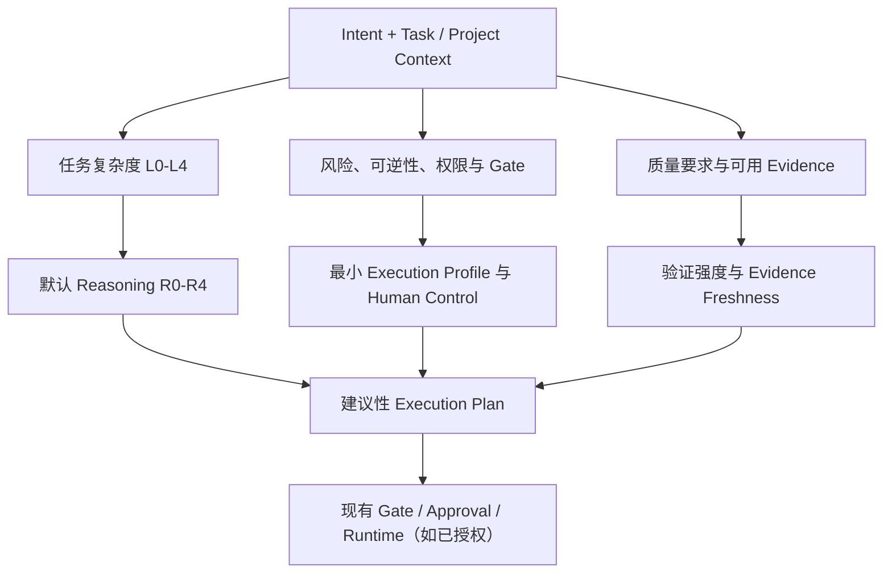

# 执行档位与证据新鲜度对齐设计

- **状态：** 书面设计，等待用户审阅
- **日期：** 2026-08-06
- **Owning Layer：** Layer 5 — Execution & Intelligence
- **Existing Module：** Execution Routing Governance
- **分类：** `EXTEND_EXISTING_MODULE`
- **实现状态：** 未实现；不改变当前模型、推理、工具、Skill 或 Runtime 行为

## 1. 目的与问题

AI CTO 已有任务复杂度 L0–L4、推理预算 R0–R4、Workflow、Model、Skill、Tool 与 Context 路由规则，但这些规则尚未形成一个清晰的统一解释：

- **复杂度**决定需要多少分析与规划；
- **风险和可逆性**决定执行必须达到的控制档位；
- **质量与证据要求**决定验证、审查与审计的强度。

本设计在既有 `Execution Routing Governance` 内增加建议性的执行档位（Execution Profile）和证据新鲜度（Evidence Freshness）语义。目标是避免低复杂度任务被不必要地重流程化，同时避免把旧证据误当成仍然适用的证据。

它不是新的 Module、Phase、Agent、Capability 或审批系统，也不导入外部 Skills 包的实现、全局规则或安装机制。

## 2. 准入与来源边界

| 字段 | 结论 |
|---|---|
| Mission Alignment | 支持“以最低充分资源交付可维护产品资产”，并提高执行证据的可追溯性。 |
| Strategic Admission | `ADMIT_FOR_CLASSIFICATION`；用户已确认仅扩展现有路由治理。 |
| Evidence / Confidence | L2：现有 AI CTO 路由文档、EFF-001 单案例，以及对外部 Skills 包的只读结构审查。 |
| External package status | 外部 Skills 包仍为 `REJECT_OR_DEFER`：License、Provider 维护与 Windows 验证兼容性证据未满足；不安装、不复制。 |
| Classification Result | `EXTEND_EXISTING_MODULE`。 |
| Architecture Review Required | 否；不改变 Layer、Module 边界或核心 Gate。 |
| ADR Required | 是；新增长期审计证据语义，见 ADR-0032。 |

外部包只提供“轻重执行档位”和“证据过期检查”的问题启发；本系统保留自身的任务复杂度、Gate、Human Control、Audit 和 Capability Governance 权威。

## 3. 统一路由模型

Routing 的建议输出至少说明：复杂度、默认推理等级、Execution Profile、选择理由、升级条件、最小 Context、验证义务和证据新鲜度。所有红线仍优先于效率目标：安全、权限、ADR、项目 Gate、数据边界、License 和当前用户指令不可被档位或偏好覆盖。

## 4. Execution Profile 合同

Execution Profile 是**建议性的执行与验证强度标签**，不等同于模型能力、Reasoning 等级、工作流、权限或执行授权。

| Profile | 适用条件 | 默认处理 | 必须升级的条件 |
|---|---|---|---|
| `LIGHT` | 范围局部、低风险、可逆、无敏感数据与生产影响 | 最小必要 Context、定向验证、简短审计证据 | 风险/影响扩大、证据不足、触及 Gate/ADR/安全/权限。 |
| `STANDARD` | 常规工程或文档任务，有明确任务与已批准基线 | 适用工程流程、变更影响分析、定向测试或审查、审计证据 | 影响跨模块、不可逆数据变化、生产/敏感范围或关键证据过期。 |
| `STRICT` | 高风险、难以回滚、生产影响、安全/权限、重大架构或证据冲突 | 复用现有 Gate、回滚、审批、Review、验证与完整审计 | 不可由路由降级；必须按现有 Governance 处理。 |

### 与现有 L0–L4、R0–R4 的关系

| Complexity | 默认推理 | 通常档位 | 说明 |
|---|---|---|---|
| L0 | R0 | 不进入档位 | 普通交流不进入 AI CTO 执行流程。 |
| L1 | R1 | `LIGHT` | 简单、局部、低风险修改或分析；高风险 L1 仍须升级。 |
| L2 | R2 | `STANDARD` | 常规工程任务，必要时使用 Engineering Workflow。 |
| L3 | R3 | `STANDARD` 或 `STRICT` | 模块变化默认完整设计/工程判断；风险决定是否严格。 |
| L4 | R4 | `STRICT` | 新项目或重大架构变化；必须走既有 CTO、Gate 与人类决策。 |

复杂度**不**自动决定控制强度：一个很简单但会影响权限、生产数据或不可逆状态的任务，仍可要求 `STRICT`。同样，`STRICT` 不表示必须使用最高能力模型，而是表示须满足更强的流程、验证和人类控制要求。

## 5. Evidence Freshness 合同

证据新鲜度只判断一份证据是否仍与其声明的任务范围一致；它不是 Knowledge、Capability、Project 或 Workflow 的生命周期状态。

每条可用于路由、验证或优化的证据可记录以下字段：

| 字段 | 说明 |
|---|---|
| `evidenceRef` | 审计、测试、Review 或其他 Evidence 的可追溯引用。 |
| `evidenceKind` | Evidence 类型与产生方法。 |
| `scopeRefs` | 被证据覆盖的相关文件、模块、任务或配置范围。 |
| `fingerprintMethod` | 已授权的 Git 范围比较、内容哈希或其他确定性方法。 |
| `fingerprintValue` | 当时观测到的范围指纹；未知则不填。 |
| `observedAt` | 产生或最后验证时间。 |
| `currentness` | `CURRENT`、`STALE` 或 `NOT_CAPTURED`。 |
| `currentnessReason` | 当前判断和范围关系的说明。 |
| `verificationMethod` | 若需重新验证，说明验证方式。 |

判断规则：

1. 仅在有权比较的**相关范围**发生变化时，原证据标为 `STALE`；无关文件变化不得使全仓库证据失效。
2. 范围一致且指纹一致时可标为 `CURRENT`。
3. 无可用 Git/内容指纹、范围不完整或从未捕获证据时，必须为 `NOT_CAPTURED`，不得推测为 `CURRENT`。
4. 标为 `STALE` 只会提升验证/审查要求；不会自动重跑测试、调用工具或改变任何系统状态。

## 6. 决策优先级与 Human Control

建议的决策顺序为：

1. 判断 Intent 与 L0–L4 复杂度，给出默认 R0–R4；
2. 检查风险、可逆性、权限、数据影响、ADR 与 Gate，得出最低 Execution Profile；
3. 检查所需质量和证据的新鲜度，确定验证义务；
4. 由现有 Human Control、Gate 和 Runtime（仅在另有授权时）决定是否可执行。

Profile 不会生成 `AUTO_EXECUTE`、执行授权、模型切换、Tool 调用或 Git 操作。它不能替代任何现有 `CONFIRM_REQUIRED`、`MANDATORY_APPROVAL`、Security Review、Release Gate 或项目级授权。

## 7. 非目标与边界

本设计不：

- 实现 Router、Runtime、模型选择或自动 Reasoning 调节；
- 安装或调用外部 Skill、Provider、Codex、MCP、Git 或其他工具；
- 修改当前用户的 Git 策略、审批策略或模型设置；
- 新建 Capability Registry Record、激活 Capability 或创建 Agent；
- 放宽、重写或绕过现有 Architecture、Security、Testing、Release、Approval 或项目 Gate；
- 将单案例（包括 EFF-001）或外部包经验固化为普适默认值。

## 8. 后续实现门槛

若未来要实现，必须先取得独立授权，并至少满足：

1. 用多个任务类别收集可比较的质量、总耗时、Token、成本、返工与人工介入证据；
2. 为不同档位提供可复核的输入、输出、升级与失败行为合同；
3. 证明 Profile 和 Evidence Freshness 不会降低既有 Gate、权限或 Human Control；
4. 通过 Architecture Review、受影响 Gate 和必要的实现 ADR；
5. 明确没有模型、工具或 Provider 的自动激活含义。

在这些条件达成前，本文件是设计规格，不是运行时策略。
